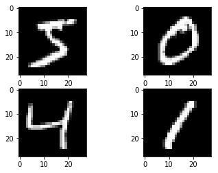

# Keras- Convolutional Neural Network

##  Digit Recognization: NMIST

### 1. Baseline MLP for MNIST dataset


```python
# Baseline MLP for MNIST dataset
import numpy
from keras.datasets import mnist
from keras.models import Sequential
from keras.layers import Dense
from keras.layers import Dropout
from keras.utils import np_utils
```

    Using TensorFlow backend.


##### Prepare Data Set


```python
# fix random seed for reproducibility
seed = 7
numpy.random.seed(seed)

# load data
(X_train, y_train), (X_test, y_test) = mnist.load_data()
```

* How many data files are there?


```python
X_train.shape,X_test.shape
```


    ((60000, 28, 28), (10000, 28, 28))


```python
y_train.shape,y_test.shape
```


    ((60000,), (10000,))


#### Visualize the data


```python
import matplotlib.pyplot as plt
%matplotlib inline

plt.figure(figsize = [10,8])
for i in range(1,10):
    plt.subplot(3,3,i)
    plt.imshow(X_train[i])
plt.show()
```


#### Convert Image matrix to Vector


```python
# flatten 28*28 images to a 784 vector for each image
num_pixels = X_train.shape[1] * X_train.shape[2]
X_train = X_train.reshape(X_train.shape[0], num_pixels).astype('float32')
X_test = X_test.reshape(X_test.shape[0], num_pixels).astype('float32')
```

#### Normalization


```python
# normalize inputs from 0-255 to 0-1
X_train = X_train / 255
X_test = X_test / 255
```

#### Prepare Labels


```python
# one hot encode outputs
y_train = np_utils.to_categorical(y_train)
y_test = np_utils.to_categorical(y_test)
num_classes = y_test.shape[1]
```

##### Model


```python
# define baseline model
def baseline_model():
	# create model
	model = Sequential()
    
	model.add(Dense(num_pixels,
                    input_dim=num_pixels,
                    kernel_initializer='normal',
                    activation='relu'))
    
	model.add(Dense(num_classes,
                    kernel_initializer='normal',
                    activation='softmax'))
    
	# Compile model
	model.compile(loss='categorical_crossentropy',
                  optimizer='adam',
                  metrics=['accuracy'])
    
	return model
```

##### Build Model


```python
model = baseline_model()
model.summary()

# Fit the model
model.fit(X_train, y_train,
          validation_data=(X_test, y_test),
          epochs=10,
          batch_size=200,
          verbose=2)
```

    WARNING:tensorflow:From /Users/admin/anaconda3/lib/python3.7/site-packages/tensorflow/python/framework/op_def_library.py:263: colocate_with (from tensorflow.python.framework.ops) is deprecated and will be removed in a future version.
    Instructions for updating:
    Colocations handled automatically by placer.
    _________________________________________________________________
    Layer (type)                 Output Shape              Param #   
    =================================================================
    dense_1 (Dense)              (None, 784)               615440    
    _________________________________________________________________
    dense_2 (Dense)              (None, 10)                7850      
    =================================================================
    Total params: 623,290
    Trainable params: 623,290
    Non-trainable params: 0
    _________________________________________________________________
    WARNING:tensorflow:From /Users/admin/anaconda3/lib/python3.7/site-packages/tensorflow/python/ops/math_ops.py:3066: to_int32 (from tensorflow.python.ops.math_ops) is deprecated and will be removed in a future version.
    Instructions for updating:
    Use tf.cast instead.
    Train on 60000 samples, validate on 10000 samples
    Epoch 1/10
     - 4s - loss: 0.2801 - acc: 0.9209 - val_loss: 0.1417 - val_acc: 0.9572
    Epoch 2/10
     - 3s - loss: 0.1118 - acc: 0.9676 - val_loss: 0.0921 - val_acc: 0.9705
    Epoch 3/10
     - 3s - loss: 0.0720 - acc: 0.9794 - val_loss: 0.0785 - val_acc: 0.9773
    Epoch 4/10
     - 3s - loss: 0.0505 - acc: 0.9857 - val_loss: 0.0739 - val_acc: 0.9772
    Epoch 5/10
     - 3s - loss: 0.0372 - acc: 0.9892 - val_loss: 0.0665 - val_acc: 0.9792
    Epoch 6/10
     - 3s - loss: 0.0267 - acc: 0.9929 - val_loss: 0.0620 - val_acc: 0.9808
    Epoch 7/10
     - 3s - loss: 0.0208 - acc: 0.9947 - val_loss: 0.0618 - val_acc: 0.9808
    Epoch 8/10
     - 3s - loss: 0.0142 - acc: 0.9967 - val_loss: 0.0630 - val_acc: 0.9807
    Epoch 9/10
     - 3s - loss: 0.0113 - acc: 0.9976 - val_loss: 0.0589 - val_acc: 0.9807
    Epoch 10/10
     - 3s - loss: 0.0082 - acc: 0.9984 - val_loss: 0.0581 - val_acc: 0.9818


    <keras.callbacks.History at 0x1298a5eb8>


##### Evaluation


```python
# Final evaluation of the model
scores = model.evaluate(X_test, y_test, verbose=0)
print("Baseline Error: %.2f%%" % (100-scores[1]*100))
```

    Baseline Error: 1.82%


---------

### 2.  Simple CNN for the MNIST Dataset


```python
# Simple CNN for the MNIST Dataset
from keras.layers import Flatten
from keras.layers.convolutional import Conv2D
from keras.layers.convolutional import MaxPooling2D
```


```python
# fix dimension ordering issue
from keras import backend as K
K.set_image_dim_ordering('th')
```

##### Get Data


```python
# fix random seed for reproducibility
seed = 7
numpy.random.seed(seed)

# load data
(X_train, y_train), (X_test, y_test) = mnist.load_data()


# reshape to be [samples][channels][width][height]
X_train = X_train.reshape(X_train.shape[0], 1, 28, 28).astype('float32')
X_test = X_test.reshape(X_test.shape[0], 1, 28, 28).astype('float32')


# normalize inputs from 0-255 to 0-1
X_train = X_train / 255
X_test = X_test / 255


# one hot encode outputs
y_train = np_utils.to_categorical(y_train)
y_test = np_utils.to_categorical(y_test)
num_classes = y_test.shape[1]

```

##### Model


```python
# define a simple CNN model
def baseline_model():
	# create model
	model = Sequential()
    
	model.add(Conv2D(32,
                     (5, 5),
                     input_shape=(1, 28, 28),
                     activation='relu'))
    
    
	model.add(MaxPooling2D(pool_size=(2, 2)))
    
	model.add(Dropout(0.2))
    
	model.add(Flatten())
    
	model.add(Dense(128, activation='relu'))
    
	model.add(Dense(num_classes, activation='softmax'))
    
    
    
	# Compile model
	model.compile(loss='categorical_crossentropy', 
                  optimizer='adam',
                  metrics=['accuracy'])
    
    
	return model

```

##### Build


```python
# build the model
model = baseline_model()
model.summary()
```

    WARNING:tensorflow:From /Users/admin/anaconda3/lib/python3.7/site-packages/keras/backend/tensorflow_backend.py:3445: calling dropout (from tensorflow.python.ops.nn_ops) with keep_prob is deprecated and will be removed in a future version.
    Instructions for updating:
    Please use `rate` instead of `keep_prob`. Rate should be set to `rate = 1 - keep_prob`.
    _________________________________________________________________
    Layer (type)                 Output Shape              Param #   
    =================================================================
    conv2d_1 (Conv2D)            (None, 32, 24, 24)        832       
    _________________________________________________________________
    max_pooling2d_1 (MaxPooling2 (None, 32, 12, 12)        0         
    _________________________________________________________________
    dropout_1 (Dropout)          (None, 32, 12, 12)        0         
    _________________________________________________________________
    flatten_1 (Flatten)          (None, 4608)              0         
    _________________________________________________________________
    dense_3 (Dense)              (None, 128)               589952    
    _________________________________________________________________
    dense_4 (Dense)              (None, 10)                1290      
    =================================================================
    Total params: 592,074
    Trainable params: 592,074
    Non-trainable params: 0
    _________________________________________________________________


##### Fit Model


```python
# Fit the model
model.fit(X_train,
          y_train,
          validation_data=(X_test, y_test),
          epochs=4,
          batch_size=200)

```

    Train on 60000 samples, validate on 10000 samples
    Epoch 1/4
    60000/60000 [==============================] - 26s 436us/step - loss: 0.2234 - acc: 0.9364 - val_loss: 0.0783 - val_acc: 0.9751
    Epoch 2/4
    60000/60000 [==============================] - 26s 428us/step - loss: 0.0712 - acc: 0.9787 - val_loss: 0.0456 - val_acc: 0.9851
    Epoch 3/4
    60000/60000 [==============================] - 25s 419us/step - loss: 0.0510 - acc: 0.9844 - val_loss: 0.0439 - val_acc: 0.9860
    Epoch 4/4
    60000/60000 [==============================] - 25s 416us/step - loss: 0.0393 - acc: 0.9880 - val_loss: 0.0402 - val_acc: 0.9878


    <keras.callbacks.History at 0xb416675c0>


##### Evaluate Model


```python
# Final evaluation of the model
scores = model.evaluate(X_test, y_test, verbose=0)
print("CNN Error: %.2f%%" % (100-scores[1]*100))

```

    CNN Error: 1.22%


-------

### 3. Larger CNN for the MNIST Dataset

#### Prepare Data


```python
K.set_image_dim_ordering('th')
# fix random seed for reproducibility
seed = 7
numpy.random.seed(seed)
# load data
(X_train, y_train), (X_test, y_test) = mnist.load_data()
# reshape to be [samples][pixels][width][height]
X_train = X_train.reshape(X_train.shape[0], 1, 28, 28).astype('float32')
X_test = X_test.reshape(X_test.shape[0], 1, 28, 28).astype('float32')
# normalize inputs from 0-255 to 0-1
X_train = X_train / 255
X_test = X_test / 255
# one hot encode outputs
y_train = np_utils.to_categorical(y_train)
y_test = np_utils.to_categorical(y_test)
num_classes = y_test.shape[1]
```

##### Model


```python
# define the larger model
def larger_model():
	# create model
	model = Sequential()
    
	model.add(Conv2D(30, 
                     (5, 5),
                     input_shape=(1, 28, 28),
                     activation='relu'))
    
	model.add(MaxPooling2D(pool_size=(2, 2)))
    
	model.add(Conv2D(15, (3, 3), activation='relu'))
    
	model.add(MaxPooling2D(pool_size=(2, 2)))
    
	model.add(Dropout(0.2))
    
	model.add(Flatten())
    
	model.add(Dense(128, activation='relu'))
	model.add(Dense(50, activation='relu'))
    
	model.add(Dense(num_classes, activation='softmax'))
    
    
	# Compile model    
	model.compile(loss='categorical_crossentropy',
                  optimizer='adam',
                  metrics=['accuracy'])
    
    
	return model
```

##### Build Model


```python
# build the model
model = larger_model()
```

##### Fit Model


```python
# Fit the model
model.fit(X_train,
          y_train,
          validation_data=(X_test, y_test),
          epochs=10,
          batch_size=200)

```

    Train on 60000 samples, validate on 10000 samples
    Epoch 1/10
    60000/60000 [==============================] - 31s 510us/step - loss: 0.3871 - acc: 0.8817 - val_loss: 0.0904 - val_acc: 0.9714
    Epoch 2/10
    60000/60000 [==============================] - 30s 494us/step - loss: 0.0998 - acc: 0.9699 - val_loss: 0.0540 - val_acc: 0.9829
    Epoch 3/10
    60000/60000 [==============================] - 30s 504us/step - loss: 0.0738 - acc: 0.9772 - val_loss: 0.0417 - val_acc: 0.9864
    Epoch 4/10
    60000/60000 [==============================] - 29s 492us/step - loss: 0.0602 - acc: 0.9816 - val_loss: 0.0375 - val_acc: 0.9870
    Epoch 5/10
    60000/60000 [==============================] - 29s 487us/step - loss: 0.0517 - acc: 0.9835 - val_loss: 0.0359 - val_acc: 0.9886
    Epoch 6/10
    60000/60000 [==============================] - 29s 476us/step - loss: 0.0446 - acc: 0.9855 - val_loss: 0.0307 - val_acc: 0.9902
    Epoch 7/10
    60000/60000 [==============================] - 40s 665us/step - loss: 0.0393 - acc: 0.9880 - val_loss: 0.0313 - val_acc: 0.9900
    Epoch 8/10
    60000/60000 [==============================] - 33s 551us/step - loss: 0.0357 - acc: 0.9887 - val_loss: 0.0259 - val_acc: 0.9911
    Epoch 9/10
    60000/60000 [==============================] - 30s 508us/step - loss: 0.0322 - acc: 0.9899 - val_loss: 0.0242 - val_acc: 0.9925
    Epoch 10/10
    60000/60000 [==============================] - 31s 512us/step - loss: 0.0307 - acc: 0.9898 - val_loss: 0.0271 - val_acc: 0.9906


    <keras.callbacks.History at 0xb2e19f320>


##### Evalauation


```python
# Final evaluation of the model
scores = model.evaluate(X_test, y_test, verbose=0)
print("Large CNN Error: %.2f%%" % (100-scores[1]*100))
```

    Large CNN Error: 0.94%


##### Plot


```python
# Plot ad hoc mnist instances
from keras.datasets import mnist
import matplotlib.pyplot as plt
# load (downloaded if needed) the MNIST dataset
(X_train, y_train), (X_test, y_test) = mnist.load_data()
# plot 4 images as gray scale
plt.subplot(221)
plt.imshow(X_train[0], cmap=plt.get_cmap('gray'))
plt.subplot(222)
plt.imshow(X_train[1], cmap=plt.get_cmap('gray'))
plt.subplot(223)
plt.imshow(X_train[2], cmap=plt.get_cmap('gray'))
plt.subplot(224)
plt.imshow(X_train[3], cmap=plt.get_cmap('gray'))
# show the plot
plt.show()
```





--------
