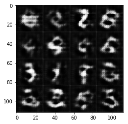
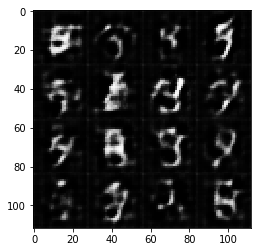
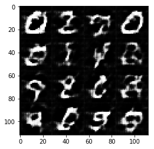
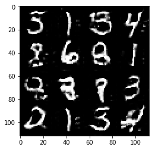
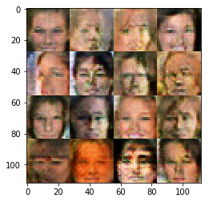
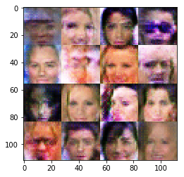

# Face Generation
In this project, you'll use generative adversarial networks to generate new images of faces.
### Get the Data
You'll be using two datasets in this project:
- MNIST
- CelebA

Since the celebA dataset is complex and you're doing GANs in a project for the first time, we want you to test your neural network on MNIST before CelebA.  Running the GANs on MNIST will allow you to see how well your model trains sooner.

If you're using [FloydHub](https://www.floydhub.com/), set `data_dir` to "/input" and use the [FloydHub data ID](http://docs.floydhub.com/home/using_datasets/) "R5KrjnANiKVhLWAkpXhNBe".


```python
data_dir = './data'

# FloydHub - Use with data ID "R5KrjnANiKVhLWAkpXhNBe"
#data_dir = '/input'


"""
DON'T MODIFY ANYTHING IN THIS CELL
"""
import helper

helper.download_extract('mnist', data_dir)
helper.download_extract('celeba', data_dir)
```

    Found mnist Data
    Found celeba Data


## Explore the Data
### MNIST
As you're aware, the [MNIST](http://yann.lecun.com/exdb/mnist/) dataset contains images of handwritten digits. You can view the first number of examples by changing `show_n_images`. 


```python
show_n_images = 25

"""
DON'T MODIFY ANYTHING IN THIS CELL
"""
%matplotlib inline
import os
from glob import glob
from matplotlib import pyplot

mnist_images = helper.get_batch(glob(os.path.join(data_dir, 'mnist/*.jpg'))[:show_n_images], 28, 28, 'L')
pyplot.imshow(helper.images_square_grid(mnist_images, 'L'), cmap='gray')
```


    <matplotlib.image.AxesImage at 0x7f5ca6429390>


### CelebA
The [CelebFaces Attributes Dataset (CelebA)](http://mmlab.ie.cuhk.edu.hk/projects/CelebA.html) dataset contains over 200,000 celebrity images with annotations.  Since you're going to be generating faces, you won't need the annotations.  You can view the first number of examples by changing `show_n_images`.


```python
show_n_images = 25

"""
DON'T MODIFY ANYTHING IN THIS CELL
"""
mnist_images = helper.get_batch(glob(os.path.join(data_dir, 'img_align_celeba/*.jpg'))[:show_n_images], 28, 28, 'RGB')
pyplot.imshow(helper.images_square_grid(mnist_images, 'RGB'))
```


    <matplotlib.image.AxesImage at 0x7f5ca634ff60>


## Preprocess the Data
Since the project's main focus is on building the GANs, we'll preprocess the data for you.  The values of the MNIST and CelebA dataset will be in the range of -0.5 to 0.5 of 28x28 dimensional images.  The CelebA images will be cropped to remove parts of the image that don't include a face, then resized down to 28x28.

The MNIST images are black and white images with a single [color channel](https://en.wikipedia.org/wiki/Channel_(digital_image%29) while the CelebA images have [3 color channels (RGB color channel)](https://en.wikipedia.org/wiki/Channel_(digital_image%29#RGB_Images).
## Build the Neural Network
You'll build the components necessary to build a GANs by implementing the following functions below:
- `model_inputs`
- `discriminator`
- `generator`
- `model_loss`
- `model_opt`
- `train`

### Check the Version of TensorFlow and Access to GPU
This will check to make sure you have the correct version of TensorFlow and access to a GPU


```python
"""
DON'T MODIFY ANYTHING IN THIS CELL
"""
from distutils.version import LooseVersion
import warnings
import tensorflow as tf

# Check TensorFlow Version
assert LooseVersion(tf.__version__) >= LooseVersion('1.0'), 'Please use TensorFlow version 1.0 or newer.  You are using {}'.format(tf.__version__)
print('TensorFlow Version: {}'.format(tf.__version__))

# Check for a GPU
if not tf.test.gpu_device_name():
    warnings.warn('No GPU found. Please use a GPU to train your neural network.')
else:
    print('Default GPU Device: {}'.format(tf.test.gpu_device_name()))
```

    TensorFlow Version: 1.0.0
    Default GPU Device: /gpu:0


### Input
Implement the `model_inputs` function to create TF Placeholders for the Neural Network. It should create the following placeholders:
- Real input images placeholder with rank 4 using `image_width`, `image_height`, and `image_channels`.
- Z input placeholder with rank 2 using `z_dim`.
- Learning rate placeholder with rank 0.

Return the placeholders in the following the tuple (tensor of real input images, tensor of z data)


```python
import problem_unittests as tests

def model_inputs(image_width, image_height, image_channels, z_dim):
    """
    Create the model inputs
    :param image_width: The input image width
    :param image_height: The input image height
    :param image_channels: The number of image channels
    :param z_dim: The dimension of Z
    :return: Tuple of (tensor of real input images, tensor of z data, learning rate)
    """
    # TODO: Implement Function
    
    
    #1. Real input images placeholder with rank 4 using image_width, image_height, and image_channels.
    input_real = tf.placeholder(tf.float32, [None, image_width,\
                                             image_height,\
                                             image_channels],\
                                             name = "input_real")
    
    
    
    #2. Z input placeholder with rank 2 using z_dim.
    input_z = tf.placeholder(tf.float32, [None, z_dim],\
                                       name = "input_z")
    
    
    #3. Learning rate placeholder with rank 0.
    learning_rate = tf.placeholder(tf.float32, None,\
                                   name = "learning_rate")

    
    return input_real, input_z, learning_rate
    
  

"""
DON'T MODIFY ANYTHING IN THIS CELL THAT IS BELOW THIS LINE
"""
tests.test_model_inputs(model_inputs)
```

    Tests Passed


### Discriminator
Implement `discriminator` to create a discriminator neural network that discriminates on `images`.  This function should be able to reuse the variabes in the neural network.  Use [`tf.variable_scope`](https://www.tensorflow.org/api_docs/python/tf/variable_scope) with a scope name of "discriminator" to allow the variables to be reused.  The function should return a tuple of (tensor output of the generator, tensor logits of the generator).


```python
def discriminator(images, reuse=False):
    """
    Create the discriminator network
    :param image: Tensor of input image(s)
    :param reuse: Boolean if the weights should be reused
    :return: Tuple of (tensor output of the discriminator, tensor logits of the discriminator)
    """
    # TODO: Implement Function

    alpha= 0.1
    sdev= 0.02
    with tf.variable_scope('discriminator', reuse=reuse):
        
        # input layer with image size(28*28*3)
        x1 = tf.layers.conv2d(images, 32, 5, 2,\
                        padding='same',\
                        kernel_initializer=tf.random_normal_initializer(stddev=sdev))
        lrelu1 = tf.maximum(alpha * x1, x1)
        # Layer 1 out: 14x14x32
        
        
        
        # Layer 2: 14x14x32
        x2 = tf.layers.conv2d(lrelu1, 64, 5, 2,\
                        padding='same',\
                        kernel_initializer=tf.random_normal_initializer(stddev=sdev))
        bn2 = tf.layers.batch_normalization(x2, training=True)
        lrelu2 = tf.maximum(alpha * bn2, bn2)
        # Layer 2 out: 7x7x64
        
        
        
        x3 = tf.layers.conv2d(lrelu2, 128, 5, 2,\
                        padding='same',\
                        kernel_initializer=tf.random_normal_initializer(stddev=sdev))
        bn3 = tf.layers.batch_normalization(x3, training=True)
        lrelu3 = tf.maximum(alpha * bn3, bn3)
        # Layer 3 out: 4x4x128
        
        
        
        x4 = tf.layers.conv2d(lrelu3, 256, 5, 2,\
                        padding='same',\
                        kernel_initializer=tf.random_normal_initializer(stddev=sdev))
        bn4 = tf.layers.batch_normalization(x4, training=True)
        lrelu4 = tf.maximum(alpha * bn4, bn4)
        # Layer 4 out: 2x2x256
        
        
        
        flattened = tf.reshape(lrelu4, (-1, 2*2*256))
        logits = tf.layers.dense(flattened, 1,\
                            kernel_initializer=tf.random_normal_initializer(stddev=sdev))
        output = tf.sigmoid(logits)
        
        return output, logits


"""
DON'T MODIFY ANYTHING IN THIS CELL THAT IS BELOW THIS LINE
"""
tests.test_discriminator(discriminator, tf)
```

    Tests Passed


### Generator
Implement `generator` to generate an image using `z`. This function should be able to reuse the variabes in the neural network.  Use [`tf.variable_scope`](https://www.tensorflow.org/api_docs/python/tf/variable_scope) with a scope name of "generator" to allow the variables to be reused. The function should return the generated 28 x 28 x `out_channel_dim` images.


```python
def generator(z, out_channel_dim, is_train=True):
    """
    Create the generator network
    :param z: Input z
    :param out_channel_dim: The number of channels in the output image
    :param is_train: Boolean if generator is being used for training
    :return: The tensor output of the generator
    """
    # TODO: Implement Function
    
    alpha = 0.2
    sdev = 0.02
    # variable scope for generator
    with tf.variable_scope('generator', reuse=not is_train):
        #fake with fully connected
        
        # Layer 1 in: 7x7x256
        x1 = tf.layers.dense(z, 4 * 4 * 512)
        x1 = tf.reshape(x1, (-1, 4, 4, 512))
        lrelu1 = tf.maximum(alpha * x1, x1)
        # Layer 1 out: 4x4x512
        
        
        x2 = tf.layers.conv2d_transpose(lrelu1, 128, 4, 1,\
                                padding='valid',\
                                kernel_initializer=tf.random_normal_initializer(stddev=sdev))
        bn2 = tf.layers.batch_normalization(x2, training=is_train)
        lrelu2 = tf.maximum(alpha * bn2, bn2)
        # Layer 2 out: 8x8x128
        
        
        x3 = tf.layers.conv2d_transpose(lrelu2, 64, 5, 2,\
                                padding='same', \
                                kernel_initializer=tf.random_normal_initializer(stddev=sdev))
        bn3 = tf.layers.batch_normalization(x3, training=is_train)
        lrelu3 = tf.maximum(alpha * bn3, bn3)
        # Layer 3 out: 16x16x64
        
        
        
        x4 = tf.layers.conv2d_transpose(lrelu3, 32, 5, 2,\
                                padding='same',\
                                kernel_initializer=tf.random_normal_initializer(stddev=sdev))
        bn4 = tf.layers.batch_normalization(x4, training=is_train)
        lrelu4 = tf.maximum(alpha * bn4, bn4)
        # Layer 4 out: 32x32x32
        
        
        
        logits = tf.layers.conv2d_transpose(lrelu4, out_channel_dim, 3, 1,\
                                    padding='same',\
                                    kernel_initializer=tf.random_normal_initializer(stddev=sdev))
        output = tf.tanh(logits)
        
        
        return output
    
    


"""
DON'T MODIFY ANYTHING IN THIS CELL THAT IS BELOW THIS LINE
"""
tests.test_generator(generator, tf)
```

    Tests Passed


### Loss
Implement `model_loss` to build the GANs for training and calculate the loss.  The function should return a tuple of (discriminator loss, generator loss).  Use the following functions you implemented:
- `discriminator(images, reuse=False)`
- `generator(z, out_channel_dim, is_train=True)`


```python
def model_loss(input_real, input_z, out_channel_dim):
    """
    Get the loss for the discriminator and generator
    :param input_real: Images from the real dataset
    :param input_z: Z input
    :param out_channel_dim: The number of channels in the output image
    :return: A tuple of (discriminator loss, generator loss)
    """
    # TODO: Implement Function
    
    g_model = generator(input_z, out_channel_dim)
    
    d_model_real, d_logits_real = discriminator(input_real)
    d_model_fake, d_logits_fake = discriminator(g_model, reuse=True)
    
    

    d_loss_real = tf.reduce_mean(
        tf.nn.sigmoid_cross_entropy_with_logits(logits=d_logits_real,\
                                                labels=tf.ones_like(d_model_real)))
    d_loss_fake = tf.reduce_mean(
        tf.nn.sigmoid_cross_entropy_with_logits(logits=d_logits_fake,\
                                                labels=tf.zeros_like(d_model_fake)))
    g_loss = tf.reduce_mean(
        tf.nn.sigmoid_cross_entropy_with_logits(logits=d_logits_fake,\
                                                labels=tf.ones_like(d_model_fake)))
    
    

    d_loss = d_loss_real + d_loss_fake

    return d_loss, g_loss


"""
DON'T MODIFY ANYTHING IN THIS CELL THAT IS BELOW THIS LINE
"""
tests.test_model_loss(model_loss)
```

    Tests Passed


### Optimization
Implement `model_opt` to create the optimization operations for the GANs. Use [`tf.trainable_variables`](https://www.tensorflow.org/api_docs/python/tf/trainable_variables) to get all the trainable variables.  Filter the variables with names that are in the discriminator and generator scope names.  The function should return a tuple of (discriminator training operation, generator training operation).


```python
def model_opt(d_loss, g_loss, learning_rate, beta1):
    """
    Get optimization operations
    :param d_loss: Discriminator loss Tensor
    :param g_loss: Generator loss Tensor
    :param learning_rate: Learning Rate Placeholder
    :param beta1: The exponential decay rate for the 1st moment in the optimizer
    :return: A tuple of (discriminator training operation, generator training operation)
    """
    # TODO: Implement Function
    
    
    t_vars = tf.trainable_variables()
    d_vars = [var for var in t_vars if var.name.startswith('discriminator')]
    g_vars = [var for var in t_vars if var.name.startswith('generator')]

    
    # Optimize
    d_train_opt = tf.train.AdamOptimizer(learning_rate,\
                                    beta1=beta1).minimize(d_loss, var_list=d_vars)
    
    
    with tf.control_dependencies(tf.get_collection(tf.GraphKeys.UPDATE_OPS)): 
        g_train_opt = tf.train.AdamOptimizer(learning_rate,\
                                    beta1=beta1).minimize(g_loss, var_list=g_vars)

    return d_train_opt, g_train_opt


"""
DON'T MODIFY ANYTHING IN THIS CELL THAT IS BELOW THIS LINE
"""
tests.test_model_opt(model_opt, tf)
```

    Tests Passed


## Neural Network Training
### Show Output
Use this function to show the current output of the generator during training. It will help you determine how well the GANs is training.


```python
"""
DON'T MODIFY ANYTHING IN THIS CELL
"""
import numpy as np

def show_generator_output(sess, n_images, input_z, out_channel_dim, image_mode):
    """
    Show example output for the generator
    :param sess: TensorFlow session
    :param n_images: Number of Images to display
    :param input_z: Input Z Tensor
    :param out_channel_dim: The number of channels in the output image
    :param image_mode: The mode to use for images ("RGB" or "L")
    """
    cmap = None if image_mode == 'RGB' else 'gray'
    z_dim = input_z.get_shape().as_list()[-1]
    example_z = np.random.uniform(-1, 1, size=[n_images, z_dim])

    samples = sess.run(
        generator(input_z, out_channel_dim, False),
        feed_dict={input_z: example_z})

    images_grid = helper.images_square_grid(samples, image_mode)
    pyplot.imshow(images_grid, cmap=cmap)
    pyplot.show()
```

### Train
Implement `train` to build and train the GANs.  Use the following functions you implemented:
- `model_inputs(image_width, image_height, image_channels, z_dim)`
- `model_loss(input_real, input_z, out_channel_dim)`
- `model_opt(d_loss, g_loss, learning_rate, beta1)`

Use the `show_generator_output` to show `generator` output while you train. Running `show_generator_output` for every batch will drastically increase training time and increase the size of the notebook.  It's recommended to print the `generator` output every 100 batches.


```python
def train(epoch_count, batch_size, z_dim, learning_rate, beta1, get_batches, data_shape, data_image_mode):
    """
    Train the GAN
    :param epoch_count: Number of epochs
    :param batch_size: Batch Size
    :param z_dim: Z dimension
    :param learning_rate: Learning Rate
    :param beta1: The exponential decay rate for the 1st moment in the optimizer
    :param get_batches: Function to get batches
    :param data_shape: Shape of the data
    :param data_image_mode: The image mode to use for images ("RGB" or "L")
    """
    # TODO: Build Model
    
    n_samples, width, height, channels = data_shape
    input_real, input_z, learn_rate = model_inputs(width, height, channels, z_dim)
    d_loss, g_loss = model_loss(input_real, input_z, channels)
    d_opt, g_opt = model_opt(d_loss, g_loss, learn_rate, beta1)
    
    steps = 0
    show_every = 50
    print_every = 25
    
    with tf.Session() as sess:
        sess.run(tf.global_variables_initializer())
        for epoch_i in range(epoch_count):
            for batch_images in get_batches(batch_size):
                batch_images *= 2
                
                # TODO: Train Model
                steps += 1
                
                # Sample random noise for G
                batch_z = np.random.uniform(-1, 1, size=(batch_size, z_dim))

                
                # Run optimizers
                _ = sess.run(d_opt, feed_dict={input_real: batch_images,\
                                               input_z: batch_z,\
                                               learn_rate: learning_rate})
                
                _ = sess.run(g_opt, feed_dict={input_real: batch_images,\
                                               input_z: batch_z,\
                                               learn_rate: learning_rate})

                
                
                
                # show_generator_output to show generator output
                if steps % show_every == 0:
                    n_images = 16
                    show_generator_output(sess, n_images, input_z, channels, data_image_mode)
                    
                    
                    

                if steps % print_every == 0:
                    train_loss_d = d_loss.eval({input_z: batch_z, input_real: batch_images})
                    train_loss_g = g_loss.eval({input_z: batch_z})

                    print("Epoch {}/{}...".format(epoch_i, epoch_count),
                          "Discriminator Loss: {:.4f}...".format(train_loss_d),
                          "Generator Loss: {:.4f}".format(train_loss_g))
                
```

### MNIST
Test your GANs architecture on MNIST.  After 2 epochs, the GANs should be able to generate images that look like handwritten digits.  Make sure the loss of the generator is lower than the loss of the discriminator or close to 0.


```python
batch_size = 64
z_dim = 100
learning_rate = 0.0005
beta1 = 0.5


"""
DON'T MODIFY ANYTHING IN THIS CELL THAT IS BELOW THIS LINE
"""
epochs = 2

mnist_dataset = helper.Dataset('mnist', glob(os.path.join(data_dir, 'mnist/*.jpg')))
with tf.Graph().as_default():
    train(epochs, batch_size, z_dim, learning_rate, beta1, mnist_dataset.get_batches,
          mnist_dataset.shape, mnist_dataset.image_mode)
```

    Epoch 0/2... Discriminator Loss: 0.1132... Generator Loss: 3.8164


    Epoch 0/2... Discriminator Loss: 0.4083... Generator Loss: 1.6668
    Epoch 0/2... Discriminator Loss: 0.2134... Generator Loss: 2.3080


    Epoch 0/2... Discriminator Loss: 0.8935... Generator Loss: 0.7820
    Epoch 0/2... Discriminator Loss: 0.9974... Generator Loss: 0.9753


    Epoch 0/2... Discriminator Loss: 1.4598... Generator Loss: 0.4637
    Epoch 0/2... Discriminator Loss: 1.0837... Generator Loss: 0.9862





    Epoch 0/2... Discriminator Loss: 1.0771... Generator Loss: 1.2634
    Epoch 0/2... Discriminator Loss: 1.5585... Generator Loss: 0.3205





    Epoch 0/2... Discriminator Loss: 1.0825... Generator Loss: 0.6745
    Epoch 0/2... Discriminator Loss: 0.9129... Generator Loss: 1.0191





    Epoch 0/2... Discriminator Loss: 0.9434... Generator Loss: 0.8767
    Epoch 0/2... Discriminator Loss: 0.9463... Generator Loss: 0.9866


    Epoch 0/2... Discriminator Loss: 1.1447... Generator Loss: 0.6476
    Epoch 0/2... Discriminator Loss: 1.3758... Generator Loss: 0.4319


    Epoch 0/2... Discriminator Loss: 0.9714... Generator Loss: 0.6623
    Epoch 0/2... Discriminator Loss: 1.5291... Generator Loss: 0.3816


    Epoch 0/2... Discriminator Loss: 1.3693... Generator Loss: 2.0586
    Epoch 0/2... Discriminator Loss: 1.7561... Generator Loss: 0.2967


    Epoch 0/2... Discriminator Loss: 1.5004... Generator Loss: 0.3576
    Epoch 0/2... Discriminator Loss: 0.7120... Generator Loss: 1.2979


    Epoch 0/2... Discriminator Loss: 0.8413... Generator Loss: 1.0782
    Epoch 0/2... Discriminator Loss: 1.1858... Generator Loss: 0.5920


    Epoch 0/2... Discriminator Loss: 1.0060... Generator Loss: 0.6120
    Epoch 0/2... Discriminator Loss: 1.2757... Generator Loss: 0.4474


    Epoch 0/2... Discriminator Loss: 1.5774... Generator Loss: 0.3005
    Epoch 0/2... Discriminator Loss: 1.2721... Generator Loss: 0.4242


    Epoch 0/2... Discriminator Loss: 1.0972... Generator Loss: 0.5191
    Epoch 0/2... Discriminator Loss: 0.8444... Generator Loss: 1.2999


    Epoch 0/2... Discriminator Loss: 0.8549... Generator Loss: 0.9284
    Epoch 0/2... Discriminator Loss: 0.8498... Generator Loss: 0.9417


    Epoch 0/2... Discriminator Loss: 0.6521... Generator Loss: 1.2973
    Epoch 0/2... Discriminator Loss: 0.9847... Generator Loss: 0.6543


    Epoch 0/2... Discriminator Loss: 1.2542... Generator Loss: 0.4832
    Epoch 0/2... Discriminator Loss: 0.9244... Generator Loss: 1.4905


    Epoch 0/2... Discriminator Loss: 1.0157... Generator Loss: 0.5582
    Epoch 0/2... Discriminator Loss: 0.5705... Generator Loss: 1.7848





    Epoch 1/2... Discriminator Loss: 1.0804... Generator Loss: 0.7368
    Epoch 1/2... Discriminator Loss: 1.3714... Generator Loss: 2.7104


    Epoch 1/2... Discriminator Loss: 0.7393... Generator Loss: 1.0792
    Epoch 1/2... Discriminator Loss: 0.8901... Generator Loss: 0.9193


    Epoch 1/2... Discriminator Loss: 1.3041... Generator Loss: 0.4482
    Epoch 1/2... Discriminator Loss: 1.0246... Generator Loss: 1.6754


    Epoch 1/2... Discriminator Loss: 1.4366... Generator Loss: 0.4005
    Epoch 1/2... Discriminator Loss: 0.7496... Generator Loss: 0.9064


    Epoch 1/2... Discriminator Loss: 1.0066... Generator Loss: 0.6571
    Epoch 1/2... Discriminator Loss: 0.6344... Generator Loss: 1.0048


    Epoch 1/2... Discriminator Loss: 0.9111... Generator Loss: 1.4843
    Epoch 1/2... Discriminator Loss: 0.8954... Generator Loss: 1.0413


    Epoch 1/2... Discriminator Loss: 2.1049... Generator Loss: 0.1755
    Epoch 1/2... Discriminator Loss: 1.0708... Generator Loss: 0.5250


    Epoch 1/2... Discriminator Loss: 1.4498... Generator Loss: 0.3438
    Epoch 1/2... Discriminator Loss: 0.8951... Generator Loss: 0.7148


    Epoch 1/2... Discriminator Loss: 0.9677... Generator Loss: 0.6380
    Epoch 1/2... Discriminator Loss: 2.0528... Generator Loss: 0.1594


    Epoch 1/2... Discriminator Loss: 0.5354... Generator Loss: 1.1890
    Epoch 1/2... Discriminator Loss: 1.5721... Generator Loss: 0.5104


    Epoch 1/2... Discriminator Loss: 0.7788... Generator Loss: 0.9999
    Epoch 1/2... Discriminator Loss: 0.8880... Generator Loss: 0.6436


    Epoch 1/2... Discriminator Loss: 0.6986... Generator Loss: 1.4282
    Epoch 1/2... Discriminator Loss: 1.2309... Generator Loss: 0.4484


    Epoch 1/2... Discriminator Loss: 1.0756... Generator Loss: 0.6155
    Epoch 1/2... Discriminator Loss: 3.1573... Generator Loss: 3.8849


    Epoch 1/2... Discriminator Loss: 0.8739... Generator Loss: 0.6847
    Epoch 1/2... Discriminator Loss: 1.7689... Generator Loss: 0.2244


    Epoch 1/2... Discriminator Loss: 0.8876... Generator Loss: 0.7815
    Epoch 1/2... Discriminator Loss: 1.1661... Generator Loss: 0.4628


    Epoch 1/2... Discriminator Loss: 1.5133... Generator Loss: 0.3179
    Epoch 1/2... Discriminator Loss: 0.6079... Generator Loss: 1.3311


    Epoch 1/2... Discriminator Loss: 0.7159... Generator Loss: 1.5858
    Epoch 1/2... Discriminator Loss: 0.7321... Generator Loss: 0.8564


    Epoch 1/2... Discriminator Loss: 1.2747... Generator Loss: 0.4073
    Epoch 1/2... Discriminator Loss: 1.3412... Generator Loss: 0.3678


    Epoch 1/2... Discriminator Loss: 0.8914... Generator Loss: 0.7424


### CelebA
Run your GANs on CelebA.  It will take around 20 minutes on the average GPU to run one epoch.  You can run the whole epoch or stop when it starts to generate realistic faces.


```python
batch_size = 64
z_dim = 100
learning_rate = 0.0005
beta1 = 0.5


"""
DON'T MODIFY ANYTHING IN THIS CELL THAT IS BELOW THIS LINE
"""
epochs = 1

celeba_dataset = helper.Dataset('celeba', glob(os.path.join(data_dir, 'img_align_celeba/*.jpg')))
with tf.Graph().as_default():
    train(epochs, batch_size, z_dim, learning_rate, beta1, celeba_dataset.get_batches,
          celeba_dataset.shape, celeba_dataset.image_mode)
```

    Epoch 0/1... Discriminator Loss: 0.6341... Generator Loss: 1.5425


    Epoch 0/1... Discriminator Loss: 1.0661... Generator Loss: 1.4051
    Epoch 0/1... Discriminator Loss: 1.4774... Generator Loss: 0.4814


    Epoch 0/1... Discriminator Loss: 0.5296... Generator Loss: 2.0486
    Epoch 0/1... Discriminator Loss: 0.4144... Generator Loss: 1.7049


    Epoch 0/1... Discriminator Loss: 0.8953... Generator Loss: 1.3714
    Epoch 0/1... Discriminator Loss: 1.2676... Generator Loss: 2.1938


    Epoch 0/1... Discriminator Loss: 0.6703... Generator Loss: 1.9268
    Epoch 0/1... Discriminator Loss: 1.3622... Generator Loss: 0.9100


    Epoch 0/1... Discriminator Loss: 0.8473... Generator Loss: 1.2377
    Epoch 0/1... Discriminator Loss: 0.7923... Generator Loss: 1.3153


    Epoch 0/1... Discriminator Loss: 2.3745... Generator Loss: 3.9981
    Epoch 0/1... Discriminator Loss: 1.3498... Generator Loss: 0.9091


    Epoch 0/1... Discriminator Loss: 0.9757... Generator Loss: 1.3260
    Epoch 0/1... Discriminator Loss: 0.9970... Generator Loss: 0.8662


    Epoch 0/1... Discriminator Loss: 1.2872... Generator Loss: 0.7643
    Epoch 0/1... Discriminator Loss: 0.9423... Generator Loss: 1.0006


    Epoch 0/1... Discriminator Loss: 0.6227... Generator Loss: 1.2088
    Epoch 0/1... Discriminator Loss: 0.5900... Generator Loss: 1.5671


    Epoch 0/1... Discriminator Loss: 1.0243... Generator Loss: 0.9068
    Epoch 0/1... Discriminator Loss: 1.5452... Generator Loss: 0.3467


    Epoch 0/1... Discriminator Loss: 0.9187... Generator Loss: 1.3025
    Epoch 0/1... Discriminator Loss: 0.9896... Generator Loss: 0.9055


    Epoch 0/1... Discriminator Loss: 0.9112... Generator Loss: 1.2679
    Epoch 0/1... Discriminator Loss: 1.0865... Generator Loss: 1.3766


    Epoch 0/1... Discriminator Loss: 1.0086... Generator Loss: 0.7582
    Epoch 0/1... Discriminator Loss: 0.8523... Generator Loss: 1.3466


    Epoch 0/1... Discriminator Loss: 0.7004... Generator Loss: 1.6204
    Epoch 0/1... Discriminator Loss: 1.1147... Generator Loss: 1.0215


    Epoch 0/1... Discriminator Loss: 0.9817... Generator Loss: 0.9707
    Epoch 0/1... Discriminator Loss: 0.8524... Generator Loss: 0.7910


    Epoch 0/1... Discriminator Loss: 1.3500... Generator Loss: 0.6876
    Epoch 0/1... Discriminator Loss: 1.1861... Generator Loss: 0.7478


    Epoch 0/1... Discriminator Loss: 1.4163... Generator Loss: 0.4300
    Epoch 0/1... Discriminator Loss: 1.3214... Generator Loss: 0.6985


    Epoch 0/1... Discriminator Loss: 1.6581... Generator Loss: 0.3179
    Epoch 0/1... Discriminator Loss: 0.8624... Generator Loss: 2.0154


    Epoch 0/1... Discriminator Loss: 0.7325... Generator Loss: 1.5246
    Epoch 0/1... Discriminator Loss: 1.3200... Generator Loss: 0.4783


    Epoch 0/1... Discriminator Loss: 0.9317... Generator Loss: 0.8402
    Epoch 0/1... Discriminator Loss: 1.2700... Generator Loss: 1.6259


    Epoch 0/1... Discriminator Loss: 1.6959... Generator Loss: 1.6403
    Epoch 0/1... Discriminator Loss: 0.9565... Generator Loss: 1.8874


    Epoch 0/1... Discriminator Loss: 0.7762... Generator Loss: 1.6332
    Epoch 0/1... Discriminator Loss: 0.9902... Generator Loss: 0.6471


    Epoch 0/1... Discriminator Loss: 1.0775... Generator Loss: 0.6818
    Epoch 0/1... Discriminator Loss: 1.0928... Generator Loss: 0.9076


    Epoch 0/1... Discriminator Loss: 1.2636... Generator Loss: 0.8888
    Epoch 0/1... Discriminator Loss: 1.9158... Generator Loss: 0.1960


    Epoch 0/1... Discriminator Loss: 1.0883... Generator Loss: 0.6902
    Epoch 0/1... Discriminator Loss: 1.0772... Generator Loss: 0.6896


    Epoch 0/1... Discriminator Loss: 1.1797... Generator Loss: 0.5554
    Epoch 0/1... Discriminator Loss: 1.1049... Generator Loss: 0.9699


    Epoch 0/1... Discriminator Loss: 1.2788... Generator Loss: 2.0408
    Epoch 0/1... Discriminator Loss: 0.7399... Generator Loss: 1.1408


    Epoch 0/1... Discriminator Loss: 1.3329... Generator Loss: 0.4466
    Epoch 0/1... Discriminator Loss: 0.9657... Generator Loss: 0.9572


    Epoch 0/1... Discriminator Loss: 1.0361... Generator Loss: 0.7271
    Epoch 0/1... Discriminator Loss: 1.0897... Generator Loss: 0.8504


    Epoch 0/1... Discriminator Loss: 1.2010... Generator Loss: 1.1790
    Epoch 0/1... Discriminator Loss: 1.6883... Generator Loss: 1.1168


    Epoch 0/1... Discriminator Loss: 1.0092... Generator Loss: 0.6636
    Epoch 0/1... Discriminator Loss: 1.3417... Generator Loss: 0.5133


    Epoch 0/1... Discriminator Loss: 0.9791... Generator Loss: 0.9111
    Epoch 0/1... Discriminator Loss: 0.8803... Generator Loss: 1.1090


    Epoch 0/1... Discriminator Loss: 0.8513... Generator Loss: 1.2366
    Epoch 0/1... Discriminator Loss: 0.7197... Generator Loss: 1.5789


    Epoch 0/1... Discriminator Loss: 0.9334... Generator Loss: 0.7907
    Epoch 0/1... Discriminator Loss: 1.1299... Generator Loss: 0.5871


    Epoch 0/1... Discriminator Loss: 0.9805... Generator Loss: 1.1100
    Epoch 0/1... Discriminator Loss: 1.1180... Generator Loss: 2.0649


    Epoch 0/1... Discriminator Loss: 0.9413... Generator Loss: 0.6843
    Epoch 0/1... Discriminator Loss: 1.1723... Generator Loss: 1.0662


    Epoch 0/1... Discriminator Loss: 1.3740... Generator Loss: 0.4719
    Epoch 0/1... Discriminator Loss: 1.2226... Generator Loss: 0.7428


    Epoch 0/1... Discriminator Loss: 1.0916... Generator Loss: 1.5043
    Epoch 0/1... Discriminator Loss: 1.2517... Generator Loss: 2.0049


    Epoch 0/1... Discriminator Loss: 1.1599... Generator Loss: 0.7082
    Epoch 0/1... Discriminator Loss: 1.0402... Generator Loss: 0.8053


    Epoch 0/1... Discriminator Loss: 1.0036... Generator Loss: 0.9750
    Epoch 0/1... Discriminator Loss: 0.9274... Generator Loss: 0.9230


    Epoch 0/1... Discriminator Loss: 1.1304... Generator Loss: 1.1508
    Epoch 0/1... Discriminator Loss: 0.7811... Generator Loss: 1.4115


    Epoch 0/1... Discriminator Loss: 1.0645... Generator Loss: 0.8931
    Epoch 0/1... Discriminator Loss: 1.4299... Generator Loss: 2.5213


    Epoch 0/1... Discriminator Loss: 1.0405... Generator Loss: 0.6912
    Epoch 0/1... Discriminator Loss: 1.1746... Generator Loss: 0.6077


    Epoch 0/1... Discriminator Loss: 0.9569... Generator Loss: 2.3023
    Epoch 0/1... Discriminator Loss: 0.9257... Generator Loss: 0.9512


    Epoch 0/1... Discriminator Loss: 0.9541... Generator Loss: 0.7513
    Epoch 0/1... Discriminator Loss: 0.9034... Generator Loss: 0.9518


    Epoch 0/1... Discriminator Loss: 1.1156... Generator Loss: 0.8511
    Epoch 0/1... Discriminator Loss: 0.9349... Generator Loss: 1.1430


    Epoch 0/1... Discriminator Loss: 1.0691... Generator Loss: 0.6279
    Epoch 0/1... Discriminator Loss: 1.1409... Generator Loss: 0.9605


    Epoch 0/1... Discriminator Loss: 1.4045... Generator Loss: 0.3858
    Epoch 0/1... Discriminator Loss: 1.0732... Generator Loss: 0.7521


    Epoch 0/1... Discriminator Loss: 1.0664... Generator Loss: 0.9785
    Epoch 0/1... Discriminator Loss: 1.1484... Generator Loss: 1.4160


    Epoch 0/1... Discriminator Loss: 1.2619... Generator Loss: 0.5863
    Epoch 0/1... Discriminator Loss: 0.9650... Generator Loss: 0.9150


    Epoch 0/1... Discriminator Loss: 0.9211... Generator Loss: 1.4288
    Epoch 0/1... Discriminator Loss: 0.9854... Generator Loss: 0.7512


    Epoch 0/1... Discriminator Loss: 0.8539... Generator Loss: 0.9985
    Epoch 0/1... Discriminator Loss: 0.9036... Generator Loss: 1.0608





    Epoch 0/1... Discriminator Loss: 1.0430... Generator Loss: 0.7103
    Epoch 0/1... Discriminator Loss: 0.8404... Generator Loss: 0.9762


    Epoch 0/1... Discriminator Loss: 1.2528... Generator Loss: 0.5786
    Epoch 0/1... Discriminator Loss: 1.2818... Generator Loss: 0.4568


    Epoch 0/1... Discriminator Loss: 1.0006... Generator Loss: 0.8900
    Epoch 0/1... Discriminator Loss: 1.3815... Generator Loss: 0.3886


    Epoch 0/1... Discriminator Loss: 1.2679... Generator Loss: 0.5873
    Epoch 0/1... Discriminator Loss: 0.9585... Generator Loss: 0.9575


    Epoch 0/1... Discriminator Loss: 1.2240... Generator Loss: 0.7966
    Epoch 0/1... Discriminator Loss: 0.8579... Generator Loss: 1.4551


    Epoch 0/1... Discriminator Loss: 1.3028... Generator Loss: 0.5394
    Epoch 0/1... Discriminator Loss: 1.1112... Generator Loss: 0.7762


    Epoch 0/1... Discriminator Loss: 1.1230... Generator Loss: 0.9227
    Epoch 0/1... Discriminator Loss: 1.2362... Generator Loss: 0.5178


    Epoch 0/1... Discriminator Loss: 1.0913... Generator Loss: 0.7929
    Epoch 0/1... Discriminator Loss: 0.8596... Generator Loss: 0.9705





    Epoch 0/1... Discriminator Loss: 1.1329... Generator Loss: 0.6999
    Epoch 0/1... Discriminator Loss: 1.0311... Generator Loss: 0.8163


    Epoch 0/1... Discriminator Loss: 0.8289... Generator Loss: 1.1358
    Epoch 0/1... Discriminator Loss: 1.2079... Generator Loss: 0.5730


    Epoch 0/1... Discriminator Loss: 0.9879... Generator Loss: 0.7466


### Submitting This Project
When submitting this project, make sure to run all the cells before saving the notebook. Save the notebook file as "dlnd_face_generation.ipynb" and save it as a HTML file under "File" -> "Download as". Include the "helper.py" and "problem_unittests.py" files in your submission.
