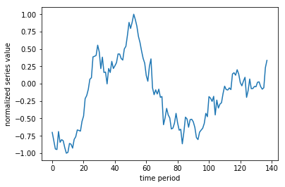
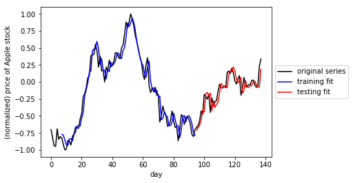

# Artificial Intelligence Nanodegree
## Recurrent Neural Network Projects

Welcome to the Recurrent Neural Network Project in the Artificial Intelligence Nanodegree! In this notebook, some template code has already been provided for you, and you will need to implement additional functionality to successfully complete this project. You will not need to modify the included code beyond what is requested. Sections that begin with **'Implementation'** in the header indicate that the following block of code will require additional functionality which you must provide. Instructions will be provided for each section and the specifics of the implementation are marked in the code block with a 'TODO' statement. Please be sure to read the instructions carefully!

In addition to implementing code, there will be questions that you must answer which relate to the project and your implementation. Each section where you will answer a question is preceded by a **'Question X'** header. Carefully read each question and provide thorough answers in the following text boxes that begin with **'Answer:'**. Your project submission will be evaluated based on your answers to each of the questions and the implementation you provide.  

>**Note:** Code and Markdown cells can be executed using the **Shift + Enter** keyboard shortcut. In addition, Markdown cells can be edited by typically double-clicking the cell to enter edit mode.

### Implementation TODOs in this notebook

This notebook contains two problems, cut into a variety of TODOs.  Make sure to complete each section containing a TODO marker throughout the notebook.  For convenience we provide links to each of these sections below.

[TODO #1: Implement a function to window time series](#TODO_1)

[TODO #2: Create a simple RNN model using keras to perform regression](#TODO_2)

[TODO #3: Finish cleaning a large text corpus](#TODO_3)

[TODO #4: Implement a function to window a large text corpus](#TODO_4)

[TODO #5: Create a simple RNN model using keras to perform multiclass classification](#TODO_5)

[TODO #6: Generate text using a fully trained RNN model and a variety of input sequences](#TODO_6)


# Problem 1: Perform time series prediction 

In this project you will perform time series prediction using a Recurrent Neural Network regressor.  In particular you will re-create the figure shown in the notes - where the stock price of Apple was forecasted (or predicted) 7 days in advance.  In completing this exercise you will learn how to construct RNNs using Keras, which will also aid in completing the second project in this notebook.

The particular network architecture we will employ for our RNN is known as  [Long Term Short Memory (LSTM)](https://en.wikipedia.org/wiki/Long_short-term_memory), which helps significantly avoid technical problems with optimization of RNNs.  

## 1.1 Getting started

First we must load in our time series - a history of around 140 days of Apple's stock price.  Then we need to perform a number of pre-processing steps to prepare it for use with an RNN model.  First off, it is good practice to normalize time series - by normalizing its range.  This helps us avoid serious numerical issues associated how common activation functions (like tanh) transform very large (positive or negative) numbers, as well as helping us to avoid related issues when computing derivatives.

Here we normalize the series to lie in the range [0,1] [using this scikit function](http://scikit-learn.org/stable/modules/generated/sklearn.preprocessing.MinMaxScaler.html), but it is also commonplace to normalize by a series standard deviation.


```python
import seaborn as sns
import pandas as pd
```


```python
### Load in necessary libraries for data input and normalization
%matplotlib inline
import numpy as np
import matplotlib.pyplot as plt

%load_ext autoreload
%autoreload 2

from my_answers import *

%load_ext autoreload
%autoreload 2

from my_answers import *

### load in and normalize the dataset
dataset = np.loadtxt('datasets/normalized_apple_prices.csv')
```

    The autoreload extension is already loaded. To reload it, use:
      %reload_ext autoreload
    The autoreload extension is already loaded. To reload it, use:
      %reload_ext autoreload


Lets take a quick look at the (normalized) time series we'll be performing predictions on.


```python
# lets take a look at our time series
#pd.DataFrame(dataset).plot()
plt.plot(dataset)
plt.xlabel('time period')
plt.ylabel('normalized series value')
```


    Text(0,0.5,u'normalized series value')





## 1.2  Cutting our time series into sequences

Remember, our time series is a sequence of numbers that we can represent in general mathematically as 

$$s_{0},s_{1},s_{2},...,s_{P}$$

where $s_{p}$ is the numerical value of the time series at time period $p$ and where $P$ is the total length of the series.  In order to apply our RNN we treat the time series prediction problem as a regression problem, and so need to use a sliding window to construct a set of associated input/output pairs to regress on.  This process is animated in the gif below.


For example - using a window of size T = 5 (as illustrated in the gif above) we produce a set of input/output pairs like the one shown in the table below

$$\begin{array}{c|c}
\text{Input} & \text{Output}\\
\hline \color{CornflowerBlue} {\langle s_{1},s_{2},s_{3},s_{4},s_{5}\rangle} & \color{Goldenrod}{ s_{6}} \\
\ \color{CornflowerBlue} {\langle s_{2},s_{3},s_{4},s_{5},s_{6} \rangle } & \color{Goldenrod} {s_{7} } \\
\color{CornflowerBlue}  {\vdots} & \color{Goldenrod} {\vdots}\\
\color{CornflowerBlue} { \langle s_{P-5},s_{P-4},s_{P-3},s_{P-2},s_{P-1} \rangle } & \color{Goldenrod} {s_{P}}
\end{array}$$

Notice here that each input is a sequence (or vector) of length 5 (and in general has length equal to the window size T) while each corresponding output is a scalar value.  Notice also how given a time series of length P and window size T = 5 as shown above, we created P - 5  input/output pairs.  More generally, for a window size T we create P - T such pairs.

Now its time for you to window the input time series as described above!  

<a id='TODO_1'></a>

**TODO:** Implement the function called **window_transform_series** in my_answers.py so that it runs a sliding window along the input series and creates associated input/output pairs.    Note that this function should input a) the series and b) the window length, and return the input/output subsequences.  Make sure to format returned input/output as generally shown in table above (where window_size = 5), and make sure your returned input is a numpy array.

-----

You can test your function on the list of odd numbers given below


```python
odd_nums = np.array([1,3,5,7,9,11,13])
```

Here is a hard-coded solution for odd_nums.  You can compare its results with what you get from your **window_transform_series** implementation.


```python
# run a window of size 2 over the odd number sequence and display the results
window_size = 2

X = []
X.append(odd_nums[0:2])
X.append(odd_nums[1:3])
X.append(odd_nums[2:4])
X.append(odd_nums[3:5])
X.append(odd_nums[4:6])

y = odd_nums[2:]

X = np.asarray(X)
y = np.asarray(y)
y = np.reshape(y, (len(y),1)) #optional

assert(type(X).__name__ == 'ndarray')
assert(type(y).__name__ == 'ndarray')
assert(X.shape == (5,2))
assert(y.shape in [(5,1), (5,)])

# print out input/output pairs --> here input = X, corresponding output = y
print ('--- the input X will look like ----')
print (X)

print ('--- the associated output y will look like ----')
print (y)
```

    --- the input X will look like ----
    [[ 1  3]
     [ 3  5]
     [ 5  7]
     [ 7  9]
     [ 9 11]]
    --- the associated output y will look like ----
    [[ 5]
     [ 7]
     [ 9]
     [11]
     [13]]


Again - you can check that your completed **window_transform_series** function works correctly by trying it on the odd_nums sequence - you should get the above output.


```python
### TODO: implement the function window_transform_series in the file my_answers.py
from my_answers import window_transform_series
```

With this function in place apply it to the series in the Python cell below.  We use a window_size = 7 for these experiments.


```python
# window the data using your windowing function
window_size = 7
X,y = window_transform_series(series = dataset, window_size = window_size)
```


```python
X.shape,y.shape
```


    ((131, 7), (131, 1))


## 1.3  Splitting into training and testing sets

In order to perform proper testing on our dataset we will lop off the last 1/3 of it for validation (or testing).  This is that once we train our model we have something to test it on (like any regression problem!).  This splitting into training/testing sets is done in the cell below.

Note how here we are **not** splitting the dataset *randomly* as one typically would do when validating a regression model.  This is because our input/output pairs *are related temporally*.   We don't want to validate our model by training on a random subset of the series and then testing on another random subset, as this simulates the scenario that we receive new points *within the timeframe of our training set*.  

We want to train on one solid chunk of the series (in our case, the first full 2/3 of it), and validate on a later chunk (the last 1/3) as this simulates how we would predict *future* values of a time series.


```python
# split our dataset into training / testing sets
train_test_split = int(np.ceil(2*len(y)/float(3)))   # set the split point

print(train_test_split)

# partition the training set
X_train = X[:train_test_split,:]
y_train = y[:train_test_split]

# keep the last chunk for testing
X_test = X[train_test_split:,:]
y_test = y[train_test_split:]

# NOTE: to use keras's RNN LSTM module our input must be reshaped to [samples, window size, stepsize] 
X_train = np.asarray(np.reshape(X_train, (X_train.shape[0], window_size, 1)))
X_test = np.asarray(np.reshape(X_test, (X_test.shape[0], window_size, 1)))
```

    88


<a id='TODO_2'></a>

## 1.4  Build and run an RNN regression model

Having created input/output pairs out of our time series and cut this into training/testing sets, we can now begin setting up our RNN.  We use Keras to quickly build a two hidden layer RNN of the following specifications

- layer 1 uses an LSTM module with 5 hidden units (note here the input_shape = (window_size,1))
- layer 2 uses a fully connected module with one unit
- the 'mean_squared_error' loss should be used (remember: we are performing regression here)

This can be constructed using just a few lines - see e.g., the [general Keras documentation](https://keras.io/getting-started/sequential-model-guide/) and the [LSTM documentation in particular](https://keras.io/layers/recurrent/) for examples of how to quickly use Keras to build neural network models.  Make sure you are initializing your optimizer given the [keras-recommended approach for RNNs](https://keras.io/optimizers/) 

(given in the cell below).  (remember to copy your completed function into the script *my_answers.py* function titled *build_part1_RNN* before submitting your project)


```python
### TODO: create required RNN model
# import keras network libraries
from keras.models import Sequential
from keras.layers import Dense
from keras.layers import LSTM
import keras

# given - fix random seed - so we can all reproduce the same results on our default time series
np.random.seed(0)


# TODO: implement build_part1_RNN in my_answers.py
from my_answers import build_part1_RNN
model = build_part1_RNN(window_size)

# build model using keras documentation recommended optimizer initialization
optimizer = keras.optimizers.RMSprop(lr=0.001, rho=0.9, epsilon=1e-08, decay=0.0)

# compile the model
model.compile(loss='mean_squared_error', optimizer=optimizer)
```

With your model built you can now fit the model by activating the cell below!  Note: the number of epochs (np_epochs) and batch_size are preset (so we can all produce the same results).  You can choose to toggle the verbose parameter - which gives you regular updates on the progress of the algorithm - on and off by setting it to 1 or 0 respectively.


```python
# run your model!
model.fit(X_train, y_train, epochs=1000, batch_size=50, verbose=1)
```

    Epoch 1/1000
    88/88 [==============================] - 0s - loss: 0.0163     
    Epoch 2/1000
    88/88 [==============================] - 0s - loss: 0.0163     
    Epoch 3/1000
    88/88 [==============================] - 0s - loss: 0.0163     
    Epoch 4/1000
    88/88 [==============================] - 0s - loss: 0.0163     
    Epoch 5/1000
    88/88 [==============================] - 0s - loss: 0.0163     
    Epoch 6/1000
    88/88 [==============================] - 0s - loss: 0.0163     
    Epoch 7/1000
    88/88 [==============================] - 0s - loss: 0.0163     
    Epoch 8/1000
    88/88 [==============================] - 0s - loss: 0.0165     
    Epoch 9/1000
    88/88 [==============================] - 0s - loss: 0.0164     
    Epoch 10/1000
    88/88 [==============================] - 0s - loss: 0.0163     
    Epoch 11/1000
    88/88 [==============================] - 0s - loss: 0.0163     
    Epoch 12/1000
    88/88 [==============================] - 0s - loss: 0.0163     
    Epoch 13/1000
    88/88 [==============================] - 0s - loss: 0.0164     
    Epoch 14/1000
    88/88 [==============================] - 0s - loss: 0.0164     
    Epoch 15/1000
    88/88 [==============================] - 0s - loss: 0.0166     
    Epoch 16/1000
    88/88 [==============================] - 0s - loss: 0.0163     
    Epoch 17/1000
    88/88 [==============================] - 0s - loss: 0.0163     
    Epoch 18/1000
    88/88 [==============================] - 0s - loss: 0.0163     
    Epoch 19/1000
    88/88 [==============================] - 0s - loss: 0.0162     
    Epoch 20/1000
    88/88 [==============================] - 0s - loss: 0.0163     
    Epoch 21/1000
    88/88 [==============================] - 0s - loss: 0.0164     
    Epoch 22/1000
    88/88 [==============================] - 0s - loss: 0.0162     
    Epoch 23/1000
    88/88 [==============================] - 0s - loss: 0.0162     
    Epoch 24/1000
    88/88 [==============================] - 0s - loss: 0.0163     
    Epoch 25/1000
    88/88 [==============================] - 0s - loss: 0.0163     
    Epoch 26/1000
    88/88 [==============================] - 0s - loss: 0.0164     
    Epoch 27/1000
    88/88 [==============================] - 0s - loss: 0.0164     
    Epoch 28/1000
    88/88 [==============================] - 0s - loss: 0.0163     
    Epoch 29/1000
    88/88 [==============================] - 0s - loss: 0.0163     
    Epoch 30/1000
    88/88 [==============================] - 0s - loss: 0.0163     
    Epoch 31/1000
    88/88 [==============================] - 0s - loss: 0.0162     
    Epoch 32/1000
    88/88 [==============================] - 0s - loss: 0.0162     
    Epoch 33/1000
    88/88 [==============================] - 0s - loss: 0.0162     
    Epoch 34/1000
    88/88 [==============================] - 0s - loss: 0.0162     
    Epoch 35/1000
    88/88 [==============================] - 0s - loss: 0.0163     
    Epoch 36/1000
    88/88 [==============================] - 0s - loss: 0.0165     
    Epoch 37/1000
    88/88 [==============================] - 0s - loss: 0.0162     
    Epoch 38/1000
    88/88 [==============================] - 0s - loss: 0.0163     
    Epoch 39/1000
    88/88 [==============================] - 0s - loss: 0.0163     
    Epoch 40/1000
    88/88 [==============================] - 0s - loss: 0.0163     
    Epoch 41/1000
    88/88 [==============================] - 0s - loss: 0.0164     
    Epoch 42/1000
    88/88 [==============================] - 0s - loss: 0.0162     
    Epoch 43/1000
    88/88 [==============================] - 0s - loss: 0.0164     
    Epoch 44/1000
    88/88 [==============================] - 0s - loss: 0.0164     
    Epoch 45/1000
    88/88 [==============================] - 0s - loss: 0.0163     
    Epoch 46/1000
    88/88 [==============================] - 0s - loss: 0.0162     
    Epoch 47/1000
    88/88 [==============================] - 0s - loss: 0.0163     
    Epoch 48/1000
    88/88 [==============================] - 0s - loss: 0.0164     
    Epoch 49/1000
    88/88 [==============================] - 0s - loss: 0.0163     
    Epoch 50/1000
    88/88 [==============================] - 0s - loss: 0.0165     
    Epoch 51/1000
    88/88 [==============================] - 0s - loss: 0.0165     
    Epoch 52/1000
    88/88 [==============================] - 0s - loss: 0.0163     
    Epoch 53/1000
    88/88 [==============================] - 0s - loss: 0.0162     
    Epoch 54/1000
    88/88 [==============================] - 0s - loss: 0.0163     
    Epoch 55/1000
    88/88 [==============================] - 0s - loss: 0.0162     
    Epoch 56/1000
    88/88 [==============================] - 0s - loss: 0.0163     
    Epoch 57/1000
    88/88 [==============================] - 0s - loss: 0.0163     
    Epoch 58/1000
    88/88 [==============================] - 0s - loss: 0.0162     
    Epoch 59/1000
    88/88 [==============================] - 0s - loss: 0.0162     
    Epoch 60/1000
    88/88 [==============================] - 0s - loss: 0.0162     
    Epoch 61/1000
    88/88 [==============================] - 0s - loss: 0.0163     
    Epoch 62/1000
    88/88 [==============================] - 0s - loss: 0.0162     
    Epoch 63/1000
    88/88 [==============================] - 0s - loss: 0.0164     
    Epoch 64/1000
    88/88 [==============================] - 0s - loss: 0.0163     
    Epoch 65/1000
    88/88 [==============================] - 0s - loss: 0.0165     
    Epoch 66/1000
    88/88 [==============================] - 0s - loss: 0.0162     
    Epoch 67/1000
    88/88 [==============================] - 0s - loss: 0.0163     
    Epoch 68/1000
    88/88 [==============================] - 0s - loss: 0.0163     
    Epoch 69/1000
    88/88 [==============================] - 0s - loss: 0.0162     
    Epoch 70/1000
    88/88 [==============================] - 0s - loss: 0.0162     
    Epoch 71/1000
    88/88 [==============================] - 0s - loss: 0.0164     
    Epoch 72/1000
    88/88 [==============================] - 0s - loss: 0.0164     
    Epoch 73/1000
    88/88 [==============================] - 0s - loss: 0.0162     
    Epoch 74/1000
    88/88 [==============================] - 0s - loss: 0.0162     
    Epoch 75/1000
    88/88 [==============================] - 0s - loss: 0.0162     
    Epoch 76/1000
    88/88 [==============================] - 0s - loss: 0.0163     
    Epoch 77/1000
    88/88 [==============================] - 0s - loss: 0.0166     
    Epoch 78/1000
    88/88 [==============================] - 0s - loss: 0.0163     
    Epoch 79/1000
    88/88 [==============================] - 0s - loss: 0.0163     
    Epoch 80/1000
    88/88 [==============================] - 0s - loss: 0.0162     
    Epoch 81/1000
    88/88 [==============================] - 0s - loss: 0.0162     
    Epoch 82/1000
    88/88 [==============================] - 0s - loss: 0.0162     
    Epoch 83/1000
    88/88 [==============================] - 0s - loss: 0.0162     
    Epoch 84/1000
    88/88 [==============================] - 0s - loss: 0.0162     
    Epoch 85/1000
    88/88 [==============================] - 0s - loss: 0.0162     
    Epoch 86/1000
    88/88 [==============================] - 0s - loss: 0.0162     
    Epoch 87/1000
    88/88 [==============================] - 0s - loss: 0.0162     
    Epoch 88/1000
    88/88 [==============================] - 0s - loss: 0.0162     
    Epoch 89/1000
    88/88 [==============================] - 0s - loss: 0.0161     
    Epoch 90/1000
    88/88 [==============================] - 0s - loss: 0.0163     
    Epoch 91/1000
    88/88 [==============================] - 0s - loss: 0.0164     
    Epoch 92/1000
    88/88 [==============================] - 0s - loss: 0.0162     
    Epoch 93/1000
    88/88 [==============================] - 0s - loss: 0.0163     
    Epoch 94/1000
    88/88 [==============================] - 0s - loss: 0.0164     
    Epoch 95/1000
    88/88 [==============================] - 0s - loss: 0.0161     
    Epoch 96/1000
    88/88 [==============================] - 0s - loss: 0.0162     
    Epoch 97/1000
    88/88 [==============================] - 0s - loss: 0.0162     
    Epoch 98/1000
    88/88 [==============================] - 0s - loss: 0.0163     
    Epoch 99/1000
    88/88 [==============================] - 0s - loss: 0.0162     
    Epoch 100/1000
    88/88 [==============================] - 0s - loss: 0.0162     
    Epoch 101/1000
    88/88 [==============================] - ETA: 0s - loss: 0.016 - 0s - loss: 0.0163     
    Epoch 102/1000
    88/88 [==============================] - 0s - loss: 0.0163     
    Epoch 103/1000
    88/88 [==============================] - 0s - loss: 0.0163     
    Epoch 104/1000
    88/88 [==============================] - ETA: 0s - loss: 0.016 - 0s - loss: 0.0161     
    Epoch 105/1000
    88/88 [==============================] - 0s - loss: 0.0169     
    Epoch 106/1000
    88/88 [==============================] - 0s - loss: 0.0162     
    Epoch 107/1000
    88/88 [==============================] - 0s - loss: 0.0162     
    Epoch 108/1000
    88/88 [==============================] - 0s - loss: 0.0162     
    Epoch 109/1000
    88/88 [==============================] - 0s - loss: 0.0161     
    Epoch 110/1000
    88/88 [==============================] - 0s - loss: 0.0161     
    Epoch 111/1000
    88/88 [==============================] - 0s - loss: 0.0163     
    Epoch 112/1000
    88/88 [==============================] - 0s - loss: 0.0162     
    Epoch 113/1000
    88/88 [==============================] - 0s - loss: 0.0161     
    Epoch 114/1000
    88/88 [==============================] - 0s - loss: 0.0162     
    Epoch 115/1000
    88/88 [==============================] - 0s - loss: 0.0161     
    Epoch 116/1000
    88/88 [==============================] - 0s - loss: 0.0164     
    Epoch 117/1000
    88/88 [==============================] - 0s - loss: 0.0165     
    Epoch 118/1000
    88/88 [==============================] - 0s - loss: 0.0162     
    Epoch 119/1000
    88/88 [==============================] - 0s - loss: 0.0162     
    Epoch 120/1000
    88/88 [==============================] - 0s - loss: 0.0161     
    Epoch 121/1000
    88/88 [==============================] - 0s - loss: 0.0162     
    Epoch 122/1000
    88/88 [==============================] - 0s - loss: 0.0162     
    Epoch 123/1000
    88/88 [==============================] - 0s - loss: 0.0162     
    Epoch 124/1000
    88/88 [==============================] - 0s - loss: 0.0162     
    Epoch 125/1000
    88/88 [==============================] - 0s - loss: 0.0163     
    Epoch 126/1000
    88/88 [==============================] - 0s - loss: 0.0161     
    Epoch 127/1000
    88/88 [==============================] - 0s - loss: 0.0161     
    Epoch 128/1000
    88/88 [==============================] - 0s - loss: 0.0162     
    Epoch 129/1000
    88/88 [==============================] - 0s - loss: 0.0161     
    Epoch 130/1000
    88/88 [==============================] - 0s - loss: 0.0163     
    Epoch 131/1000
    88/88 [==============================] - 0s - loss: 0.0161     
    Epoch 132/1000
    88/88 [==============================] - 0s - loss: 0.0162     
    Epoch 133/1000
    88/88 [==============================] - 0s - loss: 0.0161     
    Epoch 134/1000
    88/88 [==============================] - 0s - loss: 0.0161     
    Epoch 135/1000
    88/88 [==============================] - 0s - loss: 0.0163     
    Epoch 136/1000
    88/88 [==============================] - 0s - loss: 0.0163     
    Epoch 137/1000
    88/88 [==============================] - ETA: 0s - loss: 0.017 - 0s - loss: 0.0161     
    Epoch 138/1000
    88/88 [==============================] - 0s - loss: 0.0162     
    Epoch 139/1000
    88/88 [==============================] - 0s - loss: 0.0166     
    Epoch 140/1000
    88/88 [==============================] - 0s - loss: 0.0161     
    Epoch 141/1000
    88/88 [==============================] - 0s - loss: 0.0161     
    Epoch 142/1000
    88/88 [==============================] - 0s - loss: 0.0161     
    Epoch 143/1000
    88/88 [==============================] - 0s - loss: 0.0162     
    Epoch 144/1000
    88/88 [==============================] - 0s - loss: 0.0161     
    Epoch 145/1000
    88/88 [==============================] - 0s - loss: 0.0167     
    Epoch 146/1000
    88/88 [==============================] - 0s - loss: 0.0161     
    Epoch 147/1000
    88/88 [==============================] - 0s - loss: 0.0163     
    Epoch 148/1000
    88/88 [==============================] - 0s - loss: 0.0161     
    Epoch 149/1000
    88/88 [==============================] - 0s - loss: 0.0163     
    Epoch 150/1000
    88/88 [==============================] - 0s - loss: 0.0161     
    Epoch 151/1000
    88/88 [==============================] - ETA: 0s - loss: 0.017 - 0s - loss: 0.0161     
    Epoch 152/1000
    88/88 [==============================] - 0s - loss: 0.0161     
    Epoch 153/1000
    88/88 [==============================] - 0s - loss: 0.0162     
    Epoch 154/1000
    88/88 [==============================] - ETA: 0s - loss: 0.020 - 0s - loss: 0.0161     
    Epoch 155/1000
    88/88 [==============================] - 0s - loss: 0.0161     
    Epoch 156/1000
    88/88 [==============================] - 0s - loss: 0.0161     
    Epoch 157/1000
    88/88 [==============================] - 0s - loss: 0.0161     
    Epoch 158/1000
    88/88 [==============================] - 0s - loss: 0.0162     
    Epoch 159/1000
    88/88 [==============================] - 0s - loss: 0.0161     
    Epoch 160/1000
    88/88 [==============================] - 0s - loss: 0.0161     
    Epoch 161/1000
    88/88 [==============================] - 0s - loss: 0.0162     
    Epoch 162/1000
    88/88 [==============================] - 0s - loss: 0.0164     
    Epoch 163/1000
    88/88 [==============================] - 0s - loss: 0.0161     
    Epoch 164/1000
    88/88 [==============================] - 0s - loss: 0.0161     
    Epoch 165/1000
    88/88 [==============================] - 0s - loss: 0.0161     
    Epoch 166/1000
    88/88 [==============================] - 0s - loss: 0.0162     
    Epoch 167/1000
    88/88 [==============================] - 0s - loss: 0.0163     
    Epoch 168/1000
    88/88 [==============================] - 0s - loss: 0.0161     
    Epoch 169/1000
    88/88 [==============================] - 0s - loss: 0.0161     
    Epoch 170/1000
    88/88 [==============================] - 0s - loss: 0.0162     
    Epoch 171/1000
    88/88 [==============================] - 0s - loss: 0.0161     
    Epoch 172/1000
    88/88 [==============================] - ETA: 0s - loss: 0.015 - 0s - loss: 0.0161     
    Epoch 173/1000
    88/88 [==============================] - 0s - loss: 0.0162     
    Epoch 174/1000
    88/88 [==============================] - 0s - loss: 0.0161     
    Epoch 175/1000
    88/88 [==============================] - 0s - loss: 0.0162     
    Epoch 176/1000
    88/88 [==============================] - 0s - loss: 0.0162     
    Epoch 177/1000
    88/88 [==============================] - 0s - loss: 0.0162     
    Epoch 178/1000
    88/88 [==============================] - 0s - loss: 0.0161     
    Epoch 179/1000
    88/88 [==============================] - 0s - loss: 0.0161     
    Epoch 180/1000
    88/88 [==============================] - 0s - loss: 0.0160     
    Epoch 181/1000
    88/88 [==============================] - 0s - loss: 0.0161     
    Epoch 182/1000
    88/88 [==============================] - 0s - loss: 0.0161     
    Epoch 183/1000
    88/88 [==============================] - 0s - loss: 0.0162     
    Epoch 184/1000
    88/88 [==============================] - 0s - loss: 0.0161     
    Epoch 185/1000
    88/88 [==============================] - 0s - loss: 0.0163     
    Epoch 186/1000
    88/88 [==============================] - 0s - loss: 0.0161     
    Epoch 187/1000
    88/88 [==============================] - 0s - loss: 0.0160     
    Epoch 188/1000
    88/88 [==============================] - 0s - loss: 0.0161     
    Epoch 189/1000
    88/88 [==============================] - 0s - loss: 0.0161     
    Epoch 190/1000
    88/88 [==============================] - ETA: 0s - loss: 0.017 - 0s - loss: 0.0161     
    Epoch 191/1000
    88/88 [==============================] - 0s - loss: 0.0161     
    Epoch 192/1000
    88/88 [==============================] - 0s - loss: 0.0160     
    Epoch 193/1000
    88/88 [==============================] - 0s - loss: 0.0169     
    Epoch 194/1000
    88/88 [==============================] - 0s - loss: 0.0161     
    Epoch 195/1000
    88/88 [==============================] - 0s - loss: 0.0161     
    Epoch 196/1000
    88/88 [==============================] - 0s - loss: 0.0160     
    Epoch 197/1000
    88/88 [==============================] - 0s - loss: 0.0161     
    Epoch 198/1000
    88/88 [==============================] - 0s - loss: 0.0163     
    Epoch 199/1000
    88/88 [==============================] - 0s - loss: 0.0161     
    Epoch 200/1000
    88/88 [==============================] - 0s - loss: 0.0160     
    Epoch 201/1000
    88/88 [==============================] - 0s - loss: 0.0162     
    Epoch 202/1000
    88/88 [==============================] - 0s - loss: 0.0161     
    Epoch 203/1000
    88/88 [==============================] - 0s - loss: 0.0161     
    Epoch 204/1000
    88/88 [==============================] - 0s - loss: 0.0160     
    Epoch 205/1000
    88/88 [==============================] - 0s - loss: 0.0161     
    Epoch 206/1000
    88/88 [==============================] - 0s - loss: 0.0163     
    Epoch 207/1000
    88/88 [==============================] - 0s - loss: 0.0162     
    Epoch 208/1000
    88/88 [==============================] - ETA: 0s - loss: 0.014 - 0s - loss: 0.0162     
    Epoch 209/1000
    88/88 [==============================] - ETA: 0s - loss: 0.019 - 0s - loss: 0.0160     
    Epoch 210/1000
    88/88 [==============================] - 0s - loss: 0.0160     
    Epoch 211/1000
    88/88 [==============================] - 0s - loss: 0.0161     
    Epoch 212/1000
    88/88 [==============================] - 0s - loss: 0.0160     
    Epoch 213/1000
    88/88 [==============================] - 0s - loss: 0.0160     
    Epoch 214/1000
    88/88 [==============================] - 0s - loss: 0.0161     
    Epoch 215/1000
    88/88 [==============================] - 0s - loss: 0.0163     
    Epoch 216/1000
    88/88 [==============================] - 0s - loss: 0.0164     
    Epoch 217/1000
    88/88 [==============================] - 0s - loss: 0.0160     
    Epoch 218/1000
    88/88 [==============================] - 0s - loss: 0.0160     
    Epoch 219/1000
    88/88 [==============================] - 0s - loss: 0.0160     
    Epoch 220/1000
    88/88 [==============================] - 0s - loss: 0.0162     
    Epoch 221/1000
    88/88 [==============================] - 0s - loss: 0.0160     
    Epoch 222/1000
    88/88 [==============================] - 0s - loss: 0.0161     
    Epoch 223/1000
    88/88 [==============================] - 0s - loss: 0.0165     
    Epoch 224/1000
    88/88 [==============================] - 0s - loss: 0.0161     
    Epoch 225/1000
    88/88 [==============================] - 0s - loss: 0.0161     
    Epoch 226/1000
    88/88 [==============================] - 0s - loss: 0.0161     
    Epoch 227/1000
    88/88 [==============================] - 0s - loss: 0.0163     
    Epoch 228/1000
    88/88 [==============================] - 0s - loss: 0.0160     
    Epoch 229/1000
    88/88 [==============================] - 0s - loss: 0.0160     
    Epoch 230/1000
    88/88 [==============================] - ETA: 0s - loss: 0.013 - 0s - loss: 0.0161     
    Epoch 231/1000
    88/88 [==============================] - 0s - loss: 0.0161     
    Epoch 232/1000
    88/88 [==============================] - 0s - loss: 0.0160     
    Epoch 233/1000
    88/88 [==============================] - 0s - loss: 0.0160     
    Epoch 234/1000
    88/88 [==============================] - 0s - loss: 0.0160     
    Epoch 235/1000
    88/88 [==============================] - 0s - loss: 0.0161     
    Epoch 236/1000
    88/88 [==============================] - 0s - loss: 0.0161     
    Epoch 237/1000
    88/88 [==============================] - 0s - loss: 0.0163     
    Epoch 238/1000
    88/88 [==============================] - 0s - loss: 0.0160     
    Epoch 239/1000
    88/88 [==============================] - 0s - loss: 0.0160     
    Epoch 240/1000
    88/88 [==============================] - 0s - loss: 0.0165     
    Epoch 241/1000
    88/88 [==============================] - 0s - loss: 0.0161     
    Epoch 242/1000
    88/88 [==============================] - 0s - loss: 0.0160     
    Epoch 243/1000
    88/88 [==============================] - 0s - loss: 0.0161     
    Epoch 244/1000
    88/88 [==============================] - 0s - loss: 0.0160     
    Epoch 245/1000
    88/88 [==============================] - 0s - loss: 0.0160     
    Epoch 246/1000
    88/88 [==============================] - 0s - loss: 0.0161     
    Epoch 247/1000
    88/88 [==============================] - 0s - loss: 0.0160     
    Epoch 248/1000
    88/88 [==============================] - 0s - loss: 0.0162     
    Epoch 249/1000
    88/88 [==============================] - 0s - loss: 0.0160     
    Epoch 250/1000
    88/88 [==============================] - 0s - loss: 0.0160     
    Epoch 251/1000
    88/88 [==============================] - 0s - loss: 0.0164     
    Epoch 252/1000
    88/88 [==============================] - 0s - loss: 0.0160     
    Epoch 253/1000
    88/88 [==============================] - 0s - loss: 0.0161     
    Epoch 254/1000
    88/88 [==============================] - 0s - loss: 0.0160     
    Epoch 255/1000
    88/88 [==============================] - 0s - loss: 0.0161     
    Epoch 256/1000
    88/88 [==============================] - 0s - loss: 0.0162     
    Epoch 257/1000
    88/88 [==============================] - 0s - loss: 0.0160     
    Epoch 258/1000
    88/88 [==============================] - 0s - loss: 0.0160     
    Epoch 259/1000
    88/88 [==============================] - ETA: 0s - loss: 0.013 - 0s - loss: 0.0160     
    Epoch 260/1000
    88/88 [==============================] - 0s - loss: 0.0160     
    Epoch 261/1000
    88/88 [==============================] - 0s - loss: 0.0161     
    Epoch 262/1000
    88/88 [==============================] - 0s - loss: 0.0160     
    Epoch 263/1000
    88/88 [==============================] - 0s - loss: 0.0160     
    Epoch 264/1000
    88/88 [==============================] - 0s - loss: 0.0160     
    Epoch 265/1000
    88/88 [==============================] - 0s - loss: 0.0161     
    Epoch 266/1000
    88/88 [==============================] - 0s - loss: 0.0167     
    Epoch 267/1000
    88/88 [==============================] - 0s - loss: 0.0160     
    Epoch 268/1000
    88/88 [==============================] - 0s - loss: 0.0161     
    Epoch 269/1000
    88/88 [==============================] - 0s - loss: 0.0160     
    Epoch 270/1000
    88/88 [==============================] - 0s - loss: 0.0159     
    Epoch 271/1000
    88/88 [==============================] - 0s - loss: 0.0162     
    Epoch 272/1000
    88/88 [==============================] - 0s - loss: 0.0160     
    Epoch 273/1000
    88/88 [==============================] - 0s - loss: 0.0159     
    Epoch 274/1000
    88/88 [==============================] - 0s - loss: 0.0160     
    Epoch 275/1000
    88/88 [==============================] - 0s - loss: 0.0162     
    Epoch 276/1000
    88/88 [==============================] - 0s - loss: 0.0160     
    Epoch 277/1000
    88/88 [==============================] - 0s - loss: 0.0161     
    Epoch 278/1000
    88/88 [==============================] - 0s - loss: 0.0162     
    Epoch 279/1000
    88/88 [==============================] - 0s - loss: 0.0159     
    Epoch 280/1000
    88/88 [==============================] - 0s - loss: 0.0161     
    Epoch 281/1000
    88/88 [==============================] - 0s - loss: 0.0160     
    Epoch 282/1000
    88/88 [==============================] - 0s - loss: 0.0159     
    Epoch 283/1000
    88/88 [==============================] - 0s - loss: 0.0160     
    Epoch 284/1000
    88/88 [==============================] - 0s - loss: 0.0159     
    Epoch 285/1000
    88/88 [==============================] - 0s - loss: 0.0159     
    Epoch 286/1000
    88/88 [==============================] - 0s - loss: 0.0160     
    Epoch 287/1000
    88/88 [==============================] - 0s - loss: 0.0162     
    Epoch 288/1000
    88/88 [==============================] - 0s - loss: 0.0161     
    Epoch 289/1000
    88/88 [==============================] - 0s - loss: 0.0162     
    Epoch 290/1000
    88/88 [==============================] - 0s - loss: 0.0159     
    Epoch 291/1000
    88/88 [==============================] - 0s - loss: 0.0159     
    Epoch 292/1000
    88/88 [==============================] - 0s - loss: 0.0160     
    Epoch 293/1000
    88/88 [==============================] - 0s - loss: 0.0159     
    Epoch 294/1000
    88/88 [==============================] - 0s - loss: 0.0160     
    Epoch 295/1000
    88/88 [==============================] - 0s - loss: 0.0160     
    Epoch 296/1000
    88/88 [==============================] - 0s - loss: 0.0160     
    Epoch 297/1000
    88/88 [==============================] - 0s - loss: 0.0161     
    Epoch 298/1000
    88/88 [==============================] - 0s - loss: 0.0160     
    Epoch 299/1000
    88/88 [==============================] - 0s - loss: 0.0160     
    Epoch 300/1000
    88/88 [==============================] - 0s - loss: 0.0159     
    Epoch 301/1000
    88/88 [==============================] - 0s - loss: 0.0161     
    Epoch 302/1000
    88/88 [==============================] - 0s - loss: 0.0159     
    Epoch 303/1000
    88/88 [==============================] - 0s - loss: 0.0159     
    Epoch 304/1000
    88/88 [==============================] - 0s - loss: 0.0162     
    Epoch 305/1000
    88/88 [==============================] - 0s - loss: 0.0159     
    Epoch 306/1000
    88/88 [==============================] - 0s - loss: 0.0160     
    Epoch 307/1000
    88/88 [==============================] - 0s - loss: 0.0160     
    Epoch 308/1000
    88/88 [==============================] - 0s - loss: 0.0159     
    Epoch 309/1000
    88/88 [==============================] - 0s - loss: 0.0160     
    Epoch 310/1000
    88/88 [==============================] - 0s - loss: 0.0159     
    Epoch 311/1000
    88/88 [==============================] - 0s - loss: 0.0159     
    Epoch 312/1000
    88/88 [==============================] - 0s - loss: 0.0159     
    Epoch 313/1000
    88/88 [==============================] - 0s - loss: 0.0159     
    Epoch 314/1000
    88/88 [==============================] - 0s - loss: 0.0159     
    Epoch 315/1000
    88/88 [==============================] - 0s - loss: 0.0162     
    Epoch 316/1000
    88/88 [==============================] - 0s - loss: 0.0160     
    Epoch 317/1000
    88/88 [==============================] - ETA: 0s - loss: 0.012 - 0s - loss: 0.0161     
    Epoch 318/1000
    88/88 [==============================] - 0s - loss: 0.0162     
    Epoch 319/1000
    88/88 [==============================] - 0s - loss: 0.0161     
    Epoch 320/1000
    88/88 [==============================] - 0s - loss: 0.0159     
    Epoch 321/1000
    88/88 [==============================] - 0s - loss: 0.0160     
    Epoch 322/1000
    88/88 [==============================] - 0s - loss: 0.0159     
    Epoch 323/1000
    88/88 [==============================] - 0s - loss: 0.0159     
    Epoch 324/1000
    88/88 [==============================] - 0s - loss: 0.0160     
    Epoch 325/1000
    88/88 [==============================] - 0s - loss: 0.0162     
    Epoch 326/1000
    88/88 [==============================] - 0s - loss: 0.0164     
    Epoch 327/1000
    88/88 [==============================] - 0s - loss: 0.0160     
    Epoch 328/1000
    88/88 [==============================] - 0s - loss: 0.0159     
    Epoch 329/1000
    88/88 [==============================] - 0s - loss: 0.0159     
    Epoch 330/1000
    88/88 [==============================] - 0s - loss: 0.0159     
    Epoch 331/1000
    88/88 [==============================] - 0s - loss: 0.0159     
    Epoch 332/1000
    88/88 [==============================] - 0s - loss: 0.0159     
    Epoch 333/1000
    88/88 [==============================] - 0s - loss: 0.0160     
    Epoch 334/1000
    88/88 [==============================] - 0s - loss: 0.0163     
    Epoch 335/1000
    88/88 [==============================] - 0s - loss: 0.0159     
    Epoch 336/1000
    88/88 [==============================] - 0s - loss: 0.0159     
    Epoch 337/1000
    88/88 [==============================] - 0s - loss: 0.0159     
    Epoch 338/1000
    88/88 [==============================] - 0s - loss: 0.0159     
    Epoch 339/1000
    88/88 [==============================] - 0s - loss: 0.0159     
    Epoch 340/1000
    88/88 [==============================] - 0s - loss: 0.0160     
    Epoch 341/1000
    88/88 [==============================] - 0s - loss: 0.0159     
    Epoch 342/1000
    88/88 [==============================] - 0s - loss: 0.0163     
    Epoch 343/1000
    88/88 [==============================] - 0s - loss: 0.0161     
    Epoch 344/1000
    88/88 [==============================] - 0s - loss: 0.0159     
    Epoch 345/1000
    88/88 [==============================] - 0s - loss: 0.0161     
    Epoch 346/1000
    88/88 [==============================] - 0s - loss: 0.0159     
    Epoch 347/1000
    88/88 [==============================] - 0s - loss: 0.0163     
    Epoch 348/1000
    88/88 [==============================] - 0s - loss: 0.0159     
    Epoch 349/1000
    88/88 [==============================] - 0s - loss: 0.0159     
    Epoch 350/1000
    88/88 [==============================] - 0s - loss: 0.0160     
    Epoch 351/1000
    88/88 [==============================] - 0s - loss: 0.0159     
    Epoch 352/1000
    88/88 [==============================] - 0s - loss: 0.0161     
    Epoch 353/1000
    88/88 [==============================] - 0s - loss: 0.0159     
    Epoch 354/1000
    88/88 [==============================] - 0s - loss: 0.0160     
    Epoch 355/1000
    88/88 [==============================] - 0s - loss: 0.0159     
    Epoch 356/1000
    88/88 [==============================] - 0s - loss: 0.0159     
    Epoch 357/1000
    88/88 [==============================] - 0s - loss: 0.0160     
    Epoch 358/1000
    88/88 [==============================] - 0s - loss: 0.0159     
    Epoch 359/1000
    88/88 [==============================] - 0s - loss: 0.0159     
    Epoch 360/1000
    88/88 [==============================] - 0s - loss: 0.0163     
    Epoch 361/1000
    88/88 [==============================] - 0s - loss: 0.0159     
    Epoch 362/1000
    88/88 [==============================] - 0s - loss: 0.0159     
    Epoch 363/1000
    88/88 [==============================] - 0s - loss: 0.0160     
    Epoch 364/1000
    88/88 [==============================] - 0s - loss: 0.0159     
    Epoch 365/1000
    88/88 [==============================] - 0s - loss: 0.0159     
    Epoch 366/1000
    88/88 [==============================] - 0s - loss: 0.0160     
    Epoch 367/1000
    88/88 [==============================] - 0s - loss: 0.0164     
    Epoch 368/1000
    88/88 [==============================] - 0s - loss: 0.0160     
    Epoch 369/1000
    88/88 [==============================] - 0s - loss: 0.0160     
    Epoch 370/1000
    88/88 [==============================] - 0s - loss: 0.0158     
    Epoch 371/1000
    88/88 [==============================] - 0s - loss: 0.0158     
    Epoch 372/1000
    88/88 [==============================] - 0s - loss: 0.0160     
    Epoch 373/1000
    88/88 [==============================] - 0s - loss: 0.0159     
    Epoch 374/1000
    88/88 [==============================] - 0s - loss: 0.0158     
    Epoch 375/1000
    88/88 [==============================] - 0s - loss: 0.0159     
    Epoch 376/1000
    88/88 [==============================] - 0s - loss: 0.0161     
    Epoch 377/1000
    88/88 [==============================] - 0s - loss: 0.0159     
    Epoch 378/1000
    88/88 [==============================] - 0s - loss: 0.0159     
    Epoch 379/1000
    88/88 [==============================] - 0s - loss: 0.0160     
    Epoch 380/1000
    88/88 [==============================] - 0s - loss: 0.0158     
    Epoch 381/1000
    88/88 [==============================] - 0s - loss: 0.0162     
    Epoch 382/1000
    88/88 [==============================] - 0s - loss: 0.0158     
    Epoch 383/1000
    88/88 [==============================] - 0s - loss: 0.0160     
    Epoch 384/1000
    88/88 [==============================] - 0s - loss: 0.0159     
    Epoch 385/1000
    88/88 [==============================] - 0s - loss: 0.0159     
    Epoch 386/1000
    88/88 [==============================] - 0s - loss: 0.0162     
    Epoch 387/1000
    88/88 [==============================] - 0s - loss: 0.0160     
    Epoch 388/1000
    88/88 [==============================] - 0s - loss: 0.0160     
    Epoch 389/1000
    88/88 [==============================] - 0s - loss: 0.0158     
    Epoch 390/1000
    88/88 [==============================] - 0s - loss: 0.0162     
    Epoch 391/1000
    88/88 [==============================] - 0s - loss: 0.0161     
    Epoch 392/1000
    88/88 [==============================] - 0s - loss: 0.0159     
    Epoch 393/1000
    88/88 [==============================] - 0s - loss: 0.0158     
    Epoch 394/1000
    88/88 [==============================] - 0s - loss: 0.0159     
    Epoch 395/1000
    88/88 [==============================] - 0s - loss: 0.0159     
    Epoch 396/1000
    88/88 [==============================] - 0s - loss: 0.0159     
    Epoch 397/1000
    88/88 [==============================] - 0s - loss: 0.0160     
    Epoch 398/1000
    88/88 [==============================] - 0s - loss: 0.0163     
    Epoch 399/1000
    88/88 [==============================] - 0s - loss: 0.0158     
    Epoch 400/1000
    88/88 [==============================] - 0s - loss: 0.0160     
    Epoch 401/1000
    88/88 [==============================] - 0s - loss: 0.0158     
    Epoch 402/1000
    88/88 [==============================] - 0s - loss: 0.0163     
    Epoch 403/1000
    88/88 [==============================] - 0s - loss: 0.0160     
    Epoch 404/1000
    88/88 [==============================] - 0s - loss: 0.0159     
    Epoch 405/1000
    88/88 [==============================] - 0s - loss: 0.0159     
    Epoch 406/1000
    88/88 [==============================] - 0s - loss: 0.0158     
    Epoch 407/1000
    88/88 [==============================] - 0s - loss: 0.0158     
    Epoch 408/1000
    88/88 [==============================] - 0s - loss: 0.0158     
    Epoch 409/1000
    88/88 [==============================] - 0s - loss: 0.0158     
    Epoch 410/1000
    88/88 [==============================] - 0s - loss: 0.0159     
    Epoch 411/1000
    88/88 [==============================] - 0s - loss: 0.0159     
    Epoch 412/1000
    88/88 [==============================] - 0s - loss: 0.0161     
    Epoch 413/1000
    88/88 [==============================] - 0s - loss: 0.0159     
    Epoch 414/1000
    88/88 [==============================] - 0s - loss: 0.0158     
    Epoch 415/1000
    88/88 [==============================] - 0s - loss: 0.0162     
    Epoch 416/1000
    88/88 [==============================] - 0s - loss: 0.0160     
    Epoch 417/1000
    88/88 [==============================] - 0s - loss: 0.0159     
    Epoch 418/1000
    88/88 [==============================] - 0s - loss: 0.0159     
    Epoch 419/1000
    88/88 [==============================] - 0s - loss: 0.0159     
    Epoch 420/1000
    88/88 [==============================] - 0s - loss: 0.0158     
    Epoch 421/1000
    88/88 [==============================] - 0s - loss: 0.0159     
    Epoch 422/1000
    88/88 [==============================] - 0s - loss: 0.0160     
    Epoch 423/1000
    88/88 [==============================] - 0s - loss: 0.0158     
    Epoch 424/1000
    88/88 [==============================] - 0s - loss: 0.0160     
    Epoch 425/1000
    88/88 [==============================] - 0s - loss: 0.0160     
    Epoch 426/1000
    88/88 [==============================] - ETA: 0s - loss: 0.017 - 0s - loss: 0.0159     
    Epoch 427/1000
    88/88 [==============================] - 0s - loss: 0.0160     
    Epoch 428/1000
    88/88 [==============================] - 0s - loss: 0.0159     
    Epoch 429/1000
    88/88 [==============================] - 0s - loss: 0.0158     
    Epoch 430/1000
    88/88 [==============================] - 0s - loss: 0.0158     
    Epoch 431/1000
    88/88 [==============================] - 0s - loss: 0.0159     
    Epoch 432/1000
    88/88 [==============================] - 0s - loss: 0.0159     
    Epoch 433/1000
    88/88 [==============================] - 0s - loss: 0.0161     
    Epoch 434/1000
    88/88 [==============================] - 0s - loss: 0.0158     
    Epoch 435/1000
    88/88 [==============================] - 0s - loss: 0.0158     
    Epoch 436/1000
    88/88 [==============================] - 0s - loss: 0.0158     
    Epoch 437/1000
    88/88 [==============================] - 0s - loss: 0.0161     
    Epoch 438/1000
    88/88 [==============================] - 0s - loss: 0.0160     
    Epoch 439/1000
    88/88 [==============================] - 0s - loss: 0.0159     
    Epoch 440/1000
    88/88 [==============================] - 0s - loss: 0.0160     
    Epoch 441/1000
    88/88 [==============================] - 0s - loss: 0.0158     
    Epoch 442/1000
    88/88 [==============================] - ETA: 0s - loss: 0.013 - 0s - loss: 0.0160     
    Epoch 443/1000
    88/88 [==============================] - 0s - loss: 0.0159     
    Epoch 444/1000
    88/88 [==============================] - 0s - loss: 0.0158     
    Epoch 445/1000
    88/88 [==============================] - 0s - loss: 0.0158     
    Epoch 446/1000
    88/88 [==============================] - 0s - loss: 0.0161     
    Epoch 447/1000
    88/88 [==============================] - 0s - loss: 0.0158     
    Epoch 448/1000
    88/88 [==============================] - 0s - loss: 0.0158     
    Epoch 449/1000
    88/88 [==============================] - 0s - loss: 0.0158     
    Epoch 450/1000
    88/88 [==============================] - 0s - loss: 0.0161     
    Epoch 451/1000
    88/88 [==============================] - 0s - loss: 0.0160     
    Epoch 452/1000
    88/88 [==============================] - 0s - loss: 0.0159     
    Epoch 453/1000
    88/88 [==============================] - 0s - loss: 0.0159     
    Epoch 454/1000
    88/88 [==============================] - 0s - loss: 0.0158     
    Epoch 455/1000
    88/88 [==============================] - 0s - loss: 0.0158     
    Epoch 456/1000
    88/88 [==============================] - 0s - loss: 0.0158     
    Epoch 457/1000
    88/88 [==============================] - 0s - loss: 0.0158     
    Epoch 458/1000
    88/88 [==============================] - 0s - loss: 0.0158     
    Epoch 459/1000
    88/88 [==============================] - 0s - loss: 0.0158     
    Epoch 460/1000
    88/88 [==============================] - 0s - loss: 0.0159     
    Epoch 461/1000
    88/88 [==============================] - 0s - loss: 0.0160     
    Epoch 462/1000
    88/88 [==============================] - 0s - loss: 0.0159     
    Epoch 463/1000
    88/88 [==============================] - 0s - loss: 0.0158     
    Epoch 464/1000
    88/88 [==============================] - 0s - loss: 0.0158     
    Epoch 465/1000
    88/88 [==============================] - 0s - loss: 0.0160     
    Epoch 466/1000
    88/88 [==============================] - 0s - loss: 0.0159     
    Epoch 467/1000
    88/88 [==============================] - 0s - loss: 0.0159     
    Epoch 468/1000
    88/88 [==============================] - 0s - loss: 0.0158     
    Epoch 469/1000
    88/88 [==============================] - 0s - loss: 0.0157     
    Epoch 470/1000
    88/88 [==============================] - 0s - loss: 0.0158     
    Epoch 471/1000
    88/88 [==============================] - 0s - loss: 0.0159     
    Epoch 472/1000
    88/88 [==============================] - 0s - loss: 0.0158     
    Epoch 473/1000
    88/88 [==============================] - 0s - loss: 0.0157     
    Epoch 474/1000
    88/88 [==============================] - 0s - loss: 0.0159     
    Epoch 475/1000
    88/88 [==============================] - 0s - loss: 0.0160     
    Epoch 476/1000
    88/88 [==============================] - 0s - loss: 0.0158     
    Epoch 477/1000
    88/88 [==============================] - 0s - loss: 0.0158     
    Epoch 478/1000
    88/88 [==============================] - 0s - loss: 0.0160     
    Epoch 479/1000
    88/88 [==============================] - 0s - loss: 0.0163     
    Epoch 480/1000
    88/88 [==============================] - 0s - loss: 0.0159     
    Epoch 481/1000
    88/88 [==============================] - 0s - loss: 0.0158     
    Epoch 482/1000
    88/88 [==============================] - 0s - loss: 0.0158     
    Epoch 483/1000
    88/88 [==============================] - 0s - loss: 0.0159     
    Epoch 484/1000
    88/88 [==============================] - 0s - loss: 0.0159     
    Epoch 485/1000
    88/88 [==============================] - 0s - loss: 0.0161     
    Epoch 486/1000
    88/88 [==============================] - 0s - loss: 0.0158     
    Epoch 487/1000
    88/88 [==============================] - 0s - loss: 0.0157     
    Epoch 488/1000
    88/88 [==============================] - 0s - loss: 0.0157     
    Epoch 489/1000
    88/88 [==============================] - 0s - loss: 0.0157     
    Epoch 490/1000
    88/88 [==============================] - 0s - loss: 0.0158     
    Epoch 491/1000
    88/88 [==============================] - 0s - loss: 0.0160     
    Epoch 492/1000
    88/88 [==============================] - 0s - loss: 0.0161     
    Epoch 493/1000
    88/88 [==============================] - 0s - loss: 0.0157     
    Epoch 494/1000
    88/88 [==============================] - 0s - loss: 0.0158     
    Epoch 495/1000
    88/88 [==============================] - 0s - loss: 0.0159     
    Epoch 496/1000
    88/88 [==============================] - 0s - loss: 0.0158     
    Epoch 497/1000
    88/88 [==============================] - 0s - loss: 0.0160     
    Epoch 498/1000
    88/88 [==============================] - 0s - loss: 0.0158     
    Epoch 499/1000
    88/88 [==============================] - 0s - loss: 0.0158     
    Epoch 500/1000
    88/88 [==============================] - 0s - loss: 0.0158     
    Epoch 501/1000
    88/88 [==============================] - 0s - loss: 0.0158     
    Epoch 502/1000
    88/88 [==============================] - 0s - loss: 0.0159     
    Epoch 503/1000
    88/88 [==============================] - 0s - loss: 0.0158     
    Epoch 504/1000
    88/88 [==============================] - 0s - loss: 0.0158     
    Epoch 505/1000
    88/88 [==============================] - 0s - loss: 0.0157     
    Epoch 506/1000
    88/88 [==============================] - 0s - loss: 0.0162     
    Epoch 507/1000
    88/88 [==============================] - 0s - loss: 0.0157     
    Epoch 508/1000
    88/88 [==============================] - 0s - loss: 0.0158     
    Epoch 509/1000
    88/88 [==============================] - 0s - loss: 0.0157     
    Epoch 510/1000
    88/88 [==============================] - 0s - loss: 0.0158     
    Epoch 511/1000
    88/88 [==============================] - 0s - loss: 0.0159     
    Epoch 512/1000
    88/88 [==============================] - 0s - loss: 0.0157     
    Epoch 513/1000
    88/88 [==============================] - 0s - loss: 0.0158     
    Epoch 514/1000
    88/88 [==============================] - 0s - loss: 0.0159     
    Epoch 515/1000
    88/88 [==============================] - 0s - loss: 0.0159     
    Epoch 516/1000
    88/88 [==============================] - 0s - loss: 0.0157     
    Epoch 517/1000
    88/88 [==============================] - 0s - loss: 0.0159     
    Epoch 518/1000
    88/88 [==============================] - 0s - loss: 0.0158     
    Epoch 519/1000
    88/88 [==============================] - 0s - loss: 0.0159     
    Epoch 520/1000
    88/88 [==============================] - 0s - loss: 0.0157     
    Epoch 521/1000
    88/88 [==============================] - 0s - loss: 0.0158     
    Epoch 522/1000
    88/88 [==============================] - 0s - loss: 0.0157     
    Epoch 523/1000
    88/88 [==============================] - 0s - loss: 0.0159     
    Epoch 524/1000
    88/88 [==============================] - 0s - loss: 0.0158     
    Epoch 525/1000
    88/88 [==============================] - 0s - loss: 0.0158     
    Epoch 526/1000
    88/88 [==============================] - 0s - loss: 0.0161     
    Epoch 527/1000
    88/88 [==============================] - 0s - loss: 0.0159     
    Epoch 528/1000
    88/88 [==============================] - 0s - loss: 0.0161     
    Epoch 529/1000
    88/88 [==============================] - 0s - loss: 0.0157     
    Epoch 530/1000
    88/88 [==============================] - 0s - loss: 0.0158     
    Epoch 531/1000
    88/88 [==============================] - 0s - loss: 0.0163     
    Epoch 532/1000
    88/88 [==============================] - 0s - loss: 0.0158     
    Epoch 533/1000
    88/88 [==============================] - 0s - loss: 0.0157     
    Epoch 534/1000
    88/88 [==============================] - 0s - loss: 0.0157     
    Epoch 535/1000
    88/88 [==============================] - 0s - loss: 0.0157     
    Epoch 536/1000
    88/88 [==============================] - 0s - loss: 0.0157     
    Epoch 537/1000
    88/88 [==============================] - 0s - loss: 0.0158     
    Epoch 538/1000
    88/88 [==============================] - 0s - loss: 0.0157     
    Epoch 539/1000
    88/88 [==============================] - 0s - loss: 0.0157     
    Epoch 540/1000
    88/88 [==============================] - 0s - loss: 0.0159     
    Epoch 541/1000
    88/88 [==============================] - 0s - loss: 0.0157     
    Epoch 542/1000
    88/88 [==============================] - 0s - loss: 0.0157     
    Epoch 543/1000
    88/88 [==============================] - 0s - loss: 0.0157     
    Epoch 544/1000
    88/88 [==============================] - 0s - loss: 0.0158     
    Epoch 545/1000
    88/88 [==============================] - 0s - loss: 0.0157     
    Epoch 546/1000
    88/88 [==============================] - 0s - loss: 0.0158     
    Epoch 547/1000
    88/88 [==============================] - 0s - loss: 0.0157     
    Epoch 548/1000
    88/88 [==============================] - 0s - loss: 0.0159     
    Epoch 549/1000
    88/88 [==============================] - 0s - loss: 0.0158     
    Epoch 550/1000
    88/88 [==============================] - 0s - loss: 0.0157     
    Epoch 551/1000
    88/88 [==============================] - 0s - loss: 0.0157     
    Epoch 552/1000
    88/88 [==============================] - 0s - loss: 0.0157     
    Epoch 553/1000
    88/88 [==============================] - 0s - loss: 0.0157     
    Epoch 554/1000
    88/88 [==============================] - 0s - loss: 0.0160     
    Epoch 555/1000
    88/88 [==============================] - 0s - loss: 0.0159     
    Epoch 556/1000
    88/88 [==============================] - 0s - loss: 0.0159     
    Epoch 557/1000
    88/88 [==============================] - 0s - loss: 0.0158     
    Epoch 558/1000
    88/88 [==============================] - 0s - loss: 0.0158     
    Epoch 559/1000
    88/88 [==============================] - 0s - loss: 0.0156     
    Epoch 560/1000
    88/88 [==============================] - 0s - loss: 0.0157     
    Epoch 561/1000
    88/88 [==============================] - 0s - loss: 0.0159     
    Epoch 562/1000
    88/88 [==============================] - 0s - loss: 0.0158     
    Epoch 563/1000
    88/88 [==============================] - 0s - loss: 0.0157     
    Epoch 564/1000
    88/88 [==============================] - 0s - loss: 0.0159     
    Epoch 565/1000
    88/88 [==============================] - 0s - loss: 0.0156     
    Epoch 566/1000
    88/88 [==============================] - 0s - loss: 0.0158     
    Epoch 567/1000
    88/88 [==============================] - 0s - loss: 0.0159     
    Epoch 568/1000
    88/88 [==============================] - 0s - loss: 0.0159     
    Epoch 569/1000
    88/88 [==============================] - 0s - loss: 0.0158     
    Epoch 570/1000
    88/88 [==============================] - 0s - loss: 0.0157     
    Epoch 571/1000
    88/88 [==============================] - 0s - loss: 0.0156     
    Epoch 572/1000
    88/88 [==============================] - 0s - loss: 0.0157     
    Epoch 573/1000
    88/88 [==============================] - 0s - loss: 0.0158     
    Epoch 574/1000
    88/88 [==============================] - 0s - loss: 0.0157     
    Epoch 575/1000
    88/88 [==============================] - 0s - loss: 0.0156     
    Epoch 576/1000
    88/88 [==============================] - 0s - loss: 0.0158     
    Epoch 577/1000
    88/88 [==============================] - 0s - loss: 0.0157     
    Epoch 578/1000
    88/88 [==============================] - 0s - loss: 0.0157     
    Epoch 579/1000
    88/88 [==============================] - 0s - loss: 0.0162     
    Epoch 580/1000
    88/88 [==============================] - 0s - loss: 0.0158     
    Epoch 581/1000
    88/88 [==============================] - 0s - loss: 0.0157     
    Epoch 582/1000
    88/88 [==============================] - 0s - loss: 0.0156     
    Epoch 583/1000
    88/88 [==============================] - 0s - loss: 0.0156     
    Epoch 584/1000
    88/88 [==============================] - 0s - loss: 0.0156     
    Epoch 585/1000
    88/88 [==============================] - 0s - loss: 0.0156     
    Epoch 586/1000
    88/88 [==============================] - 0s - loss: 0.0156     
    Epoch 587/1000
    88/88 [==============================] - 0s - loss: 0.0156     
    Epoch 588/1000
    88/88 [==============================] - 0s - loss: 0.0157     
    Epoch 589/1000
    88/88 [==============================] - 0s - loss: 0.0158     
    Epoch 590/1000
    88/88 [==============================] - 0s - loss: 0.0157     
    Epoch 591/1000
    88/88 [==============================] - 0s - loss: 0.0157     
    Epoch 592/1000
    88/88 [==============================] - 0s - loss: 0.0156     
    Epoch 593/1000
    88/88 [==============================] - 0s - loss: 0.0156     
    Epoch 594/1000
    88/88 [==============================] - 0s - loss: 0.0156     
    Epoch 595/1000
    88/88 [==============================] - 0s - loss: 0.0157     
    Epoch 596/1000
    88/88 [==============================] - 0s - loss: 0.0158     
    Epoch 597/1000
    88/88 [==============================] - 0s - loss: 0.0157     
    Epoch 598/1000
    88/88 [==============================] - 0s - loss: 0.0156     
    Epoch 599/1000
    88/88 [==============================] - 0s - loss: 0.0159     
    Epoch 600/1000
    88/88 [==============================] - 0s - loss: 0.0159     
    Epoch 601/1000
    88/88 [==============================] - 0s - loss: 0.0157     
    Epoch 602/1000
    88/88 [==============================] - 0s - loss: 0.0156     
    Epoch 603/1000
    88/88 [==============================] - 0s - loss: 0.0157     
    Epoch 604/1000
    88/88 [==============================] - 0s - loss: 0.0157     
    Epoch 605/1000
    88/88 [==============================] - 0s - loss: 0.0156     
    Epoch 606/1000
    88/88 [==============================] - 0s - loss: 0.0159     
    Epoch 607/1000
    88/88 [==============================] - 0s - loss: 0.0156     
    Epoch 608/1000
    88/88 [==============================] - 0s - loss: 0.0156     
    Epoch 609/1000
    88/88 [==============================] - 0s - loss: 0.0159     
    Epoch 610/1000
    88/88 [==============================] - 0s - loss: 0.0156     
    Epoch 611/1000
    88/88 [==============================] - ETA: 0s - loss: 0.016 - 0s - loss: 0.0156     
    Epoch 612/1000
    88/88 [==============================] - 0s - loss: 0.0157     
    Epoch 613/1000
    88/88 [==============================] - 0s - loss: 0.0158     
    Epoch 614/1000
    88/88 [==============================] - 0s - loss: 0.0156     
    Epoch 615/1000
    88/88 [==============================] - 0s - loss: 0.0156     
    Epoch 616/1000
    88/88 [==============================] - 0s - loss: 0.0157     
    Epoch 617/1000
    88/88 [==============================] - 0s - loss: 0.0158     
    Epoch 618/1000
    88/88 [==============================] - 0s - loss: 0.0160     
    Epoch 619/1000
    88/88 [==============================] - 0s - loss: 0.0156     
    Epoch 620/1000
    88/88 [==============================] - 0s - loss: 0.0156     
    Epoch 621/1000
    88/88 [==============================] - 0s - loss: 0.0156     
    Epoch 622/1000
    88/88 [==============================] - 0s - loss: 0.0156     
    Epoch 623/1000
    88/88 [==============================] - 0s - loss: 0.0156     
    Epoch 624/1000
    88/88 [==============================] - 0s - loss: 0.0156     
    Epoch 625/1000
    88/88 [==============================] - 0s - loss: 0.0157     
    Epoch 626/1000
    88/88 [==============================] - 0s - loss: 0.0158     
    Epoch 627/1000
    88/88 [==============================] - 0s - loss: 0.0156     
    Epoch 628/1000
    88/88 [==============================] - 0s - loss: 0.0160     
    Epoch 629/1000
    88/88 [==============================] - 0s - loss: 0.0158     
    Epoch 630/1000
    88/88 [==============================] - 0s - loss: 0.0159     
    Epoch 631/1000
    88/88 [==============================] - 0s - loss: 0.0156     
    Epoch 632/1000
    88/88 [==============================] - 0s - loss: 0.0156     
    Epoch 633/1000
    88/88 [==============================] - 0s - loss: 0.0156     
    Epoch 634/1000
    88/88 [==============================] - 0s - loss: 0.0156     
    Epoch 635/1000
    88/88 [==============================] - 0s - loss: 0.0156     
    Epoch 636/1000
    88/88 [==============================] - 0s - loss: 0.0157     
    Epoch 637/1000
    88/88 [==============================] - 0s - loss: 0.0158     
    Epoch 638/1000
    88/88 [==============================] - 0s - loss: 0.0156     
    Epoch 639/1000
    88/88 [==============================] - 0s - loss: 0.0156     
    Epoch 640/1000
    88/88 [==============================] - 0s - loss: 0.0158     
    Epoch 641/1000
    88/88 [==============================] - 0s - loss: 0.0159     
    Epoch 642/1000
    88/88 [==============================] - 0s - loss: 0.0156     
    Epoch 643/1000
    88/88 [==============================] - 0s - loss: 0.0156     
    Epoch 644/1000
    88/88 [==============================] - 0s - loss: 0.0158     
    Epoch 645/1000
    88/88 [==============================] - 0s - loss: 0.0156     
    Epoch 646/1000
    88/88 [==============================] - 0s - loss: 0.0160     
    Epoch 647/1000
    88/88 [==============================] - 0s - loss: 0.0157     
    Epoch 648/1000
    88/88 [==============================] - 0s - loss: 0.0159     
    Epoch 649/1000
    88/88 [==============================] - 0s - loss: 0.0157     
    Epoch 650/1000
    88/88 [==============================] - 0s - loss: 0.0156     
    Epoch 651/1000
    88/88 [==============================] - 0s - loss: 0.0157     
    Epoch 652/1000
    88/88 [==============================] - 0s - loss: 0.0156     
    Epoch 653/1000
    88/88 [==============================] - 0s - loss: 0.0156     
    Epoch 654/1000
    88/88 [==============================] - 0s - loss: 0.0156     
    Epoch 655/1000
    88/88 [==============================] - 0s - loss: 0.0156     
    Epoch 656/1000
    88/88 [==============================] - 0s - loss: 0.0156     
    Epoch 657/1000
    88/88 [==============================] - 0s - loss: 0.0155     
    Epoch 658/1000
    88/88 [==============================] - 0s - loss: 0.0156     
    Epoch 659/1000
    88/88 [==============================] - 0s - loss: 0.0155     
    Epoch 660/1000
    88/88 [==============================] - 0s - loss: 0.0157     
    Epoch 661/1000
    88/88 [==============================] - 0s - loss: 0.0155     
    Epoch 662/1000
    88/88 [==============================] - 0s - loss: 0.0160     
    Epoch 663/1000
    88/88 [==============================] - 0s - loss: 0.0155     
    Epoch 664/1000
    88/88 [==============================] - 0s - loss: 0.0156     
    Epoch 665/1000
    88/88 [==============================] - 0s - loss: 0.0157     
    Epoch 666/1000
    88/88 [==============================] - 0s - loss: 0.0156     
    Epoch 667/1000
    88/88 [==============================] - 0s - loss: 0.0158     
    Epoch 668/1000
    88/88 [==============================] - 0s - loss: 0.0157     
    Epoch 669/1000
    88/88 [==============================] - 0s - loss: 0.0156     
    Epoch 670/1000
    88/88 [==============================] - 0s - loss: 0.0157     
    Epoch 671/1000
    88/88 [==============================] - 0s - loss: 0.0156     
    Epoch 672/1000
    88/88 [==============================] - ETA: 0s - loss: 0.014 - 0s - loss: 0.0156     
    Epoch 673/1000
    88/88 [==============================] - 0s - loss: 0.0156     
    Epoch 674/1000
    88/88 [==============================] - 0s - loss: 0.0156     
    Epoch 675/1000
    88/88 [==============================] - 0s - loss: 0.0159     
    Epoch 676/1000
    88/88 [==============================] - 0s - loss: 0.0156     
    Epoch 677/1000
    88/88 [==============================] - 0s - loss: 0.0155     
    Epoch 678/1000
    88/88 [==============================] - 0s - loss: 0.0155     
    Epoch 679/1000
    88/88 [==============================] - 0s - loss: 0.0157     
    Epoch 680/1000
    88/88 [==============================] - 0s - loss: 0.0156     
    Epoch 681/1000
    88/88 [==============================] - 0s - loss: 0.0155     
    Epoch 682/1000
    88/88 [==============================] - 0s - loss: 0.0155     
    Epoch 683/1000
    88/88 [==============================] - 0s - loss: 0.0157     
    Epoch 684/1000
    88/88 [==============================] - 0s - loss: 0.0156     
    Epoch 685/1000
    88/88 [==============================] - 0s - loss: 0.0156     
    Epoch 686/1000
    88/88 [==============================] - 0s - loss: 0.0157     
    Epoch 687/1000
    88/88 [==============================] - 0s - loss: 0.0156     
    Epoch 688/1000
    88/88 [==============================] - 0s - loss: 0.0155     
    Epoch 689/1000
    88/88 [==============================] - 0s - loss: 0.0155     
    Epoch 690/1000
    88/88 [==============================] - 0s - loss: 0.0156     
    Epoch 691/1000
    88/88 [==============================] - 0s - loss: 0.0155     
    Epoch 692/1000
    88/88 [==============================] - 0s - loss: 0.0159     
    Epoch 693/1000
    88/88 [==============================] - 0s - loss: 0.0156     
    Epoch 694/1000
    88/88 [==============================] - 0s - loss: 0.0156     
    Epoch 695/1000
    88/88 [==============================] - 0s - loss: 0.0155     
    Epoch 696/1000
    88/88 [==============================] - 0s - loss: 0.0159     
    Epoch 697/1000
    88/88 [==============================] - 0s - loss: 0.0155     
    Epoch 698/1000
    88/88 [==============================] - 0s - loss: 0.0155     
    Epoch 699/1000
    88/88 [==============================] - 0s - loss: 0.0156     
    Epoch 700/1000
    88/88 [==============================] - 0s - loss: 0.0155     
    Epoch 701/1000
    88/88 [==============================] - 0s - loss: 0.0156     
    Epoch 702/1000
    88/88 [==============================] - 0s - loss: 0.0157     
    Epoch 703/1000
    88/88 [==============================] - 0s - loss: 0.0155     
    Epoch 704/1000
    88/88 [==============================] - 0s - loss: 0.0156     
    Epoch 705/1000
    88/88 [==============================] - 0s - loss: 0.0155     
    Epoch 706/1000
    88/88 [==============================] - 0s - loss: 0.0155     
    Epoch 707/1000
    88/88 [==============================] - 0s - loss: 0.0157     
    Epoch 708/1000
    88/88 [==============================] - 0s - loss: 0.0157     
    Epoch 709/1000
    88/88 [==============================] - 0s - loss: 0.0157     
    Epoch 710/1000
    88/88 [==============================] - 0s - loss: 0.0155     
    Epoch 711/1000
    88/88 [==============================] - 0s - loss: 0.0155     
    Epoch 712/1000
    88/88 [==============================] - ETA: 0s - loss: 0.016 - 0s - loss: 0.0161     
    Epoch 713/1000
    88/88 [==============================] - 0s - loss: 0.0155     
    Epoch 714/1000
    88/88 [==============================] - 0s - loss: 0.0155     
    Epoch 715/1000
    88/88 [==============================] - 0s - loss: 0.0155     
    Epoch 716/1000
    88/88 [==============================] - 0s - loss: 0.0155     
    Epoch 717/1000
    88/88 [==============================] - 0s - loss: 0.0157     
    Epoch 718/1000
    88/88 [==============================] - 0s - loss: 0.0155     
    Epoch 719/1000
    88/88 [==============================] - 0s - loss: 0.0155     
    Epoch 720/1000
    88/88 [==============================] - 0s - loss: 0.0161     
    Epoch 721/1000
    88/88 [==============================] - 0s - loss: 0.0156     
    Epoch 722/1000
    88/88 [==============================] - 0s - loss: 0.0158     
    Epoch 723/1000
    88/88 [==============================] - 0s - loss: 0.0156     
    Epoch 724/1000
    88/88 [==============================] - 0s - loss: 0.0155     
    Epoch 725/1000
    88/88 [==============================] - 0s - loss: 0.0156     
    Epoch 726/1000
    88/88 [==============================] - ETA: 0s - loss: 0.013 - 0s - loss: 0.0155     
    Epoch 727/1000
    88/88 [==============================] - 0s - loss: 0.0155     
    Epoch 728/1000
    88/88 [==============================] - 0s - loss: 0.0156     
    Epoch 729/1000
    88/88 [==============================] - 0s - loss: 0.0155     
    Epoch 730/1000
    88/88 [==============================] - 0s - loss: 0.0155     
    Epoch 731/1000
    88/88 [==============================] - 0s - loss: 0.0156     
    Epoch 732/1000
    88/88 [==============================] - 0s - loss: 0.0155     
    Epoch 733/1000
    88/88 [==============================] - 0s - loss: 0.0156     
    Epoch 734/1000
    88/88 [==============================] - 0s - loss: 0.0155     
    Epoch 735/1000
    88/88 [==============================] - 0s - loss: 0.0155     
    Epoch 736/1000
    88/88 [==============================] - 0s - loss: 0.0157     
    Epoch 737/1000
    88/88 [==============================] - 0s - loss: 0.0155     
    Epoch 738/1000
    88/88 [==============================] - 0s - loss: 0.0159     
    Epoch 739/1000
    88/88 [==============================] - 0s - loss: 0.0156     
    Epoch 740/1000
    88/88 [==============================] - 0s - loss: 0.0156     
    Epoch 741/1000
    88/88 [==============================] - 0s - loss: 0.0158     
    Epoch 742/1000
    88/88 [==============================] - 0s - loss: 0.0155     
    Epoch 743/1000
    88/88 [==============================] - 0s - loss: 0.0155     
    Epoch 744/1000
    88/88 [==============================] - 0s - loss: 0.0157     
    Epoch 745/1000
    88/88 [==============================] - 0s - loss: 0.0159     
    Epoch 746/1000
    88/88 [==============================] - 0s - loss: 0.0156     
    Epoch 747/1000
    88/88 [==============================] - 0s - loss: 0.0155     
    Epoch 748/1000
    88/88 [==============================] - 0s - loss: 0.0154     
    Epoch 749/1000
    88/88 [==============================] - 0s - loss: 0.0155     
    Epoch 750/1000
    88/88 [==============================] - 0s - loss: 0.0155     
    Epoch 751/1000
    88/88 [==============================] - 0s - loss: 0.0155     
    Epoch 752/1000
    88/88 [==============================] - 0s - loss: 0.0155     
    Epoch 753/1000
    88/88 [==============================] - 0s - loss: 0.0154     
    Epoch 754/1000
    88/88 [==============================] - 0s - loss: 0.0155     
    Epoch 755/1000
    88/88 [==============================] - 0s - loss: 0.0154     
    Epoch 756/1000
    88/88 [==============================] - 0s - loss: 0.0154     
    Epoch 757/1000
    88/88 [==============================] - 0s - loss: 0.0155     
    Epoch 758/1000
    88/88 [==============================] - 0s - loss: 0.0154     
    Epoch 759/1000
    88/88 [==============================] - 0s - loss: 0.0159     
    Epoch 760/1000
    88/88 [==============================] - 0s - loss: 0.0157     
    Epoch 761/1000
    88/88 [==============================] - 0s - loss: 0.0154     
    Epoch 762/1000
    88/88 [==============================] - 0s - loss: 0.0155     
    Epoch 763/1000
    88/88 [==============================] - 0s - loss: 0.0157     
    Epoch 764/1000
    88/88 [==============================] - 0s - loss: 0.0154     
    Epoch 765/1000
    88/88 [==============================] - 0s - loss: 0.0154     
    Epoch 766/1000
    88/88 [==============================] - 0s - loss: 0.0155     
    Epoch 767/1000
    88/88 [==============================] - 0s - loss: 0.0155     
    Epoch 768/1000
    88/88 [==============================] - 0s - loss: 0.0154     
    Epoch 769/1000
    88/88 [==============================] - 0s - loss: 0.0156     
    Epoch 770/1000
    88/88 [==============================] - 0s - loss: 0.0155     
    Epoch 771/1000
    88/88 [==============================] - 0s - loss: 0.0156     
    Epoch 772/1000
    88/88 [==============================] - 0s - loss: 0.0155     
    Epoch 773/1000
    88/88 [==============================] - 0s - loss: 0.0156     
    Epoch 774/1000
    88/88 [==============================] - 0s - loss: 0.0155     
    Epoch 775/1000
    88/88 [==============================] - 0s - loss: 0.0155     
    Epoch 776/1000
    88/88 [==============================] - 0s - loss: 0.0154     
    Epoch 777/1000
    88/88 [==============================] - 0s - loss: 0.0156     
    Epoch 778/1000
    88/88 [==============================] - 0s - loss: 0.0156     
    Epoch 779/1000
    88/88 [==============================] - 0s - loss: 0.0157     
    Epoch 780/1000
    88/88 [==============================] - 0s - loss: 0.0155     
    Epoch 781/1000
    88/88 [==============================] - 0s - loss: 0.0154     
    Epoch 782/1000
    88/88 [==============================] - 0s - loss: 0.0155     
    Epoch 783/1000
    88/88 [==============================] - 0s - loss: 0.0155     
    Epoch 784/1000
    88/88 [==============================] - 0s - loss: 0.0154     
    Epoch 785/1000
    88/88 [==============================] - 0s - loss: 0.0155     
    Epoch 786/1000
    88/88 [==============================] - 0s - loss: 0.0155     
    Epoch 787/1000
    88/88 [==============================] - 0s - loss: 0.0154     
    Epoch 788/1000
    88/88 [==============================] - 0s - loss: 0.0154     
    Epoch 789/1000
    88/88 [==============================] - 0s - loss: 0.0154     
    Epoch 790/1000
    88/88 [==============================] - 0s - loss: 0.0155     
    Epoch 791/1000
    88/88 [==============================] - 0s - loss: 0.0155     
    Epoch 792/1000
    88/88 [==============================] - 0s - loss: 0.0154     
    Epoch 793/1000
    88/88 [==============================] - 0s - loss: 0.0154     
    Epoch 794/1000
    88/88 [==============================] - 0s - loss: 0.0155     
    Epoch 795/1000
    88/88 [==============================] - 0s - loss: 0.0158     
    Epoch 796/1000
    88/88 [==============================] - 0s - loss: 0.0155     
    Epoch 797/1000
    88/88 [==============================] - 0s - loss: 0.0156     
    Epoch 798/1000
    88/88 [==============================] - 0s - loss: 0.0154     
    Epoch 799/1000
    88/88 [==============================] - 0s - loss: 0.0155     
    Epoch 800/1000
    88/88 [==============================] - 0s - loss: 0.0154     
    Epoch 801/1000
    88/88 [==============================] - 0s - loss: 0.0154     
    Epoch 802/1000
    88/88 [==============================] - 0s - loss: 0.0155     
    Epoch 803/1000
    88/88 [==============================] - 0s - loss: 0.0156     
    Epoch 804/1000
    88/88 [==============================] - 0s - loss: 0.0155     
    Epoch 805/1000
    88/88 [==============================] - 0s - loss: 0.0154     
    Epoch 806/1000
    88/88 [==============================] - 0s - loss: 0.0158     
    Epoch 807/1000
    88/88 [==============================] - 0s - loss: 0.0155     
    Epoch 808/1000
    88/88 [==============================] - 0s - loss: 0.0155     
    Epoch 809/1000
    88/88 [==============================] - 0s - loss: 0.0154     
    Epoch 810/1000
    88/88 [==============================] - 0s - loss: 0.0155     
    Epoch 811/1000
    88/88 [==============================] - 0s - loss: 0.0154     
    Epoch 812/1000
    88/88 [==============================] - 0s - loss: 0.0156     
    Epoch 813/1000
    88/88 [==============================] - 0s - loss: 0.0154     
    Epoch 814/1000
    88/88 [==============================] - 0s - loss: 0.0156     
    Epoch 815/1000
    88/88 [==============================] - 0s - loss: 0.0155     
    Epoch 816/1000
    88/88 [==============================] - 0s - loss: 0.0156     
    Epoch 817/1000
    88/88 [==============================] - 0s - loss: 0.0155     
    Epoch 818/1000
    88/88 [==============================] - 0s - loss: 0.0154     
    Epoch 819/1000
    88/88 [==============================] - 0s - loss: 0.0154     
    Epoch 820/1000
    88/88 [==============================] - 0s - loss: 0.0154     
    Epoch 821/1000
    88/88 [==============================] - 0s - loss: 0.0156     
    Epoch 822/1000
    88/88 [==============================] - 0s - loss: 0.0154     
    Epoch 823/1000
    88/88 [==============================] - 0s - loss: 0.0154     
    Epoch 824/1000
    88/88 [==============================] - 0s - loss: 0.0155     
    Epoch 825/1000
    88/88 [==============================] - 0s - loss: 0.0154     
    Epoch 826/1000
    88/88 [==============================] - 0s - loss: 0.0154     
    Epoch 827/1000
    88/88 [==============================] - 0s - loss: 0.0154     
    Epoch 828/1000
    88/88 [==============================] - 0s - loss: 0.0158     
    Epoch 829/1000
    88/88 [==============================] - 0s - loss: 0.0155     
    Epoch 830/1000
    88/88 [==============================] - 0s - loss: 0.0155     
    Epoch 831/1000
    88/88 [==============================] - 0s - loss: 0.0154     
    Epoch 832/1000
    88/88 [==============================] - 0s - loss: 0.0156     
    Epoch 833/1000
    88/88 [==============================] - 0s - loss: 0.0155     
    Epoch 834/1000
    88/88 [==============================] - 0s - loss: 0.0155     
    Epoch 835/1000
    88/88 [==============================] - 0s - loss: 0.0155     
    Epoch 836/1000
    88/88 [==============================] - 0s - loss: 0.0159     
    Epoch 837/1000
    88/88 [==============================] - 0s - loss: 0.0154     
    Epoch 838/1000
    88/88 [==============================] - 0s - loss: 0.0154     
    Epoch 839/1000
    88/88 [==============================] - 0s - loss: 0.0153     
    Epoch 840/1000
    88/88 [==============================] - 0s - loss: 0.0154     
    Epoch 841/1000
    88/88 [==============================] - 0s - loss: 0.0154     
    Epoch 842/1000
    88/88 [==============================] - 0s - loss: 0.0154     
    Epoch 843/1000
    88/88 [==============================] - 0s - loss: 0.0154     
    Epoch 844/1000
    88/88 [==============================] - 0s - loss: 0.0154     
    Epoch 845/1000
    88/88 [==============================] - 0s - loss: 0.0154     
    Epoch 846/1000
    88/88 [==============================] - 0s - loss: 0.0156     
    Epoch 847/1000
    88/88 [==============================] - 0s - loss: 0.0155     
    Epoch 848/1000
    88/88 [==============================] - 0s - loss: 0.0154     
    Epoch 849/1000
    88/88 [==============================] - 0s - loss: 0.0154     
    Epoch 850/1000
    88/88 [==============================] - 0s - loss: 0.0155     
    Epoch 851/1000
    88/88 [==============================] - 0s - loss: 0.0155     
    Epoch 852/1000
    88/88 [==============================] - 0s - loss: 0.0156     
    Epoch 853/1000
    88/88 [==============================] - 0s - loss: 0.0154     
    Epoch 854/1000
    88/88 [==============================] - 0s - loss: 0.0155     
    Epoch 855/1000
    88/88 [==============================] - 0s - loss: 0.0153     
    Epoch 856/1000
    88/88 [==============================] - 0s - loss: 0.0154     
    Epoch 857/1000
    88/88 [==============================] - 0s - loss: 0.0153     
    Epoch 858/1000
    88/88 [==============================] - 0s - loss: 0.0154     
    Epoch 859/1000
    88/88 [==============================] - 0s - loss: 0.0154     
    Epoch 860/1000
    88/88 [==============================] - 0s - loss: 0.0155     
    Epoch 861/1000
    88/88 [==============================] - 0s - loss: 0.0154     
    Epoch 862/1000
    88/88 [==============================] - 0s - loss: 0.0158     
    Epoch 863/1000
    88/88 [==============================] - 0s - loss: 0.0154     
    Epoch 864/1000
    88/88 [==============================] - 0s - loss: 0.0154     
    Epoch 865/1000
    88/88 [==============================] - 0s - loss: 0.0154     
    Epoch 866/1000
    88/88 [==============================] - 0s - loss: 0.0154     
    Epoch 867/1000
    88/88 [==============================] - 0s - loss: 0.0155     
    Epoch 868/1000
    88/88 [==============================] - 0s - loss: 0.0153     
    Epoch 869/1000
    88/88 [==============================] - 0s - loss: 0.0155     
    Epoch 870/1000
    88/88 [==============================] - 0s - loss: 0.0161     
    Epoch 871/1000
    88/88 [==============================] - 0s - loss: 0.0157     
    Epoch 872/1000
    88/88 [==============================] - 0s - loss: 0.0155     
    Epoch 873/1000
    88/88 [==============================] - 0s - loss: 0.0154     
    Epoch 874/1000
    88/88 [==============================] - 0s - loss: 0.0154     
    Epoch 875/1000
    88/88 [==============================] - 0s - loss: 0.0154     
    Epoch 876/1000
    88/88 [==============================] - 0s - loss: 0.0153     
    Epoch 877/1000
    88/88 [==============================] - 0s - loss: 0.0153     
    Epoch 878/1000
    88/88 [==============================] - 0s - loss: 0.0154     
    Epoch 879/1000
    88/88 [==============================] - ETA: 0s - loss: 0.013 - 0s - loss: 0.0153     
    Epoch 880/1000
    88/88 [==============================] - 0s - loss: 0.0153     
    Epoch 881/1000
    88/88 [==============================] - 0s - loss: 0.0153     
    Epoch 882/1000
    88/88 [==============================] - 0s - loss: 0.0155     
    Epoch 883/1000
    88/88 [==============================] - 0s - loss: 0.0154     
    Epoch 884/1000
    88/88 [==============================] - 0s - loss: 0.0153     
    Epoch 885/1000
    88/88 [==============================] - 0s - loss: 0.0156     
    Epoch 886/1000
    88/88 [==============================] - 0s - loss: 0.0154     
    Epoch 887/1000
    88/88 [==============================] - 0s - loss: 0.0153     
    Epoch 888/1000
    88/88 [==============================] - 0s - loss: 0.0153     
    Epoch 889/1000
    88/88 [==============================] - 0s - loss: 0.0154     
    Epoch 890/1000
    88/88 [==============================] - 0s - loss: 0.0155     
    Epoch 891/1000
    88/88 [==============================] - 0s - loss: 0.0153     
    Epoch 892/1000
    88/88 [==============================] - 0s - loss: 0.0156     
    Epoch 893/1000
    88/88 [==============================] - 0s - loss: 0.0154     
    Epoch 894/1000
    88/88 [==============================] - 0s - loss: 0.0153     
    Epoch 895/1000
    88/88 [==============================] - 0s - loss: 0.0153     
    Epoch 896/1000
    88/88 [==============================] - 0s - loss: 0.0153     
    Epoch 897/1000
    88/88 [==============================] - 0s - loss: 0.0153     
    Epoch 898/1000
    88/88 [==============================] - 0s - loss: 0.0155     
    Epoch 899/1000
    88/88 [==============================] - ETA: 0s - loss: 0.013 - 0s - loss: 0.0153     
    Epoch 900/1000
    88/88 [==============================] - 0s - loss: 0.0156     
    Epoch 901/1000
    88/88 [==============================] - ETA: 0s - loss: 0.015 - 0s - loss: 0.0153     
    Epoch 902/1000
    88/88 [==============================] - 0s - loss: 0.0153     
    Epoch 903/1000
    88/88 [==============================] - 0s - loss: 0.0153     
    Epoch 904/1000
    88/88 [==============================] - 0s - loss: 0.0154     
    Epoch 905/1000
    88/88 [==============================] - 0s - loss: 0.0157     
    Epoch 906/1000
    88/88 [==============================] - 0s - loss: 0.0154     
    Epoch 907/1000
    88/88 [==============================] - 0s - loss: 0.0153     
    Epoch 908/1000
    88/88 [==============================] - 0s - loss: 0.0153     
    Epoch 909/1000
    88/88 [==============================] - 0s - loss: 0.0153     
    Epoch 910/1000
    88/88 [==============================] - 0s - loss: 0.0156     
    Epoch 911/1000
    88/88 [==============================] - 0s - loss: 0.0153     
    Epoch 912/1000
    88/88 [==============================] - 0s - loss: 0.0154     
    Epoch 913/1000
    88/88 [==============================] - 0s - loss: 0.0153     
    Epoch 914/1000
    88/88 [==============================] - 0s - loss: 0.0155     
    Epoch 915/1000
    88/88 [==============================] - 0s - loss: 0.0154     
    Epoch 916/1000
    88/88 [==============================] - 0s - loss: 0.0153     
    Epoch 917/1000
    88/88 [==============================] - 0s - loss: 0.0153     
    Epoch 918/1000
    88/88 [==============================] - 0s - loss: 0.0154     
    Epoch 919/1000
    88/88 [==============================] - 0s - loss: 0.0155     
    Epoch 920/1000
    88/88 [==============================] - 0s - loss: 0.0155     
    Epoch 921/1000
    88/88 [==============================] - 0s - loss: 0.0154     
    Epoch 922/1000
    88/88 [==============================] - 0s - loss: 0.0155     
    Epoch 923/1000
    88/88 [==============================] - 0s - loss: 0.0157     
    Epoch 924/1000
    88/88 [==============================] - 0s - loss: 0.0153     
    Epoch 925/1000
    88/88 [==============================] - 0s - loss: 0.0153     
    Epoch 926/1000
    88/88 [==============================] - 0s - loss: 0.0154     
    Epoch 927/1000
    88/88 [==============================] - 0s - loss: 0.0153     
    Epoch 928/1000
    88/88 [==============================] - 0s - loss: 0.0153     
    Epoch 929/1000
    88/88 [==============================] - 0s - loss: 0.0153     
    Epoch 930/1000
    88/88 [==============================] - 0s - loss: 0.0156     
    Epoch 931/1000
    88/88 [==============================] - 0s - loss: 0.0154     
    Epoch 932/1000
    88/88 [==============================] - 0s - loss: 0.0153     
    Epoch 933/1000
    88/88 [==============================] - ETA: 0s - loss: 0.012 - 0s - loss: 0.0156     
    Epoch 934/1000
    88/88 [==============================] - 0s - loss: 0.0153     
    Epoch 935/1000
    88/88 [==============================] - 0s - loss: 0.0153     
    Epoch 936/1000
    88/88 [==============================] - 0s - loss: 0.0154     
    Epoch 937/1000
    88/88 [==============================] - 0s - loss: 0.0155     
    Epoch 938/1000
    88/88 [==============================] - 0s - loss: 0.0154     
    Epoch 939/1000
    88/88 [==============================] - 0s - loss: 0.0153     
    Epoch 940/1000
    88/88 [==============================] - 0s - loss: 0.0153     
    Epoch 941/1000
    88/88 [==============================] - 0s - loss: 0.0152     
    Epoch 942/1000
    88/88 [==============================] - 0s - loss: 0.0154     
    Epoch 943/1000
    88/88 [==============================] - 0s - loss: 0.0153     
    Epoch 944/1000
    88/88 [==============================] - 0s - loss: 0.0154     
    Epoch 945/1000
    88/88 [==============================] - 0s - loss: 0.0153     
    Epoch 946/1000
    88/88 [==============================] - 0s - loss: 0.0153     
    Epoch 947/1000
    88/88 [==============================] - 0s - loss: 0.0155     
    Epoch 948/1000
    88/88 [==============================] - ETA: 0s - loss: 0.016 - 0s - loss: 0.0153     
    Epoch 949/1000
    88/88 [==============================] - ETA: 0s - loss: 0.018 - 0s - loss: 0.0154     
    Epoch 950/1000
    88/88 [==============================] - 0s - loss: 0.0154     
    Epoch 951/1000
    88/88 [==============================] - 0s - loss: 0.0154     
    Epoch 952/1000
    88/88 [==============================] - 0s - loss: 0.0153     
    Epoch 953/1000
    88/88 [==============================] - 0s - loss: 0.0163     
    Epoch 954/1000
    88/88 [==============================] - 0s - loss: 0.0153     
    Epoch 955/1000
    88/88 [==============================] - 0s - loss: 0.0153     
    Epoch 956/1000
    88/88 [==============================] - 0s - loss: 0.0156     
    Epoch 957/1000
    88/88 [==============================] - 0s - loss: 0.0153     
    Epoch 958/1000
    88/88 [==============================] - 0s - loss: 0.0152     
    Epoch 959/1000
    88/88 [==============================] - 0s - loss: 0.0154     
    Epoch 960/1000
    88/88 [==============================] - 0s - loss: 0.0155     
    Epoch 961/1000
    88/88 [==============================] - 0s - loss: 0.0153     
    Epoch 962/1000
    88/88 [==============================] - 0s - loss: 0.0153     
    Epoch 963/1000
    88/88 [==============================] - 0s - loss: 0.0155     
    Epoch 964/1000
    88/88 [==============================] - 0s - loss: 0.0154     
    Epoch 965/1000
    88/88 [==============================] - 0s - loss: 0.0153     
    Epoch 966/1000
    88/88 [==============================] - 0s - loss: 0.0155     
    Epoch 967/1000
    88/88 [==============================] - 0s - loss: 0.0153     
    Epoch 968/1000
    88/88 [==============================] - 0s - loss: 0.0153     
    Epoch 969/1000
    88/88 [==============================] - 0s - loss: 0.0153     
    Epoch 970/1000
    88/88 [==============================] - 0s - loss: 0.0155     
    Epoch 971/1000
    88/88 [==============================] - 0s - loss: 0.0153     
    Epoch 972/1000
    88/88 [==============================] - 0s - loss: 0.0152     
    Epoch 973/1000
    88/88 [==============================] - 0s - loss: 0.0153     
    Epoch 974/1000
    88/88 [==============================] - 0s - loss: 0.0154     
    Epoch 975/1000
    88/88 [==============================] - 0s - loss: 0.0155     
    Epoch 976/1000
    88/88 [==============================] - 0s - loss: 0.0153     
    Epoch 977/1000
    88/88 [==============================] - 0s - loss: 0.0152     
    Epoch 978/1000
    88/88 [==============================] - 0s - loss: 0.0155     
    Epoch 979/1000
    88/88 [==============================] - 0s - loss: 0.0154     
    Epoch 980/1000
    88/88 [==============================] - 0s - loss: 0.0152     
    Epoch 981/1000
    88/88 [==============================] - 0s - loss: 0.0153     
    Epoch 982/1000
    88/88 [==============================] - 0s - loss: 0.0153     
    Epoch 983/1000
    88/88 [==============================] - 0s - loss: 0.0152     
    Epoch 984/1000
    88/88 [==============================] - 0s - loss: 0.0152     
    Epoch 985/1000
    88/88 [==============================] - 0s - loss: 0.0153     
    Epoch 986/1000
    88/88 [==============================] - 0s - loss: 0.0154     
    Epoch 987/1000
    88/88 [==============================] - 0s - loss: 0.0155     
    Epoch 988/1000
    88/88 [==============================] - 0s - loss: 0.0153     
    Epoch 989/1000
    88/88 [==============================] - 0s - loss: 0.0152     
    Epoch 990/1000
    88/88 [==============================] - 0s - loss: 0.0153     
    Epoch 991/1000
    88/88 [==============================] - 0s - loss: 0.0153     
    Epoch 992/1000
    88/88 [==============================] - 0s - loss: 0.0154     
    Epoch 993/1000
    88/88 [==============================] - 0s - loss: 0.0153     
    Epoch 994/1000
    88/88 [==============================] - 0s - loss: 0.0153     
    Epoch 995/1000
    88/88 [==============================] - 0s - loss: 0.0155     
    Epoch 996/1000
    88/88 [==============================] - 0s - loss: 0.0152     
    Epoch 997/1000
    88/88 [==============================] - 0s - loss: 0.0152     
    Epoch 998/1000
    88/88 [==============================] - 0s - loss: 0.0153     
    Epoch 999/1000
    88/88 [==============================] - 0s - loss: 0.0153     
    Epoch 1000/1000
    88/88 [==============================] - 0s - loss: 0.0154     


    <keras.callbacks.History at 0x7f7bdc5c6090>


## 1.5  Checking model performance

With your model fit we can now make predictions on both our training and testing sets.


```python
# generate predictions for training
train_predict = model.predict(X_train)
test_predict = model.predict(X_test)
```

In the next cell we compute training and testing errors using our trained model - you should be able to achieve at least

*training_error* < 0.02

and 

*testing_error* < 0.02

with your fully trained model.  

If either or both of your accuracies are larger than 0.02 re-train your model - increasing the number of epochs you take (a maximum of around 1,000 should do the job) and/or adjusting your batch_size.


```python
# print out training and testing errors
training_error = model.evaluate(X_train, y_train, verbose=0)
print('training error = ' + str(training_error))

testing_error = model.evaluate(X_test, y_test, verbose=0)
print('testing error = ' + str(testing_error))
```

    training error = 0.0151829496026
    testing error = 0.0146555935444


Activating the next cell plots the original data, as well as both predictions on the training and testing sets. 


```python
### Plot everything - the original series as well as predictions on training and testing sets
import matplotlib.pyplot as plt
%matplotlib inline

# plot original series
plt.plot(dataset,color = 'k')

# plot training set prediction
split_pt = train_test_split + window_size 
plt.plot(np.arange(window_size,split_pt,1),train_predict,color = 'b')

# plot testing set prediction
plt.plot(np.arange(split_pt,split_pt + len(test_predict),1),test_predict,color = 'r')

# pretty up graph
plt.xlabel('day')
plt.ylabel('(normalized) price of Apple stock')
plt.legend(['original series','training fit','testing fit'],loc='center left', bbox_to_anchor=(1, 0.5))
plt.show()
```





**Note:** you can try out any time series for this exercise!  If you would like to try another see e.g., [this site containing thousands of time series](https://datamarket.com/data/list/?q=provider%3Atsdl) and pick another one!

# Problem 2: Create a sequence generator

## 2.1  Getting started

In this project you will implement a popular Recurrent Neural Network (RNN) architecture to create an English language sequence generator capable of building semi-coherent English sentences from scratch by building them up character-by-character.  This will require a substantial amount amount of parameter tuning on a large training corpus (at least 100,000 characters long).  In particular for this project we will be using a complete version of Sir Arthur Conan Doyle's classic book The Adventures of Sherlock Holmes.

How can we train a machine learning model to generate text automatically, character-by-character?  *By showing the model many training examples so it can learn a pattern between input and output.*  With this type of text generation each input is a string of valid characters like this one

*dogs are grea*

while the corresponding output is the next character in the sentence - which here is 't' (since the complete sentence is 'dogs are great').  We need to show a model many such examples in order for it to make reasonable predictions.

**Fun note:** For those interested in how text generation is being used check out some of the following fun resources:

- [Generate wacky sentences](http://www.cs.toronto.edu/~ilya/rnn.html) with this academic RNN text generator

- Various twitter bots that tweet automatically generated text like[this one](http://tweet-generator-alex.herokuapp.com/).

- the [NanoGenMo](https://github.com/NaNoGenMo/2016) annual contest to automatically produce a 50,000+ novel automatically

- [Robot Shakespeare](https://github.com/genekogan/RobotShakespeare) a text generator that automatically produces Shakespear-esk sentences

## 2.2  Preprocessing a text dataset

Our first task is to get a large text corpus for use in training, and on it we perform a several light pre-processing tasks.  The default corpus we will use is the classic book Sherlock Holmes, but you can use a variety of others as well - so long as they are fairly large (around 100,000 characters or more).  


```python
# read in the text, transforming everything to lower case
text = open('datasets/holmes.txt').read().lower()
print('our original text has ' + str(len(text)) + ' characters')
```

    our original text has 594933 characters


Next, lets examine a bit of the raw text.  Because we are interested in creating sentences of English words automatically by building up each word character-by-character, we only want to train on valid English words.  In other words - we need to remove all of the other characters that are not part of English words.


```python
### print out the first 1000 characters of the raw text to get a sense of what we need to throw out
text[:2000]
```


    "\xef\xbb\xbfproject gutenberg's the adventures of sherlock holmes, by arthur conan doyle\r\n\r\nthis ebook is for the use of anyone anywhere at no cost and with\r\nalmost no restrictions whatsoever.  you may copy it, give it away or\r\nre-use it under the terms of the project gutenberg license included\r\nwith this ebook or online at www.gutenberg.net\r\n\r\n\r\ntitle: the adventures of sherlock holmes\r\n\r\nauthor: arthur conan doyle\r\n\r\nposting date: april 18, 2011 [ebook #1661]\r\nfirst posted: november 29, 2002\r\n\r\nlanguage: english\r\n\r\n\r\n*** start of this project gutenberg ebook the adventures of sherlock holmes ***\r\n\r\n\r\n\r\n\r\nproduced by an anonymous project gutenberg volunteer and jose menendez\r\n\r\n\r\n\r\n\r\n\r\n\r\n\r\n\r\n\r\nthe adventures of sherlock holmes\r\n\r\nby\r\n\r\nsir arthur conan doyle\r\n\r\n\r\n\r\n   i. a scandal in bohemia\r\n  ii. the red-headed league\r\n iii. a case of identity\r\n  iv. the boscombe valley mystery\r\n   v. the five orange pips\r\n  vi. the man with the twisted lip\r\n vii. the adventure of the blue carbuncle\r\nviii. the adventure of the speckled band\r\n  ix. the adventure of the engineer's thumb\r\n   x. the adventure of the noble bachelor\r\n  xi. the adventure of the beryl coronet\r\n xii. the adventure of the copper beeches\r\n\r\n\r\n\r\n\r\nadventure i. a scandal in bohemia\r\n\r\ni.\r\n\r\nto sherlock holmes she is always the woman. i have seldom heard\r\nhim mention her under any other name. in his eyes she eclipses\r\nand predominates the whole of her sex. it was not that he felt\r\nany emotion akin to love for irene adler. all emotions, and that\r\none particularly, were abhorrent to his cold, precise but\r\nadmirably balanced mind. he was, i take it, the most perfect\r\nreasoning and observing machine that the world has seen, but as a\r\nlover he would have placed himself in a false position. he never\r\nspoke of the softer passions, save with a gibe and a sneer. they\r\nwere admirable things for the observer--excellent for drawing the\r\nveil from men's motives and actions. but for the trained reasoner\r\nto admit such intrusions int"


Wow - there's a lot of junk here (i.e., weird uncommon character combinations - as this first character chunk contains the title and author page, as well as table of contents)!  To keep things simple, we want to train our RNN on a large chunk of more typical English sentences - we don't want it to start thinking non-english words or strange characters are valid! - so lets clean up the data a bit.

First, since the dataset is so large and the first few hundred characters contain a lot of junk, lets cut it out.  Lets also find-and-replace those newline tags with empty spaces.


```python
### find and replace '\n' and '\r' symbols - replacing them 
text = text[1302:]
text = text.replace('\n',' ')    # replacing '\n' with '' simply removes the sequence
text = text.replace('\r',' ')
```

Lets see how the first 1000 characters of our text looks now!


```python
### print out the first 1000 characters of the raw text to get a sense of what we need to throw out
text[:1000]
```


    " i have seldom heard  him mention her under any other name. in his eyes she eclipses  and predominates the whole of her sex. it was not that he felt  any emotion akin to love for irene adler. all emotions, and that  one particularly, were abhorrent to his cold, precise but  admirably balanced mind. he was, i take it, the most perfect  reasoning and observing machine that the world has seen, but as a  lover he would have placed himself in a false position. he never  spoke of the softer passions, save with a gibe and a sneer. they  were admirable things for the observer--excellent for drawing the  veil from men's motives and actions. but for the trained reasoner  to admit such intrusions into his own delicate and finely  adjusted temperament was to introduce a distracting factor which  might throw a doubt upon all his mental results. grit in a  sensitive instrument, or a crack in one of his own high-power  lenses, would not be more disturbing than a strong emotion in a  nature such as hi"


<a id='TODO_3'></a>

#### TODO: finish cleaning the text

Lets make sure we haven't left any other atypical characters (commas, periods, etc., are ok) lurking around in the depths of the text.  You can do this by enumerating all the text's unique characters, examining them, and then replacing any unwanted characters with empty spaces!  Once we find all of the text's unique characters, we can remove all of the atypical ones in the next cell.  Note: don't remove the punctuation marks given in my_answers.py.


```python
### TODO: implement cleaned_text in my_answers.py
from my_answers import cleaned_text

text = cleaned_text(text)

# shorten any extra dead space created above
text = text.replace('  ',' ')
```

With your chosen characters removed print out the first few hundred lines again just to double check that everything looks good.


```python
### print out the first 2000 characters of the raw text to get a sense of what we need to throw out
text[:2000]
```


    ' i have seldom heard him mention her under any other name. in his eyes she eclipses and predominates the whole of her sex. it was not that he felt any emotion akin to love for irene adler. all emotions, and that one particularly, were abhorrent to his cold, precise but admirably balanced mind. he was, i take it, the most perfect reasoning and observing machine that the world has seen, but as a lover he would have placed himself in a false position. he never spoke of the softer passions, save with a gibe and a sneer. they were admirable things for the observerexcellent for drawing the veil from mens motives and actions. but for the trained reasoner to admit such intrusions into his own delicate and finely adjusted temperament was to introduce a distracting factor which might throw a doubt upon all his mental results. grit in a sensitive instrument, or a crack in one of his own highpower lenses, would not be more disturbing than a strong emotion in a nature such as his. and yet there was but one woman to him, and that woman was the late irene adler, of dubious and questionable memory.  i had seen little of holmes lately. my marriage had drifted us away from each other. my own complete happiness, and the homecentred interests which rise up around the man who first finds himself master of his own establishment, were sufficient to absorb all my attention, while holmes, who loathed every form of society with his whole bohemian soul, remained in our lodgings in baker street, buried among his old books, and alternating from week to week between cocaine and ambition, the drowsiness of the drug, and the fierce energy of his own keen nature. he was still, as ever, deeply attracted by the study of crime, and occupied his immense faculties and extraordinary powers of observation in following out those clues, and clearing up those mysteries which had been abandoned as hopeless by the official police. from time to time i heard some vague account of his doings: of his summons to od'


Now that we have thrown out a good number of non-English characters/character sequences lets print out some statistics about the dataset - including number of total characters and number of unique characters.


```python
# count the number of unique characters in the text
chars = sorted(list(set(text)))

# print some of the text, as well as statistics
print ("this corpus has " +  str(len(text)) + " total number of characters")
print ("this corpus has " +  str(len(chars)) + " unique characters")
```

    this corpus has 571875 total number of characters
    this corpus has 33 unique characters


## 2.3  Cutting data into input/output pairs

Now that we have our text all cleaned up, how can we use it to train a model to generate sentences automatically?  First we need to train a machine learning model - and in order to do that we need a set of input/output pairs for a model to train on.  How can we create a set of input/output pairs from our text to train on?

Remember in part 1 of this notebook how we used a sliding window to extract input/output pairs from a time series?  We do the same thing here!  We slide a window of length $T$ along our giant text corpus - everything in the window becomes one input while the character following becomes its corresponding output.  This process of extracting input/output pairs is illustrated in the gif below on a small example text using a window size of T = 5.


Notice one aspect of the sliding window in this gif that does not mirror the analogous gif for time series shown in part 1 of the notebook - we do not need to slide the window along one character at a time but can move by a fixed step size $M$ greater than 1 (in the gif indeed $M = 1$).  This is done with large input texts (like ours which has over 500,000 characters!) when sliding the window along one character at a time we would create far too many input/output pairs to be able to reasonably compute with.

More formally lets denote our text corpus - which is one long string of characters - as follows

$$s_{0},s_{1},s_{2},...,s_{P}$$

where $P$ is the length of the text (again for our text $P \approx 500,000!$).  Sliding a window of size T = 5 with a step length of M = 1 (these are the parameters shown in the gif above) over this sequence produces the following list of input/output pairs


$$\begin{array}{c|c}
\text{Input} & \text{Output}\\
\hline \color{CornflowerBlue} {\langle s_{1},s_{2},s_{3},s_{4},s_{5}\rangle} & \color{Goldenrod}{ s_{6}} \\
\ \color{CornflowerBlue} {\langle s_{2},s_{3},s_{4},s_{5},s_{6} \rangle } & \color{Goldenrod} {s_{7} } \\
\color{CornflowerBlue}  {\vdots} & \color{Goldenrod} {\vdots}\\
\color{CornflowerBlue} { \langle s_{P-5},s_{P-4},s_{P-3},s_{P-2},s_{P-1} \rangle } & \color{Goldenrod} {s_{P}}
\end{array}$$

Notice here that each input is a sequence (or vector) of 5 characters (and in general has length equal to the window size T) while each corresponding output is a single character.  We created around P total number of input/output pairs  (for general step size M we create around ceil(P/M) pairs).

<a id='TODO_4'></a>

Now its time for you to window the input time series as described above! 

**TODO:** Create a function that runs a sliding window along the input text and creates associated input/output pairs.  A skeleton function has been provided for you.  Note that this function should input a) the text  b) the window size and c) the step size, and return the input/output sequences.  Note: the return items should be *lists* - not numpy arrays.

(remember to copy your completed function into the script *my_answers.py* function titled *window_transform_text* before submitting your project)


```python
### TODO: implement window_transform_series in my_answers.py
from my_answers import window_transform_series
```

With our function complete we can now use it to produce input/output pairs!  We employ the function in the next cell, where the window_size = 50 and step_size = 5.


```python
# run your text window-ing function 
window_size = 100
step_size = 5
inputs, outputs = window_transform_text(text,window_size,step_size)
```

Lets print out a few input/output pairs to verify that we have made the right sort of stuff!


```python
# print out a few of the input/output pairs to verify that we've made the right kind of stuff to learn from
print('input = ' + inputs[2])
print('output = ' + outputs[2])
print('--------------')
print('input = ' + inputs[100])
print('output = ' + outputs[100])
```

    input = ldom heard him mention her under any other name. in his eyes she eclipses and predominates the whole
    output =  
    --------------
    input = h a gibe and a sneer. they were admirable things for the observerexcellent for drawing the veil from
    output =  


Looks good!

## 2.4  Wait, what kind of problem is text generation again?

In part 1 of this notebook we used the same pre-processing technique - the sliding window - to produce a set of training input/output pairs to tackle the problem of time series prediction *by treating the problem as one of regression*.  So what sort of problem do we have here now, with text generation?  Well, the time series prediction was a regression problem because the output (one value of the time series) was a continuous value.  Here - for character-by-character text generation - each output is a *single character*.  This isn't a continuous value - but a distinct class - therefore **character-by-character text generation is a classification problem**.  

How many classes are there in the data?  Well, the number of classes is equal to the number of unique characters we have to predict!  How many of those were there in our dataset again?  Lets print out the value again.


```python
# print out the number of unique characters in the dataset
chars = sorted(list(set(text)))
print ("this corpus has " +  str(len(chars)) + " unique characters")
print ('and these characters are ')
print (chars)
```

    this corpus has 33 unique characters
    and these characters are 
    [' ', '!', ',', '.', ':', ';', '?', 'a', 'b', 'c', 'd', 'e', 'f', 'g', 'h', 'i', 'j', 'k', 'l', 'm', 'n', 'o', 'p', 'q', 'r', 's', 't', 'u', 'v', 'w', 'x', 'y', 'z']


Rockin' - so we have a multiclass classification problem on our hands!

## 2.5  One-hot encoding characters

The last issue we have to deal with is representing our text data as numerical data so that we can use it as an input to a neural network. One of the conceptually simplest ways of doing this is via a 'one-hot encoding' scheme.  Here's how it works.

We transform each character in our inputs/outputs into a vector with length equal to the number of unique characters in our text.  This vector is all zeros except one location where we place a 1 - and this location is unique to each character type.  e.g., we transform 'a', 'b', and 'c' as follows

$$a\longleftarrow\left[\begin{array}{c}
1\\
0\\
0\\
\vdots\\
0\\
0
\end{array}\right]\,\,\,\,\,\,\,b\longleftarrow\left[\begin{array}{c}
0\\
1\\
0\\
\vdots\\
0\\
0
\end{array}\right]\,\,\,\,\,c\longleftarrow\left[\begin{array}{c}
0\\
0\\
1\\
\vdots\\
0\\
0 
\end{array}\right]\cdots$$

where each vector has 32 entries (or in general: number of entries = number of unique characters in text).

The first practical step towards doing this one-hot encoding is to form a dictionary mapping each unique character to a unique integer, and one dictionary to do the reverse mapping.  We can then use these dictionaries to quickly make our one-hot encodings, as well as re-translate (from integers to characters) the results of our trained RNN classification model.


```python
# this dictionary is a function mapping each unique character to a unique integer
chars_to_indices = dict((c, i) for i, c in enumerate(chars))  # map each unique character to unique integer

# this dictionary is a function mapping each unique integer back to a unique character
indices_to_chars = dict((i, c) for i, c in enumerate(chars))  # map each unique integer back to unique character
```

Now we can transform our input/output pairs - consisting of characters - to equivalent input/output pairs made up of one-hot encoded vectors.  In the next cell we provide a function for doing just this: it takes in the raw character input/outputs and returns their numerical versions.  In particular the numerical input is given as $\bf{X}$, and numerical output is given as the $\bf{y}$


```python
# transform character-based input/output into equivalent numerical versions
def encode_io_pairs(text,window_size,step_size):
    # number of unique chars
    chars = sorted(list(set(text)))
    num_chars = len(chars)
    
    # cut up text into character input/output pairs
    inputs, outputs = window_transform_text(text,window_size,step_size)
    
    # create empty vessels for one-hot encoded input/output
    X = np.zeros((len(inputs), window_size, num_chars), dtype=np.bool)
    y = np.zeros((len(inputs), num_chars), dtype=np.bool)
    
    # loop over inputs/outputs and transform and store in X/y
    for i, sentence in enumerate(inputs):
        for t, char in enumerate(sentence):
            X[i, t, chars_to_indices[char]] = 1
        y[i, chars_to_indices[outputs[i]]] = 1
        
    return X,y
```

Now run the one-hot encoding function by activating the cell below and transform our input/output pairs!


```python
# use your function
window_size = 100
step_size = 5
X,y = encode_io_pairs(text,window_size,step_size)
```

<a id='TODO_5'></a>

## 2.6 Setting up our RNN

With our dataset loaded and the input/output pairs extracted / transformed we can now begin setting up our RNN for training.  Again we will use Keras to quickly build a single hidden layer RNN - where our hidden layer consists of LSTM modules.

Time to get to work: build a 3 layer RNN model of the following specification

- layer 1 should be an LSTM module with 200 hidden units --> note this should have input_shape = (window_size,len(chars)) where len(chars) = number of unique characters in your cleaned text
- layer 2 should be a linear module, fully connected, with len(chars) hidden units --> where len(chars) = number of unique characters in your cleaned text
- layer 3 should be a softmax activation ( since we are solving a *multiclass classification*)
- Use the **categorical_crossentropy** loss 

This network can be constructed using just a few lines - as with the RNN network you made in part 1 of this notebook.  See e.g., the [general Keras documentation](https://keras.io/getting-started/sequential-model-guide/) and the [LSTM documentation in particular](https://keras.io/layers/recurrent/) for examples of how to quickly use Keras to build neural network models.


```python
### necessary functions from the keras library
from keras.models import Sequential
from keras.layers import Dense, Activation, LSTM
from keras.optimizers import RMSprop
from keras.utils.data_utils import get_file
import keras
import random

# TODO implement build_part2_RNN in my_answers.py
from my_answers import build_part2_RNN

model = build_part2_RNN(window_size, len(chars))

# initialize optimizer
optimizer = keras.optimizers.RMSprop(lr=0.001, rho=0.9, epsilon=1e-08, decay=0.0)

# compile model --> make sure initialized optimizer and callbacks - as defined above - are used
model.compile(loss='categorical_crossentropy', optimizer=optimizer)
```

## 2.7  Training our RNN model for text generation

With our RNN setup we can now train it!  Lets begin by trying it out on a small subset of the larger version.  In the next cell we take the first 10,000 input/output pairs from our training database to learn on.


```python
# a small subset of our input/output pairs
Xsmall = X[:10000,:,:]
ysmall = y[:10000,:]
```

Now lets fit our model!


```python
# train the model
model.fit(Xsmall, ysmall, batch_size=500, epochs=40,verbose = 1)

# save weights
model.save_weights('model_weights/best_RNN_small_textdata_weights.hdf5')
```

    Epoch 1/40
    10000/10000 [==============================] - 4s - loss: 3.0264     
    Epoch 2/40
    10000/10000 [==============================] - 4s - loss: 2.8770     
    Epoch 3/40
    10000/10000 [==============================] - 4s - loss: 2.8521     
    Epoch 4/40
    10000/10000 [==============================] - 4s - loss: 2.8178     
    Epoch 5/40
    10000/10000 [==============================] - 4s - loss: 2.7683     
    Epoch 6/40
    10000/10000 [==============================] - 4s - loss: 2.7088     
    Epoch 7/40
    10000/10000 [==============================] - 4s - loss: 2.6444     
    Epoch 8/40
    10000/10000 [==============================] - 4s - loss: 2.5756     
    Epoch 9/40
    10000/10000 [==============================] - 4s - loss: 2.5201     
    Epoch 10/40
    10000/10000 [==============================] - 4s - loss: 2.4693     
    Epoch 11/40
    10000/10000 [==============================] - 4s - loss: 2.4174     
    Epoch 12/40
    10000/10000 [==============================] - 4s - loss: 2.3831     
    Epoch 13/40
    10000/10000 [==============================] - 4s - loss: 2.3462     
    Epoch 14/40
    10000/10000 [==============================] - 4s - loss: 2.3109     
    Epoch 15/40
    10000/10000 [==============================] - 4s - loss: 2.2901     
    Epoch 16/40
    10000/10000 [==============================] - 4s - loss: 2.2616     
    Epoch 17/40
    10000/10000 [==============================] - 4s - loss: 2.2389     
    Epoch 18/40
    10000/10000 [==============================] - 4s - loss: 2.2193     
    Epoch 19/40
    10000/10000 [==============================] - 4s - loss: 2.1940     
    Epoch 20/40
    10000/10000 [==============================] - 4s - loss: 2.1783     
    Epoch 21/40
    10000/10000 [==============================] - 4s - loss: 2.1544     
    Epoch 22/40
    10000/10000 [==============================] - 4s - loss: 2.1445     
    Epoch 23/40
    10000/10000 [==============================] - 4s - loss: 2.1245     
    Epoch 24/40
    10000/10000 [==============================] - 4s - loss: 2.0990     
    Epoch 25/40
    10000/10000 [==============================] - 4s - loss: 2.0909     
    Epoch 26/40
    10000/10000 [==============================] - 4s - loss: 2.0710     
    Epoch 27/40
    10000/10000 [==============================] - 4s - loss: 2.0544     
    Epoch 28/40
    10000/10000 [==============================] - 4s - loss: 2.0342     
    Epoch 29/40
    10000/10000 [==============================] - 4s - loss: 2.0137     
    Epoch 30/40
    10000/10000 [==============================] - 4s - loss: 2.0040     
    Epoch 31/40
    10000/10000 [==============================] - 4s - loss: 1.9761     
    Epoch 32/40
    10000/10000 [==============================] - 4s - loss: 1.9636     
    Epoch 33/40
    10000/10000 [==============================] - 4s - loss: 1.9472     
    Epoch 34/40
    10000/10000 [==============================] - 4s - loss: 1.9373     
    Epoch 35/40
    10000/10000 [==============================] - 4s - loss: 1.9106     
    Epoch 36/40
    10000/10000 [==============================] - 4s - loss: 1.8947     
    Epoch 37/40
    10000/10000 [==============================] - 4s - loss: 1.8731     
    Epoch 38/40
    10000/10000 [==============================] - 4s - loss: 1.8560     
    Epoch 39/40
    10000/10000 [==============================] - 4s - loss: 1.8363     
    Epoch 40/40
    10000/10000 [==============================] - 4s - loss: 1.8157     


How do we make a given number of predictions (characters) based on this fitted model?   

First we predict the next character after following any chunk of characters in the text of length equal to our chosen window size.  Then we remove the first character in our input sequence and tack our prediction onto the end.  This gives us a slightly changed sequence of inputs that still has length equal to the size of our window.  We then feed in this updated input sequence into the model to predict the another character.  Together then we have two predicted characters following our original input sequence.  Repeating this process N times gives us N predicted characters.

In the next Python cell we provide you with a completed function that does just this - it makes predictions when given a) a trained RNN model, b) a subset of (window_size) characters from the text, and c) a number of characters to predict (to follow our input subset).


```python
# function that uses trained model to predict a desired number of future characters
def predict_next_chars(model,input_chars,num_to_predict):     
    # create output
    predicted_chars = ''
    for i in range(num_to_predict):
        # convert this round's predicted characters to numerical input    
        x_test = np.zeros((1, window_size, len(chars)))
        for t, char in enumerate(input_chars):
            x_test[0, t, chars_to_indices[char]] = 1.

        # make this round's prediction
        test_predict = model.predict(x_test,verbose = 0)[0]

        # translate numerical prediction back to characters
        r = np.argmax(test_predict)                           # predict class of each test input
        d = indices_to_chars[r] 

        # update predicted_chars and input
        predicted_chars+=d
        input_chars+=d
        input_chars = input_chars[1:]
    return predicted_chars
```

<a id='TODO_6'></a>

With your trained model try a few subsets of the complete text as input - note the length of each must be exactly equal to the window size.  For each subset use the function above to predict the next 100 characters that follow each input.


```python
# TODO: choose an input sequence and use the prediction function in the previous Python cell to predict 100 characters following it
# get an appropriately sized chunk of characters from the text
start_inds = []

# load in weights
model.load_weights('model_weights/best_RNN_small_textdata_weights.hdf5')
for s in start_inds:
    start_index = s
    input_chars = text[start_index: start_index + window_size]

    # use the prediction function
    predict_input = predict_next_chars(model,input_chars,num_to_predict = 100)

    # print out input characters
    print('------------------')
    input_line = 'input chars = ' + '\n' +  input_chars + '"' + '\n'
    print(input_line)

    # print out predicted characters
    line = 'predicted chars = ' + '\n' +  predict_input + '"' + '\n'
    print(line)
```

This looks ok, but not great.  Now lets try the same experiment with a larger chunk of the data - with the first 100,000 input/output pairs.  

Tuning RNNs for a typical character dataset like the one we will use here is a computationally intensive endeavour and thus timely on a typical CPU.  Using a reasonably sized cloud-based GPU can speed up training by a factor of 10.  Also because of the long training time it is highly recommended that you carefully write the output of each step of your process to file.  This is so that all of your results are saved even if you close the web browser you're working out of, as the processes will continue processing in the background but variables/output in the notebook system will not update when you open it again.

In the next cell we show you how to create a text file in Python and record data to it.  This sort of setup can be used to record your final predictions.


```python
### A simple way to write output to file
f = open('my_test_output.txt', 'w')              # create an output file to write too
f.write('this is only a test ' + '\n')           # print some output text
x = 2
f.write('the value of x is ' + str(x) + '\n')    # record a variable value
f.close()     

# print out the contents of my_test_output.txt
f = open('my_test_output.txt', 'r')              # create an output file to write too
f.read()
```


    'this is only a test \nthe value of x is 2\n'


With this recording devices we can now more safely perform experiments on larger portions of the text.  In the next cell we will use the first 100,000 input/output pairs to train our RNN model.

First we fit our model to the dataset, then generate text using the trained model in precisely the same generation method applied before on the small dataset.

**Note:** your generated words should be - by and large - more realistic than with the small dataset, but you won't be able to generate perfect English sentences even with this amount of data.  A rule of thumb: your model is working well if you generate sentences that largely contain real English words.


```python
# a small subset of our input/output pairs
Xlarge = X[:100000,:,:]
ylarge = y[:100000,:]

# TODO: fit to our larger dataset
model.fit(Xlarge, ylarge, batch_size=500, epochs=30, verbose=1)

# save weights
model.save_weights('model_weights/best_RNN_large_textdata_weights.hdf5')
```

    Epoch 1/30
    100000/100000 [==============================] - 44s - loss: 2.0428    
    Epoch 2/30
    100000/100000 [==============================] - 44s - loss: 1.9557    
    Epoch 3/30
    100000/100000 [==============================] - 44s - loss: 1.8930    
    Epoch 4/30
    100000/100000 [==============================] - 44s - loss: 1.8399    
    Epoch 5/30
    100000/100000 [==============================] - 44s - loss: 1.7932    
    Epoch 6/30
    100000/100000 [==============================] - 44s - loss: 1.7499    
    Epoch 7/30
    100000/100000 [==============================] - 44s - loss: 1.7120    
    Epoch 8/30
    100000/100000 [==============================] - 44s - loss: 1.6755    
    Epoch 9/30
    100000/100000 [==============================] - 44s - loss: 1.6398    
    Epoch 10/30
    100000/100000 [==============================] - 44s - loss: 1.6081    
    Epoch 11/30
    100000/100000 [==============================] - 44s - loss: 1.5772    
    Epoch 12/30
    100000/100000 [==============================] - 44s - loss: 1.5465    
    Epoch 13/30
    100000/100000 [==============================] - 44s - loss: 1.5174    
    Epoch 14/30
    100000/100000 [==============================] - 44s - loss: 1.4885    
    Epoch 15/30
    100000/100000 [==============================] - 44s - loss: 1.4604    
    Epoch 16/30
    100000/100000 [==============================] - 44s - loss: 1.4321    
    Epoch 17/30
    100000/100000 [==============================] - 44s - loss: 1.4041    
    Epoch 18/30
    100000/100000 [==============================] - 44s - loss: 1.3777    
    Epoch 19/30
    100000/100000 [==============================] - 44s - loss: 1.3497    
    Epoch 20/30
    100000/100000 [==============================] - 44s - loss: 1.3232    
    Epoch 21/30
    100000/100000 [==============================] - 44s - loss: 1.2956    
    Epoch 22/30
    100000/100000 [==============================] - 44s - loss: 1.2689    
    Epoch 23/30
    100000/100000 [==============================] - 44s - loss: 1.2422    
    Epoch 24/30
    100000/100000 [==============================] - 44s - loss: 1.2157    
    Epoch 25/30
    100000/100000 [==============================] - 44s - loss: 1.1894    
    Epoch 26/30
    100000/100000 [==============================] - 44s - loss: 1.1626    
    Epoch 27/30
    100000/100000 [==============================] - 44s - loss: 1.1381    
    Epoch 28/30
    100000/100000 [==============================] - 44s - loss: 1.1118    
    Epoch 29/30
    100000/100000 [==============================] - 44s - loss: 1.0867    
    Epoch 30/30
    100000/100000 [==============================] - 44s - loss: 1.0611    


```python
# TODO: choose an input sequence and use the prediction function in the previous Python cell to predict 100 characters following it
# get an appropriately sized chunk of characters from the text
start_inds = [100,300,500,700,900,1100,1300,1500]

# save output
f = open('text_gen_output/RNN_large_textdata_output.txt', 'w')  # create an output file to write too

# load weights
model.load_weights('model_weights/best_RNN_large_textdata_weights.hdf5')
for s in start_inds:
    start_index = s
    input_chars = text[start_index: start_index + window_size]

    # use the prediction function
    predict_input = predict_next_chars(model,input_chars,num_to_predict = 100)

    # print out input characters
    line = '-------------------' + '\n'
    print(line)
    f.write(line)

    input_line = 'input chars = ' + '\n' +  input_chars + '"' + '\n'
    print(input_line)
    f.write(input_line)

    # print out predicted characters
    predict_line = 'predicted chars = ' + '\n' +  predict_input + '"' + '\n'
    print(predict_line)
    f.write(predict_line)
f.close()
```

    -------------------
    
    input chars = 
     the whole of her sex. it was not that he felt any emotion akin to love for irene adler. all emotion"
    
    predicted chars = 
    s to the door and had betneed to the dear but sime.  there was a small before and a smilion of his h"
    
    -------------------
    
    input chars = 
    s, i take it, the most perfect reasoning and observing machine that the world has seen, but as a lov"
    
    predicted chars = 
    e the hed of the door and a wead, farried, you be a fall the with the side. that is wall go to the m"
    
    -------------------
    
    input chars = 
    h a gibe and a sneer. they were admirable things for the observerexcellent for drawing the veil from"
    
    predicted chars = 
     his eater from his sceathong and the strom in the head of a fellow sourge and losk in the attertion"
    
    -------------------
    
    input chars = 
    te and finely adjusted temperament was to introduce a distracting factor which might throw a doubt u"
    
    predicted chars = 
    pon the door and a wainer, and he said he had been could to froom the offer planss of his suchans an"
    
    -------------------
    
    input chars = 
    enses, would not be more disturbing than a strong emotion in a nature such as his. and yet there was"
    
    predicted chars = 
     a sight and then seadent possible that the ress of sherl of the door and a with a consid and should"
    
    -------------------
    
    input chars = 
     i had seen little of holmes lately. my marriage had drifted us away from each other. my own complet"
    
    predicted chars = 
    ely remarted in the door be the ore of the door of resurest that the tore in our have some have a su"
    
    -------------------
    
    input chars = 
    er of his own establishment, were sufficient to absorb all my attention, while holmes, who loathed e"
    
    predicted chars = 
    ven dead the sounders, and he seet her little to be so down that the strong of the door and a weadli"
    
    -------------------
    
    input chars = 
    among his old books, and alternating from week to week between cocaine and ambition, the drowsiness "
    
    predicted chars = 
    of the door and a wead, from the coolman was he had told me out if his with her looked and lead the "
    


```python

```
