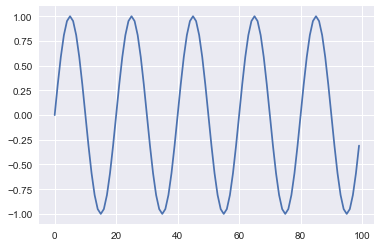
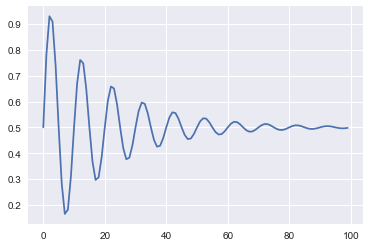
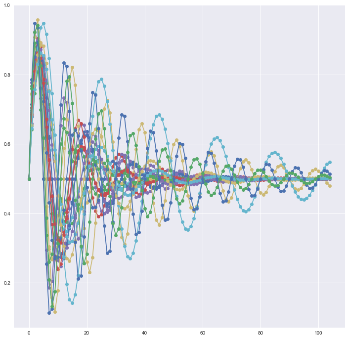
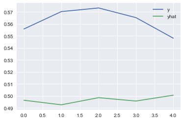

# 2. Stacked LSTM

----------


```python
from math import sin
from math import pi
from math import exp
from random import random
from random import randint
from random import uniform
from numpy import array
from matplotlib import pyplot
import matplotlib.pyplot as plt
import seaborn as sns
%matplotlib inline
```

##### Sample sequence


```python
length = 100
freq = 5
sequence = [sin(2 * pi * freq * (i/length)) for i in range(length)]
```

* Plot sequence


```python
pyplot.plot(sequence)
pyplot.show()
```





* With Damping


```python
length = 100
period = 10
decay = 0.05
sequence = [0.5 + 0.5 * sin(2 * pi * i / period) \
            * exp(-decay * i) for i in range(length)]
```


```python
pyplot.plot(sequence)
pyplot.show()
```





#### Sequence Generator

* Generate damped sine wave in [0,1]


```python
def generate_sequence(length, period, decay):
    return [0.5 + 0.5 * sin(2 * pi * i / period) *\
           exp(-decay * i) for i in range(length)]
```

* Generate input and output pairs of damped sine waves


```python
def generate_examples(length, n_patterns, output):
  X, y = list(), list()
  for _ in range(n_patterns):
    p = randint(10, 20)
    d = uniform(0.01, 0.1)
    sequence = generate_sequence(length + output, p, d)
    X.append(sequence[:-output])
    y.append(sequence[-output:])
  X = array(X).reshape(n_patterns, length, 1)
  y = array(y).reshape(n_patterns, output)
  return X, y
```

* test problem generation


```python
plt.figure(figsize =(12,12))
X, y = generate_examples(100, 20, 5)
for i in range(len(X)):
    pyplot.plot([x for x in X[i, :, 0]] + [x for x in y[i]], '-o') 
pyplot.show()   
```





##  Model


```python
# Example of one output for whole sequence
from keras.models import Sequential
from keras.layers import LSTM,Dense
```


```python
# configure problem
length = 50
output = 5


# define model
model = Sequential()
model.add(LSTM(20, return_sequences=True, input_shape=(length, 1))) 
model.add(LSTM(20, return_sequences=True))
model.add(LSTM(20, return_sequences=True))
model.add(LSTM(20))
model.add(Dense(output))


# compile
model.compile(loss='mae',
              optimizer='adam')


print(model.summary())
```

    _________________________________________________________________
    Layer (type)                 Output Shape              Param #   
    =================================================================
    lstm_13 (LSTM)               (None, 50, 20)            1760      
    _________________________________________________________________
    lstm_14 (LSTM)               (None, 50, 20)            3280      
    _________________________________________________________________
    lstm_15 (LSTM)               (None, 50, 20)            3280      
    _________________________________________________________________
    lstm_16 (LSTM)               (None, 20)                3280      
    _________________________________________________________________
    dense_4 (Dense)              (None, 5)                 105       
    =================================================================
    Total params: 11,705
    Trainable params: 11,705
    Non-trainable params: 0
    _________________________________________________________________
    None


##### Fit the model


```python
X, y = generate_examples(length, 500, output)
model.fit(X, y, batch_size=10, epochs=5, verbose = 2)
```

    Epoch 1/5
    20s - loss: 0.0586
    Epoch 2/5
    20s - loss: 0.0413
    Epoch 3/5
    21s - loss: 0.0403
    Epoch 4/5
    20s - loss: 0.0400
    Epoch 5/5
    20s - loss: 0.0419


    <keras.callbacks.History at 0x12cabab70>


##### Evaluate the model


```python
# evaluate model
X, y = generate_examples(length, 100, output) 
loss = model.evaluate(X, y, verbose=0) 
print('MAE: %f' % loss)
```

    MAE: 0.050917


##### Prediction


```python
# prediction on new data
X, y = generate_examples(length, 20, output) 
yhat = model.predict(X, verbose=0) 
pyplot.plot(y[0], label='y') 
pyplot.plot(yhat[0], label='yhat') 
pyplot.legend()
pyplot.show()
```





```python

```


```python

```
