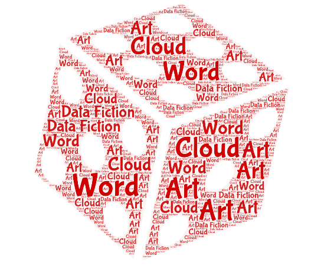

## Machine Learning

Welcome to Machine Learning, Deep Learning and Reinforcement Learning Projects!

This online document helps the absolute beginners to persue the future direction in coding and machine learning.

### Index

----------

- MACHINE LEARNING
    - Linear Regression
    - Logistic Regression
    ----------------
    - Decision Tree
    - Ensamble Methods
    - Support Vector Machine
    -------------
    - Kmeans Clustering
    - Agglomerative Clustering
    - Affinity Propagation
    - Spectral Clustering
    - DBSCAN Clustering
    - Mean Shift Clustering
    - Cluster Comparison

----------

- ML PROJECTS
    - Introduction
    - Boston Housing
    - Customer Clustering
    - Finding Donors
    - Vehicle Detection
    - Perceptron

------------

- DEEP LEARNING
    - Introduction
    - Vanila LSTM
    - Stacked LSTM
    - Bidirectional LSTM
    - Recurrent Neural Network

------------

- DL PROJECTS
    - Digit Classifier
    - Image Classifier
    - Traffic Sign Detection
    - Language Translator

-----------

- RINFORCEMENT LEARNING
    - SmartCab
    
---------

- GAN PROJECT
    - Face Generation
    
-------

- References
        
