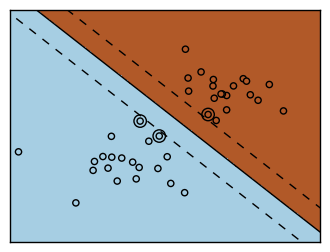
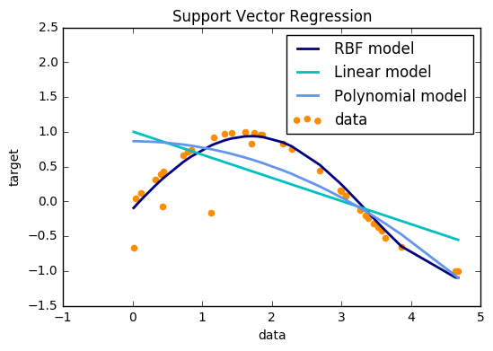

## Support Vector Mechanics (SVM)

------------------------------------------

### Introduction


```python
from sklearn import svm
```


```python
X = [[0, 0], [1, 1]]
```


```python
y = [0, 1]
```


```python
clf = svm.SVC()
```

##### Fit


```python
clf.fit(X, y) 
```


    SVC(C=1.0, cache_size=200, class_weight=None, coef0=0.0,
      decision_function_shape='ovr', degree=3, gamma='auto', kernel='rbf',
      max_iter=-1, probability=False, random_state=None, shrinking=True,
      tol=0.001, verbose=False)


##### Predict

After being fitted, the model can then be used to predict new values:


```python
clf.predict([[2., 2.]])
```


    array([1])


SVMs decision function depends on some subset of the training data, called the support vectors. Some properties of these support vectors can be found in members support_vectors_, support_ and n_support:

###### Support vectors


```python
clf.support_vectors_
```


    array([[0., 0.],
           [1., 1.]])


```python
# get indices of support vectors
clf.support_ 
```


    array([0, 1], dtype=int32)


```python
# get number of support vectors for each class
clf.n_support_ 
```


    array([1, 1], dtype=int32)


# Examples: 

---------------------------------------

## Plot Iris SVM
-----------------------
### 1. Plot different SVM classifiers in the iris dataset ([source](https://github.com/scikit-learn/scikit-learn/tree/master/examples/svm))

Comparison of different linear SVM classifiers on a 2D projection of the iris
dataset. We only consider the first 2 features of this dataset:

- Sepal length
- Sepal width

This example shows how to plot the decision surface for four SVM classifiers
with different kernels.

The linear models ``LinearSVC()`` and ``SVC(kernel='linear')`` yield slightly
different decision boundaries. This can be a consequence of the following
differences:

- ``LinearSVC`` minimizes the squared hinge loss while ``SVC`` minimizes the
  regular hinge loss.

- ``LinearSVC`` uses the One-vs-All (also known as One-vs-Rest) multiclass
  reduction while ``SVC`` uses the One-vs-One multiclass reduction.

Both linear models have linear decision boundaries (intersecting hyperplanes)
while the non-linear kernel models (polynomial or Gaussian RBF) have more
flexible non-linear decision boundaries with shapes that depend on the kind of
kernel and its parameters.

.. NOTE:: while plotting the decision function of classifiers for toy 2D
   datasets can help get an intuitive understanding of their respective
   expressive power, be aware that those intuitions don't always generalize to
   more realistic high-dimensional problems.


```python
%matplotlib inline
```


```python
import numpy as np
import matplotlib.pyplot as plt
#=====model and data set ==========
from sklearn import svm, datasets
```

##### Data Set


```python
# import some data to play with
iris = datasets.load_iris()
```


```python
iris.data[0:10]
```


    array([[5.1, 3.5, 1.4, 0.2],
           [4.9, 3. , 1.4, 0.2],
           [4.7, 3.2, 1.3, 0.2],
           [4.6, 3.1, 1.5, 0.2],
           [5. , 3.6, 1.4, 0.2],
           [5.4, 3.9, 1.7, 0.4],
           [4.6, 3.4, 1.4, 0.3],
           [5. , 3.4, 1.5, 0.2],
           [4.4, 2.9, 1.4, 0.2],
           [4.9, 3.1, 1.5, 0.1]])


```python
iris.target[0:10]
```


    array([0, 0, 0, 0, 0, 0, 0, 0, 0, 0])


- We only take the first two features. We could avoid this ugly slicing by using a two-dim dataset


```python
X = iris.data[:, :2]  
y = iris.target
```

##### Train the model


```python
h = .02  # step size in the mesh
```

- We create an instance of SVM and fit out data. We do not scale our
data since we want to plot the support vectors


```python
C = 1.0  # SVM regularization parameter
```


```python
svc = svm.SVC(kernel='linear', C=C).fit(X, y)
rbf_svc = svm.SVC(kernel='rbf', gamma=0.7, C=C).fit(X, y)
poly_svc = svm.SVC(kernel='poly', degree=3, C=C).fit(X, y)
lin_svc = svm.LinearSVC(C=C).fit(X, y)
```

###### Plot


```python

# create a mesh to plot in
x_min, x_max = X[:, 0].min() - 1, X[:, 0].max() + 1
y_min, y_max = X[:, 1].min() - 1, X[:, 1].max() + 1
xx, yy = np.meshgrid(np.arange(x_min, x_max, h),
                     np.arange(y_min, y_max, h))

plt.figure(figsize = [12,12])
# title for the plots
titles = ['SVC with linear kernel',
          'LinearSVC (linear kernel)',
          'SVC with RBF kernel',
          'SVC with polynomial (degree 3) kernel']


for i, clf in enumerate((svc, lin_svc, rbf_svc, poly_svc)):
    
    # Plot the decision boundary. For that, we will assign a color to each
    # point in the mesh [x_min, m_max]x[y_min, y_max].
    
    plt.subplot(2, 2, i + 1)
    plt.subplots_adjust(wspace=0.4, hspace=0.4)

    Z = clf.predict(np.c_[xx.ravel(), yy.ravel()])

    # Put the result into a color plot
    Z = Z.reshape(xx.shape)
    plt.contourf(xx, yy, Z, cmap=plt.cm.Paired, alpha=0.8)

    # Plot also the training points
    plt.scatter(X[:, 0], X[:, 1], c=y, cmap=plt.cm.Paired)
    plt.xlabel('Sepal length')
    plt.ylabel('Sepal width')
    plt.xlim(xx.min(), xx.max())
    plt.ylim(yy.min(), yy.max())
    plt.xticks(())
    plt.yticks(())
    plt.title(titles[i])

plt.show()
```


-----------------------

### 2. SVM with custom kernel ([source](https://github.com/scikit-learn/scikit-learn/tree/master/examples/svm))

---------------------------------------

Simple usage of Support Vector Machines to classify a sample. It will
plot the decision surface and the support vectors.


```python
import numpy as np
import matplotlib.pyplot as plt
from sklearn import svm, datasets
```

##### Data Set


```python
# import some data to play with
iris = datasets.load_iris()
X = iris.data[:, :2]  # we only take the first two features. We could
                      # avoid this ugly slicing by using a two-dim dataset
Y = iris.target
```

##### Define Kernel


```python
def my_kernel(X, Y):
    """
    We create a custom kernel:

                 (2  0)
    k(X, Y) = X  (    ) Y.T
                 (0  1)
    """
    M = np.array([[2, 0], [0, 1.0]])
    return np.dot(np.dot(X, M), Y.T)
```

##### Fit the model


```python
# we create an instance of SVM and fit out data.
clf = svm.SVC(kernel=my_kernel)
clf.fit(X, Y)
```


    SVC(C=1.0, cache_size=200, class_weight=None, coef0=0.0,
      decision_function_shape='ovr', degree=3, gamma='auto',
      kernel=<function my_kernel at 0x7f3ae7845620>, max_iter=-1,
      probability=False, random_state=None, shrinking=True, tol=0.001,
      verbose=False)


###### Plot


```python
h = .02  # step size in the mesh
# Plot the decision boundary. For that, we will assign a color to each
# point in the mesh [x_min, m_max]x[y_min, y_max].

x_min, x_max = X[:, 0].min() - 1, X[:, 0].max() + 1
y_min, y_max = X[:, 1].min() - 1, X[:, 1].max() + 1

xx, yy = np.meshgrid(np.arange(x_min, x_max, h), np.arange(y_min, y_max, h))

Z = clf.predict(np.c_[xx.ravel(), yy.ravel()])

# Put the result into a color plot
Z = Z.reshape(xx.shape)
plt.figure(figsize = [8,8])
plt.pcolormesh(xx, yy, Z, cmap=plt.cm.Paired)

# Plot also the training points
plt.scatter(X[:, 0], X[:, 1], c=Y, cmap=plt.cm.Paired)
plt.title('3-Class classification using Support Vector Machine with custom'
          ' kernel')
plt.axis('tight')
plt.show()
```


----------------

### 3. One-class SVM with non-linear kernel (RBF) ([source](https://github.com/scikit-learn/scikit-learn/tree/master/examples/svm))

------

An example using a one-class SVM for novelty detection.

`One-class SVM` is an unsupervised algorithm that learns a decision function for novelty detection:
classifying new data as similar or different to the training set.


```python
import numpy as np
import matplotlib.pyplot as plt
import matplotlib.font_manager
from sklearn import svm
```

##### Generate train data


```python
# Generate train data
X = 0.3 * np.random.randn(100, 2)
X_train = np.r_[X + 2, X - 2]
# Generate some regular novel observations
X = 0.3 * np.random.randn(20, 2)
X_test = np.r_[X + 2, X - 2]
# Generate some abnormal novel observations
X_outliers = np.random.uniform(low=-4, high=4, size=(20, 2))
```

##### Fit the Model (sklearn.svm.OneClassSVM)


```python
xx, yy = np.meshgrid(np.linspace(-5, 5, 500), np.linspace(-5, 5, 500))

# fit the model
clf = svm.OneClassSVM(nu=0.1, kernel="rbf", gamma=0.1)
clf.fit(X_train)

#predict
y_pred_train = clf.predict(X_train)
y_pred_test = clf.predict(X_test)
y_pred_outliers = clf.predict(X_outliers)

#Error
n_error_train = y_pred_train[y_pred_train == -1].size
n_error_test = y_pred_test[y_pred_test == -1].size
n_error_outliers = y_pred_outliers[y_pred_outliers == 1].size

# plot the line, the points, and the nearest vectors to the plane
Z = clf.decision_function(np.c_[xx.ravel(), yy.ravel()])
Z = Z.reshape(xx.shape)
```

###### Plot


```python
plt.figure(figsize = [12,12])
plt.title("Novelty Detection")
plt.contourf(xx, yy, Z, levels=np.linspace(Z.min(), 0, 7), cmap=plt.cm.PuBu)
a = plt.contour(xx, yy, Z, levels=[0], linewidths=2, colors='darkred')
plt.contourf(xx, yy, Z, levels=[0, Z.max()], colors='palevioletred')

s = 40
b1 = plt.scatter(X_train[:, 0], X_train[:, 1], c='white', s=s)
b2 = plt.scatter(X_test[:, 0], X_test[:, 1], c='blueviolet', s=s)
c = plt.scatter(X_outliers[:, 0], X_outliers[:, 1], c='gold', s=s)


plt.axis('tight')
plt.xlim((-5, 5))
plt.ylim((-5, 5))
plt.legend([a.collections[0], b1, b2, c],
           ["learned frontier", "training observations",
            "new regular observations", "new abnormal observations"],
           loc="upper left",
           prop=matplotlib.font_manager.FontProperties(size=11))
plt.xlabel(
    "error train: %d/200 ; errors novel regular: %d/40 ; "
    "errors novel abnormal: %d/40"
    % (n_error_train, n_error_test, n_error_outliers))
plt.show()

```


-----------------------------------

### 4. RBF SVM parameters ([source](https://github.com/scikit-learn/scikit-learn/tree/master/examples/svm))

** This example illustrates the effect of the parameters ``gamma`` and ``C`` of
the Radial Basis Function (RBF) kernel SVM.**

- Intuitively, the ``gamma`` parameter defines how far the influence of a single
training example reaches, with low values meaning 'far' and high values meaning
'close'. The ``gamma`` parameters can be seen as the inverse of the radius of
influence of samples selected by the model as support vectors.

- The ``C`` parameter trades off misclassification of training examples against
simplicity of the decision surface. A low ``C`` makes the decision surface
smooth, while a high ``C`` aims at classifying all training examples correctly
by giving the model freedom to select more samples as support vectors.

- The first plot is a visualization of the decision function for a variety of
parameter values on a simplified classification problem involving only 2 input
features and 2 possible target classes (binary classification). Note that this
kind of plot is not possible to do for problems with more features or target
classes.

- The second plot is a heatmap of the classifier's cross-validation accuracy as a
function of ``C`` and ``gamma``. For this example we explore a relatively large
grid for illustration purposes. In practice, a logarithmic grid from
:math:`10^{-3}` to :math:`10^3` is usually sufficient. If the best parameters
lie on the boundaries of the grid, it can be extended in that direction in a
subsequent search.

- Note that the heat map plot has a special colorbar with a midpoint value close
to the score values of the best performing models so as to make it easy to tell
them appart in the blink of an eye.

- The behavior of the model is very sensitive to the ``gamma`` parameter. If
``gamma`` is too large, the radius of the area of influence of the support
vectors only includes the support vector itself and no amount of
regularization with ``C`` will be able to prevent overfitting.

- When ``gamma`` is very small, the model is too constrained and cannot capture
the complexity or "shape" of the data. The region of influence of any selected
support vector would include the whole training set. The resulting model will
behave similarly to a linear model with a set of hyperplanes that separate the
centers of high density of any pair of two classes.

- For intermediate values, we can see on the second plot that good models can
be found on a diagonal of ``C`` and ``gamma``. Smooth models (lower ``gamma``
values) can be made more complex by selecting a larger number of support
vectors (larger ``C`` values) hence the diagonal of good performing models.

- Finally one can also observe that for some intermediate values of ``gamma`` we
get equally performing models when ``C`` becomes very large: it is not
necessary to regularize by limiting the number of support vectors. The radius of
the RBF kernel alone acts as a good structural regularizer. In practice though
it might still be interesting to limit the number of support vectors with a
lower value of ``C`` so as to favor models that use less memory and that are
faster to predict.

- We should also note that small differences in scores results from the random
splits of the cross-validation procedure. Those spurious variations can be
smoothed out by increasing the number of CV iterations ``n_iter`` at the
expense of compute time. Increasing the value number of ``C_range`` and
``gamma_range`` steps will increase the resolution of the hyper-parameter heat
map.

--------


```python
import numpy as np
import matplotlib.pyplot as plt
from matplotlib.colors import Normalize
#======== preprocessing ==========
from sklearn.preprocessing import StandardScaler
#===models=====================
from sklearn.svm import SVC
from sklearn.cross_validation import StratifiedShuffleSplit
from sklearn.model_selection import GridSearchCV
#======== data ==========================
from sklearn.datasets import load_iris

```


* Utility function to move the midpoint of a colormap to be around the values of interest.


```python
class MidpointNormalize(Normalize):

    def __init__(self, vmin=None, vmax=None, midpoint=None, clip=False):
        self.midpoint = midpoint
        Normalize.__init__(self, vmin, vmax, clip)

    def __call__(self, value, clip=None):
        x, y = [self.vmin, self.midpoint, self.vmax], [0, 0.5, 1]
        return np.ma.masked_array(np.interp(value, x, y))

```

* Load and prepare data set dataset for grid search


```python
iris = load_iris()
X = iris.data
y = iris.target
```

- Dataset for decision function visualization: we only keep the first two
features in X and sub-sample the dataset to keep only 2 classes and
make it a binary classification problem.


```python
X_2d = X[:, :2]
X_2d = X_2d[y > 0]
y_2d = y[y > 0]
y_2d -= 1
```

- It is usually a good idea to scale the data for SVM training.
We are cheating a bit in this example in scaling all of the data,
instead of fitting the transformation on the training set and
just applying it on the test set.


```python
scaler = StandardScaler()
X = scaler.fit_transform(X)
X_2d = scaler.fit_transform(X_2d)
```

 - Train classifiers, For an initial search, a logarithmic grid with basis 10 is often helpful. Using a basis of 2, a finer tuning can be achieved but at a much higher cost.


```python
C_range = np.logspace(-2, 10, 13)
gamma_range = np.logspace(-9, 3, 13)
param_grid = dict(gamma=gamma_range, C=C_range)
cv = StratifiedShuffleSplit(n_splits=5, test_size=0.2, random_state=42)
grid = GridSearchCV(SVC(), param_grid=param_grid, cv=cv)
grid.fit(X, y)

print("The best parameters are %s with a score of %0.2f"
      % (grid.best_params_, grid.best_score_))
```


- Now we need to fit a classifier for all parameters in the 2d version
(we use a smaller set of parameters here because it takes a while to train)


```python
C_2d_range = [1e-2, 1, 1e2]
gamma_2d_range = [1e-1, 1, 1e1]
classifiers = []
for C in C_2d_range:
    for gamma in gamma_2d_range:
        clf = SVC(C=C, gamma=gamma)
        clf.fit(X_2d, y_2d)
        classifiers.append((C, gamma, clf))

```

- visualization

draw visualization of parameter effects


```python
plt.figure(figsize=(8, 6))
xx, yy = np.meshgrid(np.linspace(-3, 3, 200), np.linspace(-3, 3, 200))
for (k, (C, gamma, clf)) in enumerate(classifiers):
    # evaluate decision function in a grid
    Z = clf.decision_function(np.c_[xx.ravel(), yy.ravel()])
    Z = Z.reshape(xx.shape)

    # visualize decision function for these parameters
    plt.subplot(len(C_2d_range), len(gamma_2d_range), k + 1)
    plt.title("gamma=10^%d, C=10^%d" % (np.log10(gamma), np.log10(C)),
              size='medium')

    # visualize parameter's effect on decision function
    plt.pcolormesh(xx, yy, -Z, cmap=plt.cm.RdBu)
    plt.scatter(X_2d[:, 0], X_2d[:, 1], c=y_2d, cmap=plt.cm.RdBu_r)
    plt.xticks(())
    plt.yticks(())
    plt.axis('tight')

# plot the scores of the grid
# grid_scores_ contains parameter settings and scores
# We extract just the scores
scores = [x[1] for x in grid.grid_scores_]
scores = np.array(scores).reshape(len(C_range), len(gamma_range))

# Draw heatmap of the validation accuracy as a function of gamma and C
#
# The score are encoded as colors with the hot colormap which varies from dark
# red to bright yellow. As the most interesting scores are all located in the
# 0.92 to 0.97 range we use a custom normalizer to set the mid-point to 0.92 so
# as to make it easier to visualize the small variations of score values in the
# interesting range while not brutally collapsing all the low score values to
# the same color.

plt.figure(figsize=(8, 6))
plt.subplots_adjust(left=.2, right=0.95, bottom=0.15, top=0.95)
plt.imshow(scores, interpolation='nearest', cmap=plt.cm.hot,
           norm=MidpointNormalize(vmin=0.2, midpoint=0.92))
plt.xlabel('gamma')
plt.ylabel('C')
plt.colorbar()
plt.xticks(np.arange(len(gamma_range)), gamma_range, rotation=45)
plt.yticks(np.arange(len(C_range)), C_range)
plt.title('Validation accuracy')
plt.show()

```


-------------

### 5. SVM: Separating hyperplane for unbalanced classes ([source](https://github.com/scikit-learn/scikit-learn/tree/master/examples/svm))

-----------

Find the optimal separating hyperplane using an SVC for classes that
are unbalanced.

We first find the separating plane with a plain SVC and then plot
(dashed) the separating hyperplane with automatically correction for
unbalanced classes.


 This example will also work by replacing ``SVC(kernel="linear")``
 with ``SGDClassifier(loss="hinge")``. Setting the ``loss`` parameter
 of the :class:`SGDClassifier` equal to ``hinge`` will yield behaviour
 such as that of a SVC with a linear kernel.

For example try instead of the ``SVC``::

```clf = SGDClassifier(n_iter=100, alpha=0.01)```


```python
import numpy as np
import matplotlib.pyplot as plt
from sklearn import svm
from sklearn.linear_model import SGDClassifier
```

###### Data


```python
# we create 40 separable points
rng = np.random.RandomState(0)
n_samples_1 = 1000
n_samples_2 = 100
X = np.r_[1.5 * rng.randn(n_samples_1, 2),
          0.5 * rng.randn(n_samples_2, 2) + [2, 2]]
y = [0] * (n_samples_1) + [1] * (n_samples_2)
```

##### Model


```python
# fit the model and get the separating hyperplane
clf = svm.SVC(kernel='linear', C=1.0)
clf.fit(X, y)

w = clf.coef_[0]
a = -w[0] / w[1]
xx = np.linspace(-5, 5)
yy = a * xx - clf.intercept_[0] / w[1]

```

###### Get the separating hyperplane using weighted classes


```python
# get the separating hyperplane using weighted classes
wclf = svm.SVC(kernel='linear', class_weight={1: 10})
wclf.fit(X, y)

ww = wclf.coef_[0]
wa = -ww[0] / ww[1]
wyy = wa * xx - wclf.intercept_[0] / ww[1]
```

######  Plot


```python

# plot separating hyperplanes and samples
h0 = plt.plot(xx, yy, 'k-', label='no weights')
h1 = plt.plot(xx, wyy, 'k--', label='with weights')
plt.scatter(X[:, 0], X[:, 1], c=y, cmap=plt.cm.Paired)
plt.legend()

plt.axis('tight')
plt.show()

```


---------------------

### 6. SVM: Maximum margin separating hyperplane ([source](https://github.com/scikit-learn/scikit-learn/tree/master/examples/svm))

--------------------------

Plot the maximum margin separating hyperplane within a two-class
separable dataset using a Support Vector Machine classifier with
linear kernel.


```python
import numpy as np
import matplotlib.pyplot as plt
from sklearn import svm
```

 - data


```python
# we create 40 separable points
np.random.seed(0)
X = np.r_[np.random.randn(20, 2) - [2, 2], np.random.randn(20, 2) + [2, 2]]
Y = [0] * 20 + [1] * 20
```

 - Model 


```python
# fit the model
clf = svm.SVC(kernel='linear')
clf.fit(X, Y)

# get the separating hyperplane
w = clf.coef_[0]
a = -w[0] / w[1]
xx = np.linspace(-5, 5)
yy = a * xx - (clf.intercept_[0]) / w[1]
```

 - Separating hyperplane 


```python
# plot the parallels to the separating hyperplane that pass through the
# support vectors
b = clf.support_vectors_[0]
yy_down = a * xx + (b[1] - a * b[0])
b = clf.support_vectors_[-1]
yy_up = a * xx + (b[1] - a * b[0])
```

 - Plot


```python
# plot the line, the points, and the nearest vectors to the plane
plt.plot(xx, yy, 'k-')
plt.plot(xx, yy_down, 'k--')
plt.plot(xx, yy_up, 'k--')

plt.scatter(clf.support_vectors_[:, 0], clf.support_vectors_[:, 1],
            s=80, facecolors='none')
plt.scatter(X[:, 0], X[:, 1], c=Y, cmap=plt.cm.Paired)

plt.axis('tight')
plt.show()
```


--------------

### 7. SVM-Anova: SVM with univariate feature selection ([source](https://github.com/scikit-learn/scikit-learn/tree/master/examples/svm))

-----------

This example shows how to perform univariate feature selection before running a
SVC (support vector classifier) to improve the classification scores.


```python
import numpy as np
import matplotlib.pyplot as plt
from sklearn import svm, datasets, feature_selection
from sklearn.cross_validation import cross_val_score
from sklearn.pipeline import Pipeline
```

 - Data


```python
# Import some data to play with
digits = datasets.load_digits()
y = digits.target
# Throw away data, to be in the curse of dimension settings
y = y[:200]
X = digits.data[:200]
n_samples = len(y)
X = X.reshape((n_samples, -1))
# add 200 non-informative features
X = np.hstack((X, 2 * np.random.random((n_samples, 200))))
```

 - Feature-selection transform


```python
# Create a feature-selection transform and 
transform = feature_selection.SelectPercentile(feature_selection.f_classif)
```

 - instance of SVM 


```python
# Instance of SVM that we combine together to have an full-blown estimator
clf = Pipeline([('anova', transform), ('svc', svm.SVC(C=1.0))])
```

 - cross-validation score as a function of percentile of features


```python
#the cross-validation score as a function of percentile of features
score_means = list()
score_stds = list()
percentiles = (1, 3, 6, 10, 15, 20, 30, 40, 60, 80, 100)

for percentile in percentiles:
    clf.set_params(anova__percentile=percentile)
    # Compute cross-validation score using 1 CPU
    this_scores = cross_val_score(clf, X, y, n_jobs=1)
    score_means.append(this_scores.mean())
    score_stds.append(this_scores.std())
```


 - Plot


```python
plt.errorbar(percentiles, score_means, np.array(score_stds))

plt.title(
    'Performance of the SVM-Anova varying the percentile of features selected')
plt.xlabel('Percentile')
plt.ylabel('Prediction rate')

plt.axis('tight')
plt.show()
```


--------------

### 8. SVM-Kernels ([source](https://github.com/scikit-learn/scikit-learn/tree/master/examples/svm))

-----------------

Three different types of SVM-Kernels are displayed below.
The polynomial and RBF are especially useful when the
data-points are not linearly separable.


```python
import numpy as np
import matplotlib.pyplot as plt
from sklearn import svm
```

  - Data


```python
# Our dataset and targets
X = np.c_[(.4, -.7),
          (-1.5, -1),
          (-1.4, -.9),
          (-1.3, -1.2),
          (-1.1, -.2),
          (-1.2, -.4),
          (-.5, 1.2),
          (-1.5, 2.1),
          (1, 1),
          # --
          (1.3, .8),
          (1.2, .5),
          (.2, -2),
          (.5, -2.4),
          (.2, -2.3),
          (0, -2.7),
          (1.3, 2.1)].T
Y = [0] * 8 + [1] * 8

```

 - plot


```python

# figure number
fignum = 1

# fit the model
for kernel in ('linear', 'poly', 'rbf'):
    clf = svm.SVC(kernel=kernel, gamma=2)
    clf.fit(X, Y)

    # plot the line, the points, and the nearest vectors to the plane
    plt.figure(fignum, figsize=(4, 3))
    plt.clf()

    plt.scatter(clf.support_vectors_[:, 0], clf.support_vectors_[:, 1], s=80,
                facecolors='none', zorder=10)
    plt.scatter(X[:, 0], X[:, 1], c=Y, zorder=10, cmap=plt.cm.Paired)

    plt.axis('tight')
    x_min = -3
    x_max = 3
    y_min = -3
    y_max = 3

    XX, YY = np.mgrid[x_min:x_max:200j, y_min:y_max:200j]
    Z = clf.decision_function(np.c_[XX.ravel(), YY.ravel()])

    # Put the result into a color plot
    Z = Z.reshape(XX.shape)
    plt.figure(fignum, figsize=(4, 3))
    plt.pcolormesh(XX, YY, Z > 0, cmap=plt.cm.Paired)
    plt.contour(XX, YY, Z, colors=['k', 'k', 'k'], linestyles=['--', '-', '--'],
                levels=[-.5, 0, .5])

    plt.xlim(x_min, x_max)
    plt.ylim(y_min, y_max)

    plt.xticks(())
    plt.yticks(())
    fignum = fignum + 1
plt.show()

```


-------

### 9. SVM Margins Example ([source](https://github.com/scikit-learn/scikit-learn/tree/master/examples/svm))

------

The plots below illustrate the effect the parameter `C` has
on the separation line. A large value of `C` basically tells
our model that we do not have that much faith in our data's
distribution, and will only consider points close to line
of separation.

A small value of `C` includes more/all the observations, allowing
the margins to be calculated using all the data in the area.


```python

import numpy as np
import matplotlib.pyplot as plt
from sklearn import svm
```

 - Data


```python
# we create 40 separable points
np.random.seed(0)
X = np.r_[np.random.randn(20, 2) - [2, 2], np.random.randn(20, 2) + [2, 2]]
Y = [0] * 20 + [1] * 20
```

 - Plot


```python
# figure number
fignum = 1

# fit the model
for name, penalty in (('unreg', 1), ('reg', 0.05)):

    clf = svm.SVC(kernel='linear', C=penalty)
    clf.fit(X, Y)

    # get the separating hyperplane
    w = clf.coef_[0]
    a = -w[0] / w[1]
    xx = np.linspace(-5, 5)
    yy = a * xx - (clf.intercept_[0]) / w[1]

    # plot the parallels to the separating hyperplane that pass through the
    # support vectors
    margin = 1 / np.sqrt(np.sum(clf.coef_ ** 2))
    yy_down = yy + a * margin
    yy_up = yy - a * margin

    # plot the line, the points, and the nearest vectors to the plane
    plt.figure(fignum, figsize=(4, 3))
    plt.clf()
    plt.plot(xx, yy, 'k-')
    plt.plot(xx, yy_down, 'k--')
    plt.plot(xx, yy_up, 'k--')

    plt.scatter(clf.support_vectors_[:, 0], clf.support_vectors_[:, 1], s=80,
                facecolors='none', zorder=10)
    plt.scatter(X[:, 0], X[:, 1], c=Y, zorder=10, cmap=plt.cm.Paired)

    plt.axis('tight')
    x_min = -4.8
    x_max = 4.2
    y_min = -6
    y_max = 6

    XX, YY = np.mgrid[x_min:x_max:200j, y_min:y_max:200j]
    Z = clf.predict(np.c_[XX.ravel(), YY.ravel()])

    # Put the result into a color plot
    Z = Z.reshape(XX.shape)
    plt.figure(fignum, figsize=(4, 3))
    plt.pcolormesh(XX, YY, Z, cmap=plt.cm.Paired)

    plt.xlim(x_min, x_max)
    plt.ylim(y_min, y_max)

    plt.xticks(())
    plt.yticks(())
    fignum = fignum + 1

plt.show()
```





------

### 10. Non-linear SVM ([source](https://github.com/scikit-learn/scikit-learn/tree/master/examples/svm))

------

Perform binary classification using non-linear SVC
with RBF kernel. The target to predict is a XOR of the
inputs.

The color map illustrates the decision function learned by the SVC.


```python

import numpy as np
import matplotlib.pyplot as plt
from sklearn import svm
```

 - Data


```python
xx, yy = np.meshgrid(np.linspace(-3, 3, 500),
                     np.linspace(-3, 3, 500))
np.random.seed(0)
X = np.random.randn(300, 2)
Y = np.logical_xor(X[:, 0] > 0, X[:, 1] > 0)

```

 - Model


```python

# fit the model
clf = svm.NuSVC()
clf.fit(X, Y)

# plot the decision function for each datapoint on the grid
Z = clf.decision_function(np.c_[xx.ravel(), yy.ravel()])
Z = Z.reshape(xx.shape)


```

- Plot


```python
plt.imshow(Z, interpolation='nearest',
           extent=(xx.min(), xx.max(), yy.min(), yy.max()), aspect='auto',
           origin='lower', cmap=plt.cm.PuOr_r)
contours = plt.contour(xx, yy, Z, levels=[0], linewidths=2,
                       linetypes='--')
plt.scatter(X[:, 0], X[:, 1], s=30, c=Y, cmap=plt.cm.Paired)
plt.xticks(())
plt.yticks(())
plt.axis([-3, 3, -3, 3])
plt.show()

```


----------

### 11. Support Vector Regression (SVR) using linear and non-linear kernels ([source](https://github.com/scikit-learn/scikit-learn/tree/master/examples/svm))

--------------

Toy example of 1D regression using linear, polynomial and RBF kernels.


```python
import numpy as np
from sklearn.svm import SVR
import matplotlib.pyplot as plt
```

 - Data


```python
# Generate sample data
X = np.sort(5 * np.random.rand(40, 1), axis=0)
y = np.sin(X).ravel()


# Add noise to targets
y[::5] += 3 * (0.5 - np.random.rand(8))
```

- Model


```python

# Fit regression model
svr_rbf = SVR(kernel='rbf', C=1e3, gamma=0.1)
svr_lin = SVR(kernel='linear', C=1e3)
svr_poly = SVR(kernel='poly', C=1e3, degree=2)
y_rbf = svr_rbf.fit(X, y).predict(X)
y_lin = svr_lin.fit(X, y).predict(X)
y_poly = svr_poly.fit(X, y).predict(X)

```

 - Plot


```python
# look at the results
lw = 2
plt.scatter(X, y, color='darkorange', label='data')
plt.hold('on')
plt.plot(X, y_rbf, color='navy', lw=lw, label='RBF model')
plt.plot(X, y_lin, color='c', lw=lw, label='Linear model')
plt.plot(X, y_poly, color='cornflowerblue', lw=lw, label='Polynomial model')
plt.xlabel('data')
plt.ylabel('target')
plt.title('Support Vector Regression')
plt.legend()
plt.show()

```





-------

### 13. Scaling the regularization parameter for SVCs ([source](https://github.com/scikit-learn/scikit-learn/tree/master/examples/svm))

------------

The following example illustrates the effect of scaling the
regularization parameter when using :ref:`svm` for `classification`.
For SVC classification, we are interested in a risk minimization for the
equation:

    $ C \sum_{i=1, n} \mathcal{L} (f(x_i), y_i) + \Omega (w)$

where

    - `C` is used to set the amount of regularization
    - `\mathcal{L}` is a `loss` function of our samples
      and our model parameters.
    - `\Omega` is a `penalty` function of our model parameters

If we consider the loss function to be the individual error per
sample, then the data-fit term, or the sum of the error for each sample, will
increase as we add more samples. The penalization term, however, will not
increase.

When using, for example, :ref:`cross validation <cross_validation>`, to
set the amount of regularization with `C`, there will be a
different amount of samples between the main problem and the smaller problems
within the folds of the cross validation.

Since our loss function is dependent on the amount of samples, the latter
will influence the selected value of `C`.
The question that arises is `How do we optimally adjust C to
account for the different amount of training samples?`

The figures below are used to illustrate the effect of scaling our
`C` to compensate for the change in the number of samples, in the
case of using an `l1` penalty, as well as the `l2` penalty.

l1-penalty case
-----------------
In the `l1` case, theory says that prediction consistency
(i.e. that under given hypothesis, the estimator
learned predicts as well as a model knowing the true distribution)
is not possible because of the bias of the `l1`. It does say, however,
that model consistency, in terms of finding the right set of non-zero
parameters as well as their signs, can be achieved by scaling
`C1`.

l2-penalty case
-----------------
The theory says that in order to achieve prediction consistency, the
penalty parameter should be kept constant
as the number of samples grow.

Simulations
------------

The two figures below plot the values of `C` on the `x-axis` and the
corresponding cross-validation scores on the `y-axis`, for several different
fractions of a generated data-set.

In the `l1` penalty case, the cross-validation-error correlates best with
the test-error, when scaling our `C` with the number of samples, `n`,
which can be seen in the first figure.

For the `l2` penalty case, the best result comes from the case where `C`
is not scaled.


    Two separate datasets are used for the two different plots. The reason
    behind this is the `l1` case works better on sparse data, while `l2`
    is better suited to the non-sparse case.


```python

import numpy as np
import matplotlib.pyplot as plt

from sklearn.svm import LinearSVC
from sklearn.model_selection import ShuffleSplit
from sklearn.model_selection import GridSearchCV


from sklearn.utils import check_random_state
from sklearn import datasets
```

 - Data,Model,Plot


```python
rnd = check_random_state(1)

# set up dataset
n_samples = 100
n_features = 300

# l1 data (only 5 informative features)
X_1, y_1 = datasets.make_classification(n_samples=n_samples,
                                        n_features=n_features, n_informative=5,
                                        random_state=1)

# l2 data: non sparse, but less features
y_2 = np.sign(.5 - rnd.rand(n_samples))
X_2 = rnd.randn(n_samples, n_features / 5) + y_2[:, np.newaxis]
X_2 += 5 * rnd.randn(n_samples, n_features / 5)

clf_sets = [(LinearSVC(penalty='l1', loss='squared_hinge', dual=False,
                       tol=1e-3),
             np.logspace(-2.3, -1.3, 10), X_1, y_1),
            (LinearSVC(penalty='l2', loss='squared_hinge', dual=True,
                       tol=1e-4),
             np.logspace(-4.5, -2, 10), X_2, y_2)]

colors = ['navy', 'cyan', 'darkorange']
lw = 2

for fignum, (clf, cs, X, y) in enumerate(clf_sets):
    # set up the plot for each regressor
    plt.figure(fignum, figsize=(9, 10))

    for k, train_size in enumerate(np.linspace(0.3, 0.7, 3)[::-1]):
        param_grid = dict(C=cs)
        # To get nice curve, we need a large number of iterations to
        # reduce the variance
        grid = GridSearchCV(clf, refit=False, param_grid=param_grid,
                            cv=ShuffleSplit(train_size=train_size, n_iter=250,
                                            random_state=1))
        grid.fit(X, y)
        scores = [x[1] for x in grid.grid_scores_]

        scales = [(1, 'No scaling'),
                  ((n_samples * train_size), '1/n_samples'),
                  ]

        for subplotnum, (scaler, name) in enumerate(scales):
            plt.subplot(2, 1, subplotnum + 1)
            plt.xlabel('C')
            plt.ylabel('CV Score')
            grid_cs = cs * float(scaler)  # scale the C's
            plt.semilogx(grid_cs, scores, label="fraction %.2f" %
                         train_size, color=colors[k], lw=lw)
            plt.title('scaling=%s, penalty=%s, loss=%s' %
                      (name, clf.penalty, clf.loss))

    plt.legend(loc="best")
plt.show()

```

-----------

### 14. SVM: Weighted samples ([source](https://github.com/scikit-learn/scikit-learn/tree/master/examples/svm))

------------

Plot decision function of a weighted dataset, where the size of points
is proportional to its weight.

The sample weighting rescales the C parameter, which means that the classifier
puts more emphasis on getting these points right. The effect might often be
subtle.
To emphasize the effect here, we particularly weight outliers, making the
deformation of the decision boundary very visible.


```python
import numpy as np
import matplotlib.pyplot as plt
from sklearn import svm

```


```python
def plot_decision_function(classifier, sample_weight, axis, title):
    # plot the decision function
    xx, yy = np.meshgrid(np.linspace(-4, 5, 500), np.linspace(-4, 5, 500))

    Z = classifier.decision_function(np.c_[xx.ravel(), yy.ravel()])
    Z = Z.reshape(xx.shape)

    # plot the line, the points, and the nearest vectors to the plane
    axis.contourf(xx, yy, Z, alpha=0.75, cmap=plt.cm.bone)
    axis.scatter(X[:, 0], X[:, 1], c=y, s=100 * sample_weight, alpha=0.9,
                 cmap=plt.cm.bone)

    axis.axis('off')
    axis.set_title(title)
```

 - Data


```python
# we create 20 points
np.random.seed(0)
X = np.r_[np.random.randn(10, 2) + [1, 1], np.random.randn(10, 2)]
y = [1] * 10 + [-1] * 10
sample_weight_last_ten = abs(np.random.randn(len(X)))
sample_weight_constant = np.ones(len(X))
# and bigger weights to some outliers
sample_weight_last_ten[15:] *= 5
sample_weight_last_ten[9] *= 15
```

 - Model


```python
# for reference, first fit without class weights
# fit the model
clf_weights = svm.SVC()
clf_weights.fit(X, y, sample_weight=sample_weight_last_ten)

clf_no_weights = svm.SVC()
clf_no_weights.fit(X, y)
```


    SVC(C=1.0, cache_size=200, class_weight=None, coef0=0.0,
      decision_function_shape=None, degree=3, gamma='auto', kernel='rbf',
      max_iter=-1, probability=False, random_state=None, shrinking=True,
      tol=0.001, verbose=False)


- Plot


```python
fig, axes = plt.subplots(1, 2, figsize=(14, 6))
plot_decision_function(clf_no_weights, sample_weight_constant, axes[0],
                       "Constant weights")
plot_decision_function(clf_weights, sample_weight_last_ten, axes[1],
                       "Modified weights")

plt.show()
```


    <matplotlib.figure.Figure at 0x114969e80>


