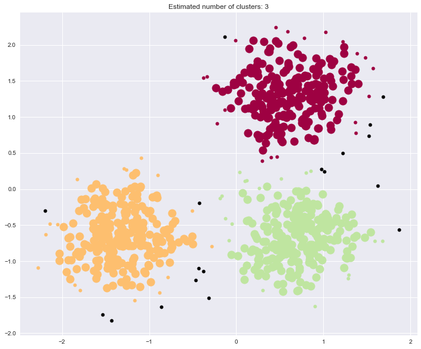

## Clustering- DBSCAN

***These codes are imported from Scikit-Learn python package for learning purpose***


```python
import matplotlib.pyplot as plt
import numpy as np
import seaborn as sns
%matplotlib inline
sns.set()
```

### 8. Demo of DBSCAN clustering algorithm

Finds core samples of high density and expands clusters from them.


```python
from sklearn.cluster import DBSCAN
from sklearn import metrics
from sklearn.datasets.samples_generator import make_blobs
from sklearn.preprocessing import StandardScaler

```

#### Generate sample data


```python
centers = [[1, 1], [-1, -1], [1, -1]]
X, labels_true = make_blobs(n_samples=750,\
                            centers=centers,\
                            cluster_std=0.4,\
                            random_state=0)
```

#### Preprocessing


```python
X = StandardScaler().fit_transform(X)
```

#### Compute DBSCAN


```python
# Compute DBSCAN
db = DBSCAN(eps=0.3, min_samples=10).fit(X)
core_samples_mask = np.zeros_like(db.labels_, dtype=bool)
core_samples_mask[db.core_sample_indices_] = True
labels = db.labels_
```

#### Number of clusters in labels, ignoring noise if present.


```python
n_clusters_ = len(set(labels)) - (1 if -1 in labels else 0)

print('Estimated number of clusters: %d' % n_clusters_)
print("Homogeneity: %0.3f" % metrics.homogeneity_score(labels_true, labels))
print("Completeness: %0.3f" % metrics.completeness_score(labels_true, labels))
print("V-measure: %0.3f" % metrics.v_measure_score(labels_true, labels))
print("Adjusted Rand Index: %0.3f"
      % metrics.adjusted_rand_score(labels_true, labels))
print("Adjusted Mutual Information: %0.3f"
      % metrics.adjusted_mutual_info_score(labels_true, labels))
print("Silhouette Coefficient: %0.3f"
      % metrics.silhouette_score(X, labels))

```

    Estimated number of clusters: 3
    Homogeneity: 0.953
    Completeness: 0.883
    V-measure: 0.917
    Adjusted Rand Index: 0.952
    Adjusted Mutual Information: 0.883
    Silhouette Coefficient: 0.626


#### Results


```python
# Black removed and is used for noise instead.
unique_labels = set(labels)
plt.figure(figsize = [12,10])
colors = plt.cm.Spectral(np.linspace(0, 1, len(unique_labels)))
for k, col in zip(unique_labels, colors):
    if k == -1:
        # Black used for noise.
        col = 'k'

    class_member_mask = (labels == k)

    xy = X[class_member_mask & core_samples_mask]
    plt.plot(xy[:, 0], xy[:, 1], 'o', markerfacecolor=col,
             markeredgecolor='k', markersize=14)

    xy = X[class_member_mask & ~core_samples_mask]
    plt.plot(xy[:, 0], xy[:, 1], 'o', markerfacecolor=col,
             markeredgecolor='k', markersize=6)

plt.title('Estimated number of clusters: %d' % n_clusters_)
plt.show()

```





------------
