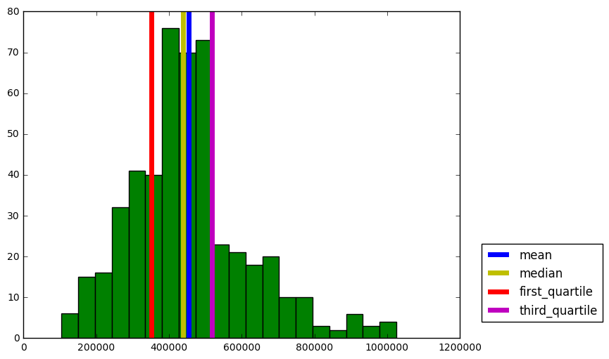
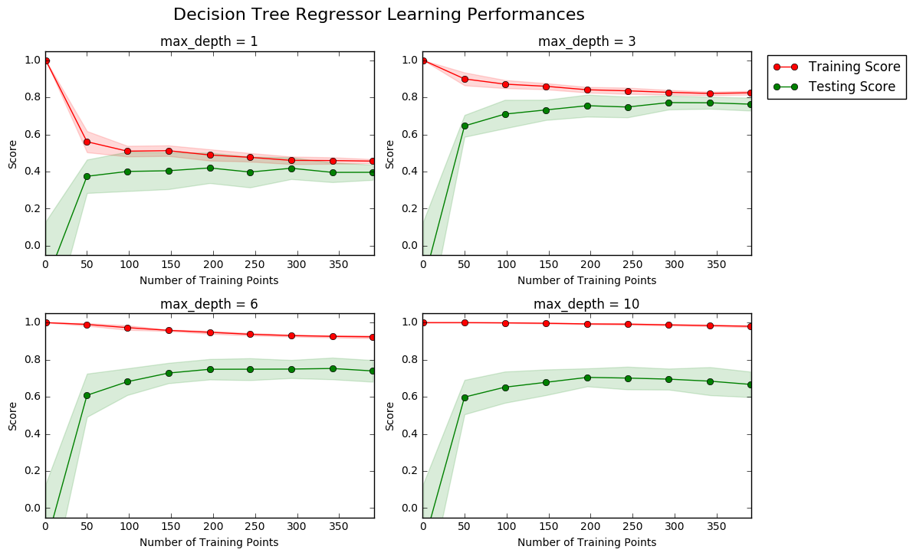
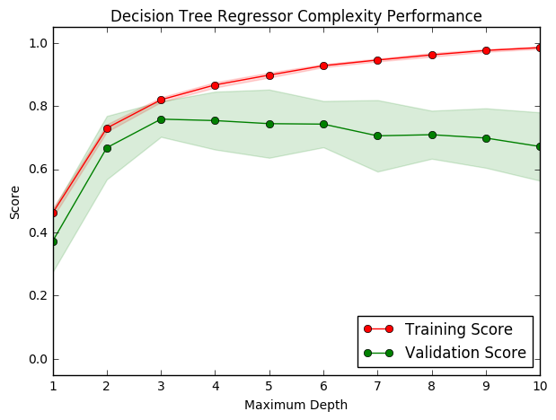
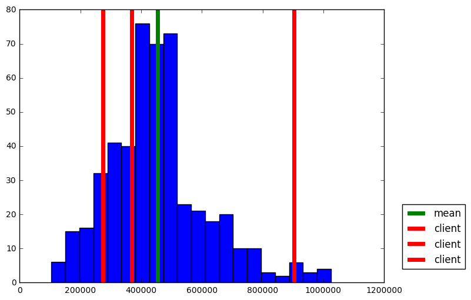

# Machine Learning Engineer Nanodegree
## Model Evaluation & Validation
## Project: Predicting Boston Housing Prices

Welcome to the first project of the Machine Learning Engineer Nanodegree! In this notebook, some template code has already been provided for you, and you will need to implement additional functionality to successfully complete this project. You will not need to modify the included code beyond what is requested. Sections that begin with **'Implementation'** in the header indicate that the following block of code will require additional functionality which you must provide. Instructions will be provided for each section and the specifics of the implementation are marked in the code block with a 'TODO' statement. Please be sure to read the instructions carefully!

In addition to implementing code, there will be questions that you must answer which relate to the project and your implementation. Each section where you will answer a question is preceded by a **'Question X'** header. Carefully read each question and provide thorough answers in the following text boxes that begin with **'Answer:'**. Your project submission will be evaluated based on your answers to each of the questions and the implementation you provide.  

>**Note:** Code and Markdown cells can be executed using the **Shift + Enter** keyboard shortcut. In addition, Markdown cells can be edited by typically double-clicking the cell to enter edit mode.

## Getting Started
In this project, you will evaluate the performance and predictive power of a model that has been trained and tested on data collected from homes in suburbs of Boston, Massachusetts. A model trained on this data that is seen as a *good fit* could then be used to make certain predictions about a home — in particular, its monetary value. This model would prove to be invaluable for someone like a real estate agent who could make use of such information on a daily basis.

The dataset for this project originates from the [UCI Machine Learning Repository](https://archive.ics.uci.edu/ml/datasets/Housing). The Boston housing data was collected in 1978 and each of the 506 entries represent aggregated data about 14 features for homes from various suburbs in Boston, Massachusetts. For the purposes of this project, the following preprocessing steps have been made to the dataset:
- 16 data points have an `'MEDV'` value of 50.0. These data points likely contain **missing or censored values** and have been removed.
- 1 data point has an `'RM'` value of 8.78. This data point can be considered an **outlier** and has been removed.
- The features `'RM'`, `'LSTAT'`, `'PTRATIO'`, and `'MEDV'` are essential. The remaining **non-relevant features** have been excluded.
- The feature `'MEDV'` has been **multiplicatively scaled** to account for 35 years of market inflation.

Run the code cell below to load the Boston housing dataset, along with a few of the necessary Python libraries required for this project. You will know the dataset loaded successfully if the size of the dataset is reported.


```python
# Import libraries necessary for this project
import numpy as np
import pandas as pd
from sklearn.cross_validation import ShuffleSplit

# Import supplementary visualizations code visuals.py
import visuals as vs

# Pretty display for notebooks
%matplotlib inline

# Load the Boston housing dataset
data = pd.read_csv('housing.csv')
prices = data['MEDV']
features = data.drop('MEDV', axis = 1)
    
# Success
print("Boston housing dataset has {} data points with {} variables each.".format(*data.shape))
```

    Boston housing dataset has 489 data points with 4 variables each.


--------------

# Part- I

## Data Exploration
In this first section of this project, you will make a cursory investigation about the Boston housing data and provide your observations. Familiarizing yourself with the data through an explorative process is a fundamental practice to help you better understand and justify your results.

Since the main goal of this project is to construct a working model which has the capability of predicting the value of houses, we will need to separate the dataset into **features** and the **target variable**. The **features**, `'RM'`, `'LSTAT'`, and `'PTRATIO'`, give us quantitative information about each data point. The **target variable**, `'MEDV'`, will be the variable we seek to predict. These are stored in `features` and `prices`, respectively.

### Implementation: Calculate Statistics
For your very first coding implementation, you will calculate descriptive statistics about the Boston housing prices. Since `numpy` has already been imported for you, use this library to perform the necessary calculations. These statistics will be extremely important later on to analyze various prediction results from the constructed model.

In the code cell below, you will need to implement the following:
- Calculate the minimum, maximum, mean, median, and standard deviation of `'MEDV'`, which is stored in `prices`.
  - Store each calculation in their respective variable.


```python
# TODO: Minimum price of the data
minimum_price = np.min(prices)

# TODO: Maximum price of the data
maximum_price = np.max(prices)

# TODO: Mean price of the data
mean_price = np.mean(prices)

# TODO: Median price of the data
median_price = np.median(prices)

# Extra: First abd Third Quartile
first_quartile = np.percentile(prices, 25)
third_quartile = np.percentile(prices, 75)

# TODO: Standard deviation of prices of the data
std_price = np.std(prices)

# Show the calculated statistics
print ("Statistics for Boston housing dataset:\n")
print ("Minimum price: ${:,.2f}".format(minimum_price))
print ("Maximum price: ${:,.2f}".format(maximum_price))
print ("Mean price: ${:,.2f}".format(mean_price))
print ("Median price ${:,.2f}".format(median_price))
print ("First Quartile: ${:,.2f}".format(first_quartile ))
print ("Third Quartile: ${:,.2f}".format(third_quartile ))
print ("Standard deviation of prices: ${:,.2f}".format(std_price))
```

    Statistics for Boston housing dataset:
    
    Minimum price: $105,000.00
    Maximum price: $1,024,800.00
    Mean price: $454,342.94
    Median price $438,900.00
    First Quartile: $350,700.00
    Third Quartile: $518,700.00
    Standard deviation of prices: $165,171.13


* I love visualizing them


```python
import matplotlib.pyplot as plt
plt.figure(figsize=(8, 6))
plt.hist(prices, bins = 20, color= 'g')
plt.axvline(mean_price, lw = 5, c = 'b', label = 'mean')
plt.axvline(median_price, lw = 5, c = 'y', label = 'median')
plt.axvline(first_quartile, lw = 5, c = 'r',label = 'first_quartile')
plt.axvline(third_quartile, lw = 5, c = 'm', label = 'third_quartile')
plt.legend(bbox_to_anchor=(1.05, 0.05),loc='lower left',borderaxespad = 0.)
```


    <matplotlib.legend.Legend at 0x11b06b400>





### Question 1 - Feature Observation
As a reminder, we are using three features from the Boston housing dataset: `'RM'`, `'LSTAT'`, and `'PTRATIO'`. For each data point (neighborhood):
- `'RM'` is the average number of rooms among homes in the neighborhood.
- `'LSTAT'` is the percentage of homeowners in the neighborhood considered "lower class" (working poor).
- `'PTRATIO'` is the ratio of students to teachers in primary and secondary schools in the neighborhood.

_Using your intuition, for each of the three features above, do you think that an increase in the value of that feature would lead to an **increase** in the value of `'MEDV'` or a **decrease** in the value of `'MEDV'`? Justify your answer for each._  
**Hint:** Would you expect a home that has an `'RM'` value of 6 be worth more or less than a home that has an `'RM'` value of 7?

**Answer: **

Increase in the value of a features sometime cross the limit for increase in the value of `MEDV`. Let me go one by one.

1. House with large `RM` (more rooms) is in general more likely to cost more for the larger space. But small houses with many rooms may not impose same type of contribution on decision making.

2. High `LSTAT` means the house has a poor neighborhood and likely to reduce the value of `MEDV`. This is because houses in rich neighborhood is correlated with high standard of self paied local security network, transportation and other extra infrastructure.

3. Low `PTRATIO` implies that the community has rich education resources. This will raise the value of the hosue. But this is correlated with the family members and chance of having baby in near future.

* Checking my intution


```python
import matplotlib.pyplot as plt
plt.figure(figsize=(20, 5))
for i, col in enumerate(features.columns):
    plt.subplot(1, 4, i+1)
    plt.plot(data[col], prices, 'o')
    plt.title(col)
    plt.xlabel(col)
    plt.ylabel('prices')
```


Plot 1 and 2 are making a lot of sense. Plot 3 is  little complicated.

---------------

# Part- II


## Developing a Model


In this second section of the project, you will develop the tools and techniques necessary for a model to make a prediction. Being able to make accurate evaluations of each model's performance through the use of these tools and techniques helps to greatly reinforce the confidence in your predictions.

### Implementation: Define a Performance Metric
It is difficult to measure the quality of a given model without quantifying its performance over training and testing. This is typically done using some type of performance metric, whether it is through calculating some type of error, the goodness of fit, or some other useful measurement. For this project, you will be calculating the [*coefficient of determination*](http://stattrek.com/statistics/dictionary.aspx?definition=coefficient_of_determination), R<sup>2</sup>, to quantify your model's performance. The coefficient of determination for a model is a useful statistic in regression analysis, as it often describes how "good" that model is at making predictions. 

The values for R<sup>2</sup> range from 0 to 1, which captures the percentage of squared correlation between the predicted and actual values of the **target variable**. A model with an R<sup>2</sup> of 0 is no better than a model that always predicts the *mean* of the target variable, whereas a model with an R<sup>2</sup> of 1 perfectly predicts the target variable. Any value between 0 and 1 indicates what percentage of the target variable, using this model, can be explained by the **features**. _A model can be given a negative R<sup>2</sup> as well, which indicates that the model is **arbitrarily worse** than one that always predicts the mean of the target variable._

For the `performance_metric` function in the code cell below, you will need to implement the following:
- Use `r2_score` from `sklearn.metrics` to perform a performance calculation between `y_true` and `y_predict`.
- Assign the performance score to the `score` variable.


```python
# Import 'r2_score'
from sklearn.metrics import r2_score

def performance_metric(y_true, y_predict):
    """ Calculates and returns the performance score between 
        true and predicted values based on the metric chosen. """
    
    #Calculate the performance score between 'y_true' and 'y_predict'
    score = r2_score(y_true, y_predict)
    
    # Return the score
    return score
```

### Question 2 - Goodness of Fit
Assume that a dataset contains five data points and a model made the following predictions for the target variable:

| True Value | Prediction |
| :-------------: | :--------: |
| 3.0 | 2.5 |
| -0.5 | 0.0 |
| 2.0 | 2.1 |
| 7.0 | 7.8 |
| 4.2 | 5.3 |
*Would you consider this model to have successfully captured the variation of the target variable? Why or why not?* 

Run the code cell below to use the `performance_metric` function and calculate this model's coefficient of determination.


```python
# Calculate the performance of this model
score = performance_metric([3, -0.5, 2, 7, 4.2], [2.5, 0.0, 2.1, 7.8, 5.3])
print ("Model has a coefficient of determination, R^2, of {:.3f}.".format(score))
```

    Model has a coefficient of determination, R^2, of 0.923.


**Answer:**

**Would you consider this model to have successfully captured the variation of the target variable?**

 Yes, this model have successfully captured the variation of the target variable. Since r2_score is 0.923, this implies that 92.3% of the variables are predictable.
 
 
**Why or why not?**

The r2_score provides a measure of how well future samples are likely to be predicted by the model compared to the case where all predictions are replaced by mean value of target variable. First of all, the meaning of different values of r2_score are :

$ \huge{R^{2} (y,\hat{y}) = 1 - \frac{\sum _{i=0}^{n_{samples} -1} (y_{i} - \hat{y}_{i})^{2}}{\sum _{i=0}^{n_{samples} -1} (y_{i} - \bar{y})^{2}}}$

Where $\hat{y}$ = prediction, $\bar{y}$ = mean value

* Special case: $R^{2} =0$,
     In this case model predictions are equivalent to all predictions replaced by mean value.
     
* Special case: $R^{2} =1$,
     In this case model prediction is equal to the exact value. This is an ideal case and may lead us to overfitting.
     
* Special case: $R^{2} < 0$,
     In this case model predictions are more worst and could not even exceed the score if we roughly predict all value to mean value.
     
 Thus, the value of $ R^{2}$ closer to 1 is the best value!


  

Reference used: http://scikit-learn.org/stable/modules/model_evaluation.html#r2-score

### Implementation: Shuffle and Split Data
Your next implementation requires that you take the Boston housing dataset and split the data into training and testing subsets. Typically, the data is also shuffled into a random order when creating the training and testing subsets to remove any bias in the ordering of the dataset.

For the code cell below, you will need to implement the following:
- Use `train_test_split` from `sklearn.cross_validation` to shuffle and split the `features` and `prices` data into training and testing sets.
  - Split the data into 80% training and 20% testing.
  - Set the `random_state` for `train_test_split` to a value of your choice. This ensures results are consistent.
- Assign the train and testing splits to `X_train`, `X_test`, `y_train`, and `y_test`.


```python
# Import 'train_test_split'
from sklearn.cross_validation import train_test_split

# Shuffle and split the data into training and testing subsets
X_train, X_test, y_train, y_test = train_test_split(features, prices, test_size=0.20, random_state=31) 

# Success
print ("Training and testing split was successful.")
```

    Training and testing split was successful.


### Question 3 - Training and Testing
*What is the benefit to splitting a dataset into some ratio of training and testing subsets for a learning algorithm?*  
**Hint:** What could go wrong with not having a way to test your model?

**Answer: **

Theoretically, there could be infinite data and  the best model with 99.99% accuracy disregarding the computational cost and time. 

Practically, this is not feasible. For a given set of data, there exist infinitely many models withinh the certain range of accuricy. Our intention is to find that best model which will have less and less error based on computational cost. If we use whole data as training data in the search of the best model, we will hit that model which will predict all data in traing set with high accuracy but we are left with nothing to check our model. We will be unknown with the accuracy of the model with the data which exist out there in the Universal set(which has infinite data where training data is only a subset of it).

In short, test set being independent from training set, helps us better evluate the algorithms by detecting overfitting or underfitting in training subsets. 

----

## Analyzing Model Performance
In this third section of the project, you'll take a look at several models' learning and testing performances on various subsets of training data. Additionally, you'll investigate one particular algorithm with an increasing `'max_depth'` parameter on the full training set to observe how model complexity affects performance. Graphing your model's performance based on varying criteria can be beneficial in the analysis process, such as visualizing behavior that may not have been apparent from the results alone.

### Learning Curves
The following code cell produces four graphs for a decision tree model with different maximum depths. Each graph visualizes the learning curves of the model for both training and testing as the size of the training set is increased. Note that the shaded region of a learning curve denotes the uncertainty of that curve (measured as the standard deviation). The model is scored on both the training and testing sets using R<sup>2</sup>, the coefficient of determination.  

Run the code cell below and use these graphs to answer the following question.


```python
# Produce learning curves for varying training set sizes and maximum depths
vs.ModelLearning(features, prices)
```





### Question 4 - Learning the Data
*Choose one of the graphs above and state the maximum depth for the model. What happens to the score of the training curve as more training points are added? What about the testing curve? Would having more training points benefit the model?*  
**Hint:** Are the learning curves converging to particular scores?

**Answer: **

By looking gap between training and testing curves, as `max_depth` goes from `1` to `10`, this clearly indicates that algorithm goes from underfitting to overfitting. Graph with `max_depth = 3` seems to be the best fit in between. So my analysis goes for `max_depth = 3`.

1. **What happens to the score of the training curve as more training points are added?**

    Adding more training points may reduce the noise in training score plot and it will be more smooth and almost horizontal after crossing certain limit along x-axis(Number of Training Points). For example at `max_depth =3`, as training points increase, it does not suffer from overfitting or underfitting, so adding more training points will not affect the trend of convergence.
    
   
2. **What about the testing curve?**
    
   It will behave similar to training curves.
    
3. **Would having more training points benefit the model?**

   Eventhough training curve becomes smooth on increasing training data, it is evident form the convergence of training and testing curves that after certain number of training points it may not have much siginificance to improve accuracy with respect to computation cost.
   

### Complexity Curves
The following code cell produces a graph for a decision tree model that has been trained and validated on the training data using different maximum depths. The graph produces two complexity curves — one for training and one for validation. Similar to the **learning curves**, the shaded regions of both the complexity curves denote the uncertainty in those curves, and the model is scored on both the training and validation sets using the `performance_metric` function.  

Run the code cell below and use this graph to answer the following two questions.


```python
vs.ModelComplexity(X_train, y_train)
```





### Question 5 - Bias-Variance Tradeoff
*When the model is trained with a maximum depth of 1, does the model suffer from high bias or from high variance? How about when the model is trained with a maximum depth of 10? What visual cues in the graph justify your conclusions?*  
**Hint:** How do you know when a model is suffering from high bias or high variance?

**Answer: **

1. **When the model is trained with a maximum depth of 1, does the model suffer from high bias or from high variance?**

    Yes, it suffers from high bias. First of all the validation score and training score both are lower than desired value (~0.8). Sconldly, both curve are close to each other on score value which indicates there is underfitting.

2. **How about when the model is trained with a maximum depth of 10?**

    Now, it suffers from high variance. The gap between validation score and training score clearly indicates there is overfitting.
        
3. **What visual cues in the graph justify your conclusions?**

   Comparision with desired values (>0.8) and gap between training and testing curves are the important cues for the conclusion.

### Question 6 - Best-Guess Optimal Model
*Which maximum depth do you think results in a model that best generalizes to unseen data? What intuition lead you to this answer?*

**Answer: **

The best maximum depth seems to be 3. Both training curve and validation curve reach maximum value of score with no sign of overfitting or underfitting.

--------

# Part-III

-----

## Evaluating Model Performance
In this final section of the project, you will construct a model and make a prediction on the client's feature set using an optimized model from `fit_model`.

### Question 7 - Grid Search
*What is the grid search technique and how it can be applied to optimize a learning algorithm?*

**Answer: **

  Grid search is an exhaustive search algorithm which searches over all combinations of parameters we specify to find the optimum combination that yields the best performance. Due to its exhaustive search nature, grid search can be computationally expensive, especially when data size is large and model is complicated. Sometimes we resort to randomized search in this case to search only some combinations of the parameters. Following are the detail of two such algorithms:
  
-----------

  | Algorithm | Detail | Implementation | Difference |
| --- | --- | --- | --- |
| ``GridSearchCV`` |``GridSearchCV`` implements with exhaustive search over specified parameter values for an estimator. The parameters of the estimator used to apply these methods are optimized by cross-validated grid-search over a parameter grid. | ``fit``, ``score``, ``predict``, ``predict_proba``,``decision_function``,``transform`` and ``inverse_transform``  | In ``GridSearchCV``, all parameter values are tried out. |
| ``RandomizedSearchCV`` |``RandomizedSearchCV`` implements with Randomized search on hyper parameters. The parameters of the estimator used to apply these methods are optimized by cross-validated search over parameter settings.|``fit``, ``score``, ``predict``, ``predict_proba``,``decision_function``,``transform`` and ``inverse_transform`` |In contrast to ``GridSearchCV``, not all parameter values are tried out, but rather a fixed number of parameter settings is sampled from the specified distributions. The number of parameter settings that are tried is given by ``n_iter``.|

References used to answer: 
1. http://scikit-learn.org/stable/modules/generated/sklearn.model_selection.GridSearchCV.html#sklearn.model_selection.GridSearchCV
2. http://scikit-learn.org/stable/modules/generated/sklearn.model_selection.RandomizedSearchCV.html#sklearn.model_selection.RandomizedSearchCV


### Question 8 - Cross-Validation
*What is the k-fold cross-validation training technique? What benefit does this technique provide for grid search when optimizing a model?*  
**Hint:** Much like the reasoning behind having a testing set, what could go wrong with using grid search without a cross-validated set?

**Answer: **

1. **What is the k-fold cross-validation training technique?**

    Practically, this is a method to extract the data resources from multiple direction to insure that the model trained is robust over any possible noise. Technically, it is achived by taking all data as training sets and testing sets via roation and averaging.
    This includes the following steps:
    
    Step-I:  Data is divided into k folds of eqaully large chunks.
    
    Step-II: Iterated through the k chunks using the current chunk for validation and other k-1 chunks for training.
    
    Step -III: Average is taken over the validation scores to give a single validation score for the learning algorithm.
    
    
2. **What benefit does this technique provide for grid search when optimizing a model?**

   Using all the examples in the dataset for both training and testing is the main advantage of k-fold cross-validation. This makes it more robust to variations of parameters in grid search. Grid search may overfit the validation set if certain evaluation data points are outliers. It can be eliminated by averaging over k-times evaluations using all data points.


### Implementation: Fitting a Model
Your final implementation requires that you bring everything together and train a model using the **decision tree algorithm**. To ensure that you are producing an optimized model, you will train the model using the grid search technique to optimize the `'max_depth'` parameter for the decision tree. The `'max_depth'` parameter can be thought of as how many questions the decision tree algorithm is allowed to ask about the data before making a prediction. Decision trees are part of a class of algorithms called *supervised learning algorithms*.

In addition, you will find your implementation is using `ShuffleSplit()` for an alternative form of cross-validation (see the `'cv_sets'` variable). While it is not the K-Fold cross-validation technique you describe in **Question 8**, this type of cross-validation technique is just as useful!. The `ShuffleSplit()` implementation below will create 10 (`'n_iter'`) shuffled sets, and for each shuffle, 20% (`'test_size'`) of the data will be used as the *validation set*. While you're working on your implementation, think about the contrasts and similarities it has to the K-fold cross-validation technique.

For the `fit_model` function in the code cell below, you will need to implement the following:
- Use [`DecisionTreeRegressor`](http://scikit-learn.org/stable/modules/generated/sklearn.tree.DecisionTreeRegressor.html) from `sklearn.tree` to create a decision tree regressor object.
  - Assign this object to the `'regressor'` variable.
- Create a dictionary for `'max_depth'` with the values from 1 to 10, and assign this to the `'params'` variable.
- Use [`make_scorer`](http://scikit-learn.org/stable/modules/generated/sklearn.metrics.make_scorer.html) from `sklearn.metrics` to create a scoring function object.
  - Pass the `performance_metric` function as a parameter to the object.
  - Assign this scoring function to the `'scoring_fnc'` variable.
- Use [`GridSearchCV`](http://scikit-learn.org/0.17/modules/generated/sklearn.grid_search.GridSearchCV.html) from `sklearn.grid_search` to create a grid search object.
  - Pass the variables `'regressor'`, `'params'`, `'scoring_fnc'`, and `'cv_sets'` as parameters to the object. 
  - Assign the `GridSearchCV` object to the `'grid'` variable.


```python
# Import 'make_scorer', 'DecisionTreeRegressor', and 'GridSearchCV'
from sklearn.metrics import make_scorer
from sklearn.tree import DecisionTreeRegressor
from sklearn.grid_search import GridSearchCV

def fit_model(X, y):
    """ Performs grid search over the 'max_depth' parameter for a 
        decision tree regressor trained on the input data [X, y]. """
    
    # Create cross-validation sets from the training data
    cv_sets = ShuffleSplit(X.shape[0], n_iter = 10, test_size = 0.20, random_state = 0)

    # Create a decision tree regressor object
    regressor = DecisionTreeRegressor()

    # Create a dictionary for the parameter 'max_depth' with a range from 1 to 10
    params = {'max_depth':(1,2,3,4,5,6,7,8,9,10)}

    # Transform 'performance_metric' into a scoring function using 'make_scorer' 
    scoring_fnc = make_scorer(performance_metric)

    # Create the grid search object
    grid = GridSearchCV(regressor, params,scoring_fnc,cv=cv_sets)

    # Fit the grid search object to the data to compute the optimal model
    grid = grid.fit(X, y)

    # Return the optimal model after fitting the data
    return grid.best_estimator_
```

### Making Predictions
Once a model has been trained on a given set of data, it can now be used to make predictions on new sets of input data. In the case of a *decision tree regressor*, the model has learned *what the best questions to ask about the input data are*, and can respond with a prediction for the **target variable**. You can use these predictions to gain information about data where the value of the target variable is unknown — such as data the model was not trained on.

### Question 9 - Optimal Model
_What maximum depth does the optimal model have? How does this result compare to your guess in **Question 6**?_  

Run the code block below to fit the decision tree regressor to the training data and produce an optimal model.


```python
# Fit the training data to the model using grid search
reg = fit_model(X_train, y_train)

# Produce the value for 'max_depth'
print ("Parameter 'max_depth' is {} for the optimal model."\
                           .format(reg.get_params()['max_depth']))
```

    Parameter 'max_depth' is 3 for the optimal model.


#### **Answer: **

The optimal model has `max_depth=4`, it is close to the result `max_depth=3` in **Question 6**. This difference could be as a result of different data used for in the graphical representation and the grid search. Arguably grid search should be more reliable. 

   Making life less complicated by following - Occam's Razor principle(https://simple.wikipedia.org/wiki/Occam's_razor), which favours a simpler model to more complicated ones. :)

### Question 10 - Predicting Selling Prices
Imagine that you were a real estate agent in the Boston area looking to use this model to help price homes owned by your clients that they wish to sell. You have collected the following information from three of your clients:

| Feature | Client 1 | Client 2 | Client 3 |
| :---: | :---: | :---: | :---: |
| Total number of rooms in home | 5 rooms | 4 rooms | 8 rooms |
| Neighborhood poverty level (as %) | 17% | 32% | 3% |
| Student-teacher ratio of nearby schools | 15-to-1 | 22-to-1 | 12-to-1 |
*What price would you recommend each client sell his/her home at? Do these prices seem reasonable given the values for the respective features?*  
**Hint:** Use the statistics you calculated in the **Data Exploration** section to help justify your response.  

Run the code block below to have your optimized model make predictions for each client's home.


```python
# Produce a matrix for client data
client_data = [[5, 17, 15], # Client 1
               [4, 32, 22], # Client 2
               [8, 3, 12]]  # Client 3

# Show predictions
for i, price in enumerate(reg.predict(client_data)):
    print ("Predicted selling price for Client {}'s home: ${:,.2f}".format(i+1, price))
```

    Predicted selling price for Client 1's home: $369,680.77
    Predicted selling price for Client 2's home: $274,568.97
    Predicted selling price for Client 3's home: $903,150.00


**Answer: **
1. **What price would you recommend each client sell his/her home at?**

Following are the prices recomended:
    
```
Predicted selling price for Client 1's home: $410,792.31
Predicted selling price for Client 2's home: $234,054.55
Predicted selling price for Client 3's home: $920,010.00
```

2. **Do these prices seem reasonable given the values for the respective features?**

    Yes. The above prices are for average house(~410k), cheap house(~234k), and costy house(~920k) respectively by their deviation from mean_price measured in std_price.This is evident from histogram plot of prices below. The predicated prices are reasonable considering dataset statistics and our observation in **Question 1**. The house price is likely to be in proportion to `RM`, and in inverse proportion to `LSTAT` or `PTRATIO`. As an example, for client 2  the deviations of three features all decrease the house price based on assumpution in Question 1 which cause it be cheaper than average house.
    


```python
import matplotlib.pyplot as plt
plt.figure(figsize=(8, 6))
plt.hist(prices, bins = 20)
mean_price = np.mean(prices)
plt.axvline(mean_price, lw = 5, c = 'g',label = "mean")

for price in reg.predict(client_data):
    plt.axvline(price, lw = 5, c = 'r', label = "client")
plt.legend(bbox_to_anchor=(1.05, 0.05),loc='lower left',borderaxespad = 0.)
```


    <matplotlib.legend.Legend at 0x11bf42ba8>





### Sensitivity
An optimal model is not necessarily a robust model. Sometimes, a model is either too complex or too simple to sufficiently generalize to new data. Sometimes, a model could use a learning algorithm that is not appropriate for the structure of the data given. Other times, the data itself could be too noisy or contain too few samples to allow a model to adequately capture the target variable — i.e., the model is underfitted. Run the code cell below to run the `fit_model` function ten times with different training and testing sets to see how the prediction for a specific client changes with the data it's trained on.


```python
vs.PredictTrials(features, prices, fit_model, client_data)
```

    Trial 1: $391,183.33
    Trial 2: $419,700.00
    Trial 3: $415,800.00
    Trial 4: $420,622.22
    Trial 5: $418,377.27
    Trial 6: $411,931.58
    Trial 7: $399,663.16
    Trial 8: $407,232.00
    Trial 9: $351,577.61
    Trial 10: $413,700.00
    
    Range in prices: $69,044.61


The standard deviation of prices is 165,171.13 and range of price predicted is 69,044.61. This shows that the price predicted is consistent within 1 stadard deviation.

### Question 11 - Applicability
*In a few sentences, discuss whether the constructed model should or should not be used in a real-world setting.*  
**Hint:** Some questions to answering:
- *How relevant today is data that was collected from 1978?*
- *Are the features present in the data sufficient to describe a home?*
- *Is the model robust enough to make consistent predictions?*
- *Would data collected in an urban city like Boston be applicable in a rural city?*

**Answer: **

The constructed model should not be used directly in a real-world setting. Following are the potential reasons:


1. This data is from 1978.So, this model can not capture the present day scenario and can be biased with time changing.

2. Dataset has a small number of samples. This may cause the model not to be robust enough to make consistent predictions.

3. The features such as location,security, transportation, population etc are also likly to affect the house price. The features in this dataset may be insufficient to avoid underfitting, apart from room numbers, local incoming and education resources.

4. There could be different models in different areas such as urban city or rural city. Newly built smart homes or IOT add technology may add new features not seen before in house pricing.

-------------------

> **Note**: Once you have completed all of the code implementations and successfully answered each question above, you may finalize your work by exporting the iPython Notebook as an HTML document. You can do this by using the menu above and navigating to  
**File -> Download as -> HTML (.html)**. Include the finished document along with this notebook as your submission.

-----------------
