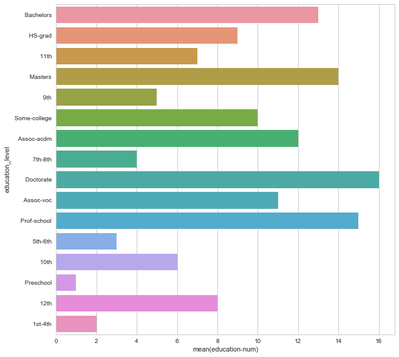
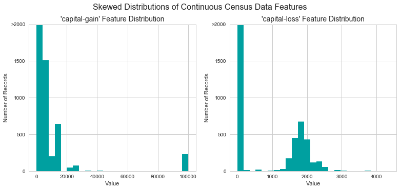

# Machine Learning Engineer Nanodegree
## Supervised Learning
## Project: Finding Donors for *CharityML*

Welcome to the second project of the Machine Learning Engineer Nanodegree! In this notebook, some template code has already been provided for you, and it will be your job to implement the additional functionality necessary to successfully complete this project. Sections that begin with **'Implementation'** in the header indicate that the following block of code will require additional functionality which you must provide. Instructions will be provided for each section and the specifics of the implementation are marked in the code block with a `'TODO'` statement. Please be sure to read the instructions carefully!

In addition to implementing code, there will be questions that you must answer which relate to the project and your implementation. Each section where you will answer a question is preceded by a **'Question X'** header. Carefully read each question and provide thorough answers in the following text boxes that begin with **'Answer:'**. Your project submission will be evaluated based on your answers to each of the questions and the implementation you provide.  

>**Note:** Code and Markdown cells can be executed using the **Shift + Enter** keyboard shortcut. In addition, Markdown cells can be edited by typically double-clicking the cell to enter edit mode.

## Getting Started

In this project, you will employ several supervised algorithms of your choice to accurately model individuals' income using data collected from the 1994 U.S. Census. You will then choose the best candidate algorithm from preliminary results and further optimize this algorithm to best model the data. Your goal with this implementation is to construct a model that accurately predicts whether an individual makes more than $50,000. This sort of task can arise in a non-profit setting, where organizations survive on donations.  Understanding an individual's income can help a non-profit better understand how large of a donation to request, or whether or not they should reach out to begin with.  While it can be difficult to determine an individual's general income bracket directly from public sources, we can (as we will see) infer this value from other publically available features. 

The dataset for this project originates from the [UCI Machine Learning Repository](https://archive.ics.uci.edu/ml/datasets/Census+Income). The datset was donated by Ron Kohavi and Barry Becker, after being published in the article _"Scaling Up the Accuracy of Naive-Bayes Classifiers: A Decision-Tree Hybrid"_. You can find the article by Ron Kohavi [online](https://www.aaai.org/Papers/KDD/1996/KDD96-033.pdf). The data we investigate here consists of small changes to the original dataset, such as removing the `'fnlwgt'` feature and records with missing or ill-formatted entries.

----
## Exploring the Data
Run the code cell below to load necessary Python libraries and load the census data. Note that the last column from this dataset, `'income'`, will be our target label (whether an individual makes more than, or at most, $50,000 annually). All other columns are features about each individual in the census database.


```python
# Import libraries necessary for this project
import numpy as np
import pandas as pd
from time import time
from IPython.display import display # Allows the use of display() for DataFrames

# Import supplementary visualization code visuals.py
import visuals as vs

# Pretty display for notebooks
%matplotlib inline

# Load the Census dataset
data = pd.read_csv("census.csv")

# Success - Display the first record
display(data.head(n=2))
print('shape of data =',  data.shape)
```


<div>
<table border="1" class="dataframe">
  <thead>
    <tr style="text-align: right;">
      <th></th>
      <th>age</th>
      <th>workclass</th>
      <th>education_level</th>
      <th>education-num</th>
      <th>marital-status</th>
      <th>occupation</th>
      <th>relationship</th>
      <th>race</th>
      <th>sex</th>
      <th>capital-gain</th>
      <th>capital-loss</th>
      <th>hours-per-week</th>
      <th>native-country</th>
      <th>income</th>
    </tr>
  </thead>
  <tbody>
    <tr>
      <th>0</th>
      <td>39</td>
      <td>State-gov</td>
      <td>Bachelors</td>
      <td>13.0</td>
      <td>Never-married</td>
      <td>Adm-clerical</td>
      <td>Not-in-family</td>
      <td>White</td>
      <td>Male</td>
      <td>2174.0</td>
      <td>0.0</td>
      <td>40.0</td>
      <td>United-States</td>
      <td>&lt;=50K</td>
    </tr>
    <tr>
      <th>1</th>
      <td>50</td>
      <td>Self-emp-not-inc</td>
      <td>Bachelors</td>
      <td>13.0</td>
      <td>Married-civ-spouse</td>
      <td>Exec-managerial</td>
      <td>Husband</td>
      <td>White</td>
      <td>Male</td>
      <td>0.0</td>
      <td>0.0</td>
      <td>13.0</td>
      <td>United-States</td>
      <td>&lt;=50K</td>
    </tr>
  </tbody>
</table>
</div>


    ('shape of data =', (45222, 14))


##### Data info


```python
data.info()
```

    <class 'pandas.core.frame.DataFrame'>
    RangeIndex: 45222 entries, 0 to 45221
    Data columns (total 14 columns):
    age                45222 non-null int64
    workclass          45222 non-null object
    education_level    45222 non-null object
    education-num      45222 non-null float64
    marital-status     45222 non-null object
    occupation         45222 non-null object
    relationship       45222 non-null object
    race               45222 non-null object
    sex                45222 non-null object
    capital-gain       45222 non-null float64
    capital-loss       45222 non-null float64
    hours-per-week     45222 non-null float64
    native-country     45222 non-null object
    income             45222 non-null object
    dtypes: float64(4), int64(1), object(9)
    memory usage: 4.8+ MB


```python
data.describe()
```


<div>
<table border="1" class="dataframe">
  <thead>
    <tr style="text-align: right;">
      <th></th>
      <th>age</th>
      <th>education-num</th>
      <th>capital-gain</th>
      <th>capital-loss</th>
      <th>hours-per-week</th>
    </tr>
  </thead>
  <tbody>
    <tr>
      <th>count</th>
      <td>45222.000000</td>
      <td>45222.000000</td>
      <td>45222.000000</td>
      <td>45222.000000</td>
      <td>45222.000000</td>
    </tr>
    <tr>
      <th>mean</th>
      <td>38.547941</td>
      <td>10.118460</td>
      <td>1101.430344</td>
      <td>88.595418</td>
      <td>40.938017</td>
    </tr>
    <tr>
      <th>std</th>
      <td>13.217870</td>
      <td>2.552881</td>
      <td>7506.430084</td>
      <td>404.956092</td>
      <td>12.007508</td>
    </tr>
    <tr>
      <th>min</th>
      <td>17.000000</td>
      <td>1.000000</td>
      <td>0.000000</td>
      <td>0.000000</td>
      <td>1.000000</td>
    </tr>
    <tr>
      <th>25%</th>
      <td>28.000000</td>
      <td>9.000000</td>
      <td>0.000000</td>
      <td>0.000000</td>
      <td>40.000000</td>
    </tr>
    <tr>
      <th>50%</th>
      <td>37.000000</td>
      <td>10.000000</td>
      <td>0.000000</td>
      <td>0.000000</td>
      <td>40.000000</td>
    </tr>
    <tr>
      <th>75%</th>
      <td>47.000000</td>
      <td>13.000000</td>
      <td>0.000000</td>
      <td>0.000000</td>
      <td>45.000000</td>
    </tr>
    <tr>
      <th>max</th>
      <td>90.000000</td>
      <td>16.000000</td>
      <td>99999.000000</td>
      <td>4356.000000</td>
      <td>99.000000</td>
    </tr>
  </tbody>
</table>
</div>


---------

#### Histogram


```python
import matplotlib.pyplot as plt
plt.figure(figsize = (14,10))
plt.subplot(2,3,1)
plt.title("distribution of age")
data['age'].hist(bins = 100)
plt.subplot(2,3,2)
plt.title("distribution of education-num")
data['education-num'].hist(bins = 40)
plt.subplot(2,3,3)
plt.title("distribution of capital-gain")
data['capital-gain'].hist(bins = 100)
plt.subplot(2,3,4)
plt.title("distribution of hours-per-week")
data['hours-per-week'].hist(bins = 50)
plt.subplot(2,3,5)
plt.title("distribution of capital-loss")
data['capital-loss'].hist(bins = 50)
```


    <matplotlib.axes._subplots.AxesSubplot at 0x13ab99890>


-----------

##### Pairplot:
Lets look little more insight about dependency or independency of income with other variables like age, hours per week etc.


```python
import seaborn as sns
plt.figure(figsize = (16,21))
sns.set()
sns.pairplot(data, hue="income")
```


    <seaborn.axisgrid.PairGrid at 0x13bb2b290>


    <matplotlib.figure.Figure at 0x13b569490>


It shows high earning is in general for older age, large education number and hours per week etc. This might be because of knowledge and experience.

---------

### Implementation: Data Exploration
A cursory investigation of the dataset will determine how many individuals fit into either group, and will tell us about the percentage of these individuals making more than \$50,000. In the code cell below, you will need to compute the following:
- The total number of records, `'n_records'`
- The number of individuals making more than \$50,000 annually, `'n_greater_50k'`.
- The number of individuals making at most \$50,000 annually, `'n_at_most_50k'`.
- The percentage of individuals making more than \$50,000 annually, `'greater_percent'`.

**Hint:** You may need to look at the table above to understand how the `'income'` entries are formatted. 


```python
# Total number of records
n_records = data.shape[0]

# Number of records where individual's income is more than $50,000
n_greater_50k = data[(data.income=='>50K')].shape[0]

# Number of records where individual's income is at most $50,000
n_at_most_50k = data[(data.income=='<=50K')].shape[0]

# Percentage of individuals whose income is more than $50,000
greater_percent = (n_greater_50k/float(n_records))*100.0

# Print the results
print ("Total number of records: {}".format(n_records))
print ("Individuals making more than $50,000: {}".format(n_greater_50k))
print ("Individuals making at most $50,000: {}".format(n_at_most_50k))
print ("Percentage of individuals making more than $50,000: {:.2f}%".format(greater_percent))
```

    Total number of records: 45222
    Individuals making more than $50,000: 11208
    Individuals making at most $50,000: 34014
    Percentage of individuals making more than $50,000: 24.78%


I love to plot them in pi-chart.


```python
import matplotlib.pyplot as plt
plt.figure(figsize =(4,4))
labels = 'High Earning', 'Low Earning'
sizes = [n_greater_50k, n_at_most_50k]
colors = ['yellowgreen', 'gold']
explode = (0, 0.1)
plt.pie(sizes, explode=explode, labels=labels, colors=colors,
        autopct='%1.1f%%', shadow=True, startangle=90)
plt.axis('equal')
plt.title('Income')
plt.show()
```


---------

#### 1. Income versus merital status and sex: 

 Lets look the distribution of count over different merital status and sex: 


```python
sns.countplot(y="marital-status", hue="income", data=data, palette="Greens_d");
```


Plot below shows the count of individuals making less than or more than 50K, with a breakdown by the features sex and marital-status.


```python
import seaborn as sns
plt.figure(figsize = (16,21))
sns.set(style="whitegrid", color_codes=True)
sns.factorplot("sex", col="marital-status", data=data, 
               hue='income', kind="count", col_wrap=2);

```


    <matplotlib.figure.Figure at 0x13f1333d0>


Naturally, married families are more stable, happy and show more in count and also earn much!

--------

#### 2. Income versus age and hours per week
--------
I am pretty much interested to see income with respect to age


```python
plt.figure(figsize = (15,21))
plt.subplot(1,2,1)
sns.countplot(y="age", hue="income", data=data, palette="Greens_d");
plt.subplot(1,2,2)
sns.countplot(y="hours-per-week", hue="income", data=data, palette="Greens_d");
```


Wow! Look at the profile of count distribution over age, young generation are going crazy. Large no of young people are working hard to earn less money. They should! Because they have to learn. If you want to earn more, you need to wait patiently and keep learning skills till 40. :) :)

From hours per week count, ***why is that 40 hours so much special?*** This data is little bit biased. We prefer to say 10, 15, 20, 25 etc. But do not bother to say exact value like 13.5 hours or 21 hours. Working place, office etc set working hours like 10 hrs, 20 hrs etc thats why people say like that.

***I have a question to my reviewer:*** Should I add some **normal noise** to this data(hours per week) during preprocessing to get more robust model?

Is there any relation of age with working hours? Lets see it below.


```python
plt.figure(figsize = (15,21))
sns.jointplot(x="age", y="hours-per-week", data=data,size=15,kind = 'reg');
```


    <matplotlib.figure.Figure at 0x1459e1410>


I see as the age grows people work more hours, (Do they sleep less ? or take no rest? no idea! There is not data for sleeping habit). Happyness and calmness definitely play a role to decide for donation!

----------

####  3. Income versus education number and eduction level

First lets see how are these two related.


```python
plt.figure(figsize = (10,10))
sns.barplot(x="education-num", y="education_level", data=data);
```





Our guess came true. Doctorate has highest education number. Second heighest is Prof-school and pre school is the lowest one.

Lets see distribution of count of income over different education level and education number.


```python
plt.figure(figsize = (16,16))
plt.subplot(1,2,1)
sns.countplot(y="education-num", hue="income", data=data, palette="Greens_d");
plt.subplot(1,2,2)
sns.countplot(y="education_level", hue="income", data=data, palette="Greens_d");

```


WOw! Look at that **HS-grad** which has **education number = 9**. These are the majority of the total population. Interestingly **Bachelors (education num = 13)** have heighest count on earning much compaired to others!

I am going to skip two more features (capital- gain and capital-loss). Which are being discussed in **Data Preparation** topics

---------

----
## Preparing the Data
Before data can be used as input for machine learning algorithms, it often must be cleaned, formatted, and restructured — this is typically known as **preprocessing**. Fortunately, for this dataset, there are no invalid or missing entries we must deal with, however, there are some qualities about certain features that must be adjusted. This preprocessing can help tremendously with the outcome and predictive power of nearly all learning algorithms.

### Transforming Skewed Continuous Features
A dataset may sometimes contain at least one feature whose values tend to lie near a single number, but will also have a non-trivial number of vastly larger or smaller values than that single number.  Algorithms can be sensitive to such distributions of values and can underperform if the range is not properly normalized. With the census dataset two features fit this description: '`capital-gain'` and `'capital-loss'`. 

Run the code cell below to plot a histogram of these two features. Note the range of the values present and how they are distributed.


```python
# Split the data into features and target label
income_raw = data['income']
features_raw = data.drop('income', axis = 1)

# Visualize skewed continuous features of original data
vs.distribution(data)
```





For highly-skewed feature distributions such as `'capital-gain'` and `'capital-loss'`, it is common practice to apply a <a href="https://en.wikipedia.org/wiki/Data_transformation_(statistics)">logarithmic transformation</a> on the data so that the very large and very small values do not negatively affect the performance of a learning algorithm. Using a logarithmic transformation significantly reduces the range of values caused by outliers. Care must be taken when applying this transformation however: The logarithm of `0` is undefined, so we must translate the values by a small amount above `0` to apply the the logarithm successfully.

Run the code cell below to perform a transformation on the data and visualize the results. Again, note the range of values and how they are distributed. 


```python
# Log-transform the skewed features
skewed = ['capital-gain', 'capital-loss']
features_raw[skewed] = data[skewed].apply(lambda x: np.log(x + 1))

# Visualize the new log distributions
vs.distribution(features_raw, transformed = True)
```


### Normalizing Numerical Features
In addition to performing transformations on features that are highly skewed, it is often good practice to perform some type of scaling on numerical features. Applying a scaling to the data does not change the shape of each feature's distribution (such as `'capital-gain'` or `'capital-loss'` above); however, normalization ensures that each feature is treated equally when applying supervised learners. Note that once scaling is applied, observing the data in its raw form will no longer have the same original meaning, as exampled below.

Run the code cell below to normalize each numerical feature. We will use [`sklearn.preprocessing.MinMaxScaler`](http://scikit-learn.org/stable/modules/generated/sklearn.preprocessing.MinMaxScaler.html) for this.


```python
# Import sklearn.preprocessing.StandardScaler
from sklearn.preprocessing import MinMaxScaler

# Initialize a scaler, then apply it to the features
scaler = MinMaxScaler()
numerical = ['age', 'education-num', 'capital-gain', 'capital-loss', 'hours-per-week']
features_raw[numerical] = scaler.fit_transform(data[numerical])

# Show an example of a record with scaling applied
display(features_raw.head(n = 2))
```


<div>
<table border="1" class="dataframe">
  <thead>
    <tr style="text-align: right;">
      <th></th>
      <th>age</th>
      <th>workclass</th>
      <th>education_level</th>
      <th>education-num</th>
      <th>marital-status</th>
      <th>occupation</th>
      <th>relationship</th>
      <th>race</th>
      <th>sex</th>
      <th>capital-gain</th>
      <th>capital-loss</th>
      <th>hours-per-week</th>
      <th>native-country</th>
    </tr>
  </thead>
  <tbody>
    <tr>
      <th>0</th>
      <td>0.301370</td>
      <td>State-gov</td>
      <td>Bachelors</td>
      <td>0.8</td>
      <td>Never-married</td>
      <td>Adm-clerical</td>
      <td>Not-in-family</td>
      <td>White</td>
      <td>Male</td>
      <td>0.02174</td>
      <td>0.0</td>
      <td>0.397959</td>
      <td>United-States</td>
    </tr>
    <tr>
      <th>1</th>
      <td>0.452055</td>
      <td>Self-emp-not-inc</td>
      <td>Bachelors</td>
      <td>0.8</td>
      <td>Married-civ-spouse</td>
      <td>Exec-managerial</td>
      <td>Husband</td>
      <td>White</td>
      <td>Male</td>
      <td>0.00000</td>
      <td>0.0</td>
      <td>0.122449</td>
      <td>United-States</td>
    </tr>
  </tbody>
</table>
</div>


### Implementation: Data Preprocessing

From the table in **Exploring the Data** above, we can see there are several features for each record that are non-numeric. Typically, learning algorithms expect input to be numeric, which requires that non-numeric features (called *categorical variables*) be converted. One popular way to convert categorical variables is by using the **one-hot encoding** scheme. One-hot encoding creates a _"dummy"_ variable for each possible category of each non-numeric feature. For example, assume `someFeature` has three possible entries: `A`, `B`, or `C`. We then encode this feature into `someFeature_A`, `someFeature_B` and `someFeature_C`.

|   | someFeature |                    | someFeature_A | someFeature_B | someFeature_C |
| :-: | :-: |                            | :-: | :-: | :-: |
| 0 |  B  |  | 0 | 1 | 0 |
| 1 |  C  | ----> one-hot encode ----> | 0 | 0 | 1 |
| 2 |  A  |  | 1 | 0 | 0 |

Additionally, as with the non-numeric features, we need to convert the non-numeric target label, `'income'` to numerical values for the learning algorithm to work. Since there are only two possible categories for this label ("<=50K" and ">50K"), we can avoid using one-hot encoding and simply encode these two categories as `0` and `1`, respectively. In code cell below, you will need to implement the following:
 - Use [`pandas.get_dummies()`](http://pandas.pydata.org/pandas-docs/stable/generated/pandas.get_dummies.html?highlight=get_dummies#pandas.get_dummies) to perform one-hot encoding on the `'features_raw'` data.
 - Convert the target label `'income_raw'` to numerical entries.
   - Set records with "<=50K" to `0` and records with ">50K" to `1`.


```python
# One-hot encode the 'features_raw' data using pandas.get_dummies()
features = pd.get_dummies(features_raw)


# Encode the 'income_raw' data to numerical values
income = income_raw.apply(lambda x: 1 if x == '>50K' else 0)
# Alternate method
# pd.get_dummies(income_raw)['>50K']
# pd.get_dummies(income_raw, drop_first=True)


# Print the number of features after one-hot encoding
encoded = list(features.columns)
print ("{} total features after one-hot encoding.".format(len(encoded)))

# Uncomment the following line to see the encoded feature names
#print encoded
```

    103 total features after one-hot encoding.


```python
features.shape
```


    (45222, 103)


### Shuffle and Split Data
Now all _categorical variables_ have been converted into numerical features, and all numerical features have been normalized. As always, we will now split the data (both features and their labels) into training and test sets. 80% of the data will be used for training and 20% for testing.

Run the code cell below to perform this split.


```python
# Import train_test_split
from sklearn.model_selection import train_test_split
from sklearn.utils import shuffle


#shuffle the data
features, income = shuffle(features, income)

# Split the 'features' and 'income' data into training and testing sets
X_train, X_test, y_train, y_test = train_test_split(features, income, test_size = 0.2, random_state = 0)

# Show the results of the split
print ("Training set has {} samples.".format(X_train.shape[0]))
print ("Testing set has {} samples.".format(X_test.shape[0]))
```

    Training set has 36177 samples.
    Testing set has 9045 samples.


----
## Evaluating Model Performance
In this section, we will investigate four different algorithms, and determine which is best at modeling the data. Three of these algorithms will be supervised learners of your choice, and the fourth algorithm is known as a *naive predictor*.

### Metrics and the Naive Predictor
*CharityML*, equipped with their research, knows individuals that make more than \$50,000 are most likely to donate to their charity. Because of this, *CharityML* is particularly interested in predicting who makes more than \$50,000 accurately. It would seem that using **accuracy** as a metric for evaluating a particular model's performace would be appropriate. Additionally, identifying someone that *does not* make more than \$50,000 as someone who does would be detrimental to *CharityML*, since they are looking to find individuals willing to donate. Therefore, a model's ability to precisely predict those that make more than \$50,000 is *more important* than the model's ability to **recall** those individuals. We can use **F-beta score** as a metric that considers both precision and recall:

$$ F_{\beta} = (1 + \beta^2) \cdot \frac{precision \cdot recall}{\left( \beta^2 \cdot precision \right) + recall} $$

In particular, when $\beta = 0.5$, more emphasis is placed on precision. This is called the **F$_{0.5}$ score** (or F-score for simplicity).

Looking at the distribution of classes (those who make at most \$50,000, and those who make more), it's clear most individuals do not make more than \$50,000. This can greatly affect **accuracy**, since we could simply say *"this person does not make more than \$50,000"* and generally be right, without ever looking at the data! Making such a statement would be called **naive**, since we have not considered any information to substantiate the claim. It is always important to consider the *naive prediction* for your data, to help establish a benchmark for whether a model is performing well. That been said, using that prediction would be pointless: If we predicted all people made less than \$50,000, *CharityML* would identify no one as donors. 

-----------

### Question 1 - Naive Predictor Performace
*If we chose a model that always predicted an individual made more than \$50,000, what would that model's accuracy and F-score be on this dataset?*  
**Note:** You must use the code cell below and assign your results to `'accuracy'` and `'fscore'` to be used later.

**Answer**

Since this model always predicts individual making more than \$50,000,

- True Positive(TP) = greater_percentage*no_of_observations
- False Positive(FP) = no_of_observations - True Positive
- False Negative(FN) = 0

 - accuracy = $\large{\frac{TP}{TP+FP}}$ = greater_percent/100
 - recall = $\large{\frac{TP}{TP+FN}}$ = 1.0


```python
# Accuracy
accuracy = greater_percent / 100.0

# Calculate F-score with beta = 0.5
beta = 0.5
recall = 1.0
fscore = (1 + beta**2) * accuracy * recall / (beta**2 * accuracy + recall)

# Print results 
print ("Naive Predictor: [Accuracy score: {:.4f}, F-score: {:.4f}]".format(accuracy, fscore))
```

    Naive Predictor: [Accuracy score: 0.2478, F-score: 0.2917]


```python
accuracy
```


    0.2478439697492371


-------------

###  Supervised Learning Models
**The following supervised learning models are currently available in** [`scikit-learn`](http://scikit-learn.org/stable/supervised_learning.html) **that you may choose from:**
- Gaussian Naive Bayes (GaussianNB)
- Decision Trees
- Ensemble Methods (Bagging, AdaBoost, Random Forest, Gradient Boosting)
- K-Nearest Neighbors (KNeighbors)
- Stochastic Gradient Descent Classifier (SGDC)
- Support Vector Machines (SVM)
- Logistic Regression

--------

### Question 2 - Model Application
List three of the supervised learning models above that are appropriate for this problem that you will test on the census data. For each model chosen
- *Describe one real-world application in industry where the model can be applied.* (You may need to do research for this — give references!)
- *What are the strengths of the model; when does it perform well?*
- *What are the weaknesses of the model; when does it perform poorly?*
- *What makes this model a good candidate for the problem, given what you know about the data?*

### **Answer: **


model | real-world application | strength | weakness | why it's a good candidate
--- | --- | --- | --- | ---
[Gaussian Naive Bayes](https://en.wikipedia.org/wiki/Naive_Bayes_classifier#Relation_to_logistic_regression) | natural languages processing (such as spam classification and text document classification) | even it being simple, It works well in many complex real-world situation.it relies on the independence assumption which means that each distribution can be independently estimated as a one-dimensional distribution and there is no decoupling between them. This helps to reduce the  problems stemming from the curse of dimensionality, such as the need for data sets that scale exponentially with the number of features. |Since it relies on the independence assumption; it only works well with limited amount of features and  | This model classifies datasets with complex relationships. Naive Bayes classifiers are also highly scalable because it requires a number of parameters linear in the number of variables in a learning problem.


model | real-world application | strength | weakness | why it's a good candidate
--- | --- | --- | --- | ---
[Support Vector Machine](https://en.wikipedia.org/wiki/Support_vector_machine#Applications) | knowledge-based systems such as image recognition and hand-written digit recognition, widely applied in the biological and other sciences |It has both linear classification and non-linear classification using what is called the kernel trick. It can map inputs into high-dimensional feature spaces and captures complex relationships in dataset. A special property of SVM is that they simultaneously minimize the empirical classification error and maximize the geometric margin and hence make them more robust among other classifiers. | It is problematic for learning with data points and many features. It requirs full labelling of data. It shows computational inefficiency specifically the complex parameters such as C (regularization) and kernels are hard to interpret | It's powerful in capturing complex relationships in data automatically. It can be optimized by fine tuning parameters.


model | real-world application | strength | weakness | why it's a good candidate
--- | --- | --- | --- | ---
[Logistic Regression](https://en.wikipedia.org/wiki/Logistic_regression#Fields_and_example_applications) | medical (disease diagonastics) and economics (mortage), social science(voter prediction), natural language processing, business (prediction of a customer's propensity to purchase a product) | It is simple, fast, efficient for small dataset with limited features.  It is more robust: the independent variables don’t have to be normally distributed, or have equal variance in each group. It may handle nonlinear effects. | It cannot capture complex relationship in data, need fine tune of feature population and selection to avoid underfitting or overfitting. | It is the baseline algorithms in most framework. It is widely used in many applications.

----------

### Implementation - Creating a Training and Predicting Pipeline
To properly evaluate the performance of each model you've chosen, it's important that you create a training and predicting pipeline that allows you to quickly and effectively train models using various sizes of training data and perform predictions on the testing data. Your implementation here will be used in the following section.
In the code block below, you will need to implement the following:
 - Import `fbeta_score` and `accuracy_score` from [`sklearn.metrics`](http://scikit-learn.org/stable/modules/classes.html#sklearn-metrics-metrics).
 - Fit the learner to the sampled training data and record the training time.
 - Perform predictions on the test data `X_test`, and also on the first 300 training points `X_train[:300]`.
   - Record the total prediction time.
 - Calculate the accuracy score for both the training subset and testing set.
 - Calculate the F-score for both the training subset and testing set.
   - Make sure that you set the `beta` parameter!


```python
# Import two metrics from sklearn - fbeta_score and accuracy_score
from sklearn.metrics import fbeta_score, accuracy_score
from time import time

beta = 0.5


def train_predict(learner, sample_size, X_train, y_train, X_test, y_test): 
    '''
    inputs:
        learner: the learning algorithm to be trained and predicted on
        sample_size: the size of samples (number) to be drawn from training set
        X_train: features training set
        y_train: income training set
        X_test: features testing set
        y_test: income testing set
    '''
    
    results = {}
    # Training sets has been modified the by sample size to train model
    # with different number of samples.Otherwise training time for each model would be constant
    X_train = X_train[:sample_size]
    y_train = y_train[:sample_size]
    
    
    # TODO: Fit the learner to the training data using slicing with 'sample_size'
    start = time()  # Get start time  -------->
    learner.fit(X_train, y_train)
    end = time()    # Get end time      <--------

    
    
    # TODO: Calculate the training time
    results['train_time'] = end-start
        
        
    # TODO: Get the predictions on the test set,
    #       then get predictions on the first 300 training samples
    start = time()  # Get start time    ------->
    predictions_test = learner.predict(X_test)
    predictions_train = learner.predict(X_train[:300])
    end = time()    # Get end time        <-------
    
    
    # TODO: Calculate the total prediction time
    results['pred_time'] = end-start
           
        
        
        
    # TODO: Compute accuracy on the first 300 training samples
    results['acc_train'] = accuracy_score(y_train[:300], predictions_train)
        
    # TODO: Compute accuracy on test set
    results['acc_test'] = accuracy_score(y_test, predictions_test)
    
    # TODO: Compute F-score on the the first 300 training samples
    results['f_train'] = fbeta_score(y_train[:300], predictions_train, beta=beta)
        
    # TODO: Compute F-score on the test set
    results['f_test'] = fbeta_score(y_test, predictions_test, beta=beta)
       
    # Success
    print ("{} trained on {} samples.".format(learner.__class__.__name__, sample_size))
        
    # Return the results
    return results
```

### Implementation: Initial Model Evaluation
In the code cell, you will need to implement the following:
- Import the three supervised learning models you've discussed in the previous section.
- Initialize the three models and store them in `'clf_A'`, `'clf_B'`, and `'clf_C'`.
  - Use a `'random_state'` for each model you use, if provided.
  - **Note:** Use the default settings for each model — you will tune one specific model in a later section.
- Calculate the number of records equal to 1%, 10%, and 100% of the training data.
  - Store those values in `'samples_1'`, `'samples_10'`, and `'samples_100'` respectively.

**Note:** Depending on which algorithms you chose, the following implementation may take some time to run!


```python
# TODO: Import the three supervised learning models from sklearn
from sklearn.linear_model import LogisticRegression, SGDClassifier
from sklearn.svm import LinearSVC, SVC
from sklearn.ensemble import AdaBoostClassifier, GradientBoostingClassifier
from sklearn.neighbors import KNeighborsClassifier
from sklearn.naive_bayes import GaussianNB
from sklearn.tree import DecisionTreeClassifier

# TODO: Initialize the three models
clf_A = LogisticRegression(random_state=101)
clf_B = LinearSVC(random_state=102)
clf_C = GaussianNB()

# TODO: Calculate the number of samples for 1%, 10%, and 100% of the training data
n_train = len(y_train)
samples_1 = int(n_train * 0.01)
samples_10 = int(n_train * 0.1)
samples_100 = n_train

# Collect results on the learners
results = {}
for clf in [clf_A, clf_B, clf_C]:
    clf_name = clf.__class__.__name__
    results[clf_name] = {}
    for i, samples in enumerate([samples_1, samples_10, samples_100]):
        results[clf_name][i] = \
        train_predict(clf, samples, X_train, y_train, X_test, y_test)

# Run metrics visualization for the three supervised learning models chosen
vs.evaluate(results, accuracy, fscore)
```

    LogisticRegression trained on 361 samples.
    LogisticRegression trained on 3617 samples.
    LogisticRegression trained on 36177 samples.
    LinearSVC trained on 361 samples.
    LinearSVC trained on 3617 samples.
    LinearSVC trained on 36177 samples.
    GaussianNB trained on 361 samples.
    GaussianNB trained on 3617 samples.
    GaussianNB trained on 36177 samples.


```python
for i in results.items():
    print i[0]
    display(pd.DataFrame(i[1]).rename(columns={0:'1%', 1:'10%', 2:'100%'}))
```

    LinearSVC


<div>
<table border="1" class="dataframe">
  <thead>
    <tr style="text-align: right;">
      <th></th>
      <th>1%</th>
      <th>10%</th>
      <th>100%</th>
    </tr>
  </thead>
  <tbody>
    <tr>
      <th>acc_test</th>
      <td>0.812604</td>
      <td>0.842012</td>
      <td>0.847319</td>
    </tr>
    <tr>
      <th>acc_train</th>
      <td>0.876667</td>
      <td>0.860000</td>
      <td>0.843333</td>
    </tr>
    <tr>
      <th>f_test</th>
      <td>0.622364</td>
      <td>0.689428</td>
      <td>0.705203</td>
    </tr>
    <tr>
      <th>f_train</th>
      <td>0.734463</td>
      <td>0.705521</td>
      <td>0.668790</td>
    </tr>
    <tr>
      <th>pred_time</th>
      <td>0.004078</td>
      <td>0.004321</td>
      <td>0.004121</td>
    </tr>
    <tr>
      <th>train_time</th>
      <td>0.003039</td>
      <td>0.045014</td>
      <td>0.769056</td>
    </tr>
  </tbody>
</table>
</div>


    LogisticRegression


<div>
<table border="1" class="dataframe">
  <thead>
    <tr style="text-align: right;">
      <th></th>
      <th>1%</th>
      <th>10%</th>
      <th>100%</th>
    </tr>
  </thead>
  <tbody>
    <tr>
      <th>acc_test</th>
      <td>0.817247</td>
      <td>0.838474</td>
      <td>0.847208</td>
    </tr>
    <tr>
      <th>acc_train</th>
      <td>0.876667</td>
      <td>0.850000</td>
      <td>0.840000</td>
    </tr>
    <tr>
      <th>f_test</th>
      <td>0.632853</td>
      <td>0.682881</td>
      <td>0.703769</td>
    </tr>
    <tr>
      <th>f_train</th>
      <td>0.745342</td>
      <td>0.683230</td>
      <td>0.660377</td>
    </tr>
    <tr>
      <th>pred_time</th>
      <td>0.004678</td>
      <td>0.004482</td>
      <td>0.004177</td>
    </tr>
    <tr>
      <th>train_time</th>
      <td>0.002453</td>
      <td>0.020018</td>
      <td>0.333923</td>
    </tr>
  </tbody>
</table>
</div>


    GaussianNB


<div>
<table border="1" class="dataframe">
  <thead>
    <tr style="text-align: right;">
      <th></th>
      <th>1%</th>
      <th>10%</th>
      <th>100%</th>
    </tr>
  </thead>
  <tbody>
    <tr>
      <th>acc_test</th>
      <td>0.489331</td>
      <td>0.350138</td>
      <td>0.598231</td>
    </tr>
    <tr>
      <th>acc_train</th>
      <td>0.483333</td>
      <td>0.333333</td>
      <td>0.593333</td>
    </tr>
    <tr>
      <th>f_test</th>
      <td>0.359942</td>
      <td>0.317909</td>
      <td>0.425515</td>
    </tr>
    <tr>
      <th>f_train</th>
      <td>0.360825</td>
      <td>0.302102</td>
      <td>0.407268</td>
    </tr>
    <tr>
      <th>pred_time</th>
      <td>0.029218</td>
      <td>0.024140</td>
      <td>0.023861</td>
    </tr>
    <tr>
      <th>train_time</th>
      <td>0.001960</td>
      <td>0.009882</td>
      <td>0.090051</td>
    </tr>
  </tbody>
</table>
</div>


----
## Improving Results
In this final section, you will choose from the three supervised learning models the *best* model to use on the student data. You will then perform a grid search optimization for the model over the entire training set (`X_train` and `y_train`) by tuning at least one parameter to improve upon the untuned model's F-score. 

---------

### Question 3 - Choosing the Best Model
*Based on the evaluation you performed earlier, in one to two paragraphs, explain to *CharityML* which of the three models you believe to be most appropriate for the task of identifying individuals that make more than \$50,000.*  
**Hint:** Your answer should include discussion of the metrics, prediction/training time, and the algorithm's suitability for the data.

**Answer: **

I conclude `Logistic Regression` as the most appropriate model with respect to both accuracy and computation time. It has shown the best balance between training/testing speed, and accuracy/f1 scores of test data with different volumes. It also shows a little overfitting problem as there's no large gap between training scores and testing scores.

The `Support Vector Machine` has a slightly higer accuracy and f-score, but long training time makes it difficult for tuning hyperparameters later. In case of extra computation cost could not be paid to get little increase in performance, SVM would be droped.

`Naive Bayers with Gaussian` model shows the fastest training speed and least variance of scores between training and testing, however, it may have undefitting problem and need more training samples or iterations. This model is rejected simply because it has small accuracy.

---------

### Question 4 - Describing the Model in Layman's Terms
*In one to two paragraphs, explain to *CharityML*, in layman's terms, how the final model chosen is supposed to work. Be sure that you are describing the major qualities of the model, such as how the model is trained and how the model makes a prediction. Avoid using advanced mathematical or technical jargon, such as describing equations or discussing the algorithm implementation.*

**Answer: ** 

Logistic Regression is my final model.

- Logistic Regression first learns from the training data. To learn a model from the data it utilizes weights. These weights are initially assigned as random numbers. As the training steps keep consuming training data, it modifies those weights with respect to the label of the data. At the end it uses classification function to classify data. It is like a model which tries to remember the class lebel of the data by observing different data of same class. Overfitting and underfitting are like over memorization and lack of information. If the features are plotted in a 2-D map, logistic regression draws stright lines as boundaries to seperate features into different classifictions.

- The detailed steps of how Logistic Regression works is as follows:

    1. Outline of Model: It first multiplies features with weights and add them up, then a classification function is applied to the sum. If the function output is large enough, then the classifier would positively relate it with a certain label.
    
    2. Performance checking: One need an objective score to measure how the classifier performs. During training, the predictions are compared to true labels to provide feedback. The weights are updated in order to get a better score in following predictions.
    
    3. Testing step: For prediction, it applies the weights, multiplication, summation, and function to the testing sample to get the final prediction.
    

-------

### Implementation: Model Tuning
Fine tune the chosen model. Use grid search (`GridSearchCV`) with at least one important parameter tuned with at least 3 different values. You will need to use the entire training set for this. In the code cell below, you will need to implement the following:
- Import [`sklearn.grid_search.GridSearchCV`](http://scikit-learn.org/0.17/modules/generated/sklearn.grid_search.GridSearchCV.html) and [`sklearn.metrics.make_scorer`](http://scikit-learn.org/stable/modules/generated/sklearn.metrics.make_scorer.html).
- Initialize the classifier you've chosen and store it in `clf`.
 - Set a `random_state` if one is available to the same state you set before.
- Create a dictionary of parameters you wish to tune for the chosen model.
 - Example: `parameters = {'parameter' : [list of values]}`.
 - **Note:** Avoid tuning the `max_features` parameter of your learner if that parameter is available!
- Use `make_scorer` to create an `fbeta_score` scoring object (with $\beta = 0.5$).
- Perform grid search on the classifier `clf` using the `'scorer'`, and store it in `grid_obj`.
- Fit the grid search object to the training data (`X_train`, `y_train`), and store it in `grid_fit`.

**Note:** Depending on the algorithm chosen and the parameter list, the following implementation may take some time to run!


```python
# TODO: Import 'GridSearchCV', 'make_scorer', and any other necessary libraries
from sklearn.model_selection import GridSearchCV
from sklearn.metrics import make_scorer


# TODO: Initialize the classifier
clf = LogisticRegression()

# TODO: Create the parameters list you wish to tune
parameters = {'solver': ['newton-cg', 'lbfgs', 'sag'],
              'C': np.logspace(-2, 2, 13),
              'random_state': [101,101,101]}

# TODO: Make an fbeta_score scoring object
scorer = make_scorer(fbeta_score, beta=beta)

# TODO: Perform grid search on the classifier using 'scorer' as the scoring method
grid_obj = GridSearchCV(clf, parameters, cv =4, scoring=scorer)

# TODO: Fit the grid search object to the training data and find the optimal parameters
grid_fit = grid_obj.fit(X_train, y_train)

# Get the estimator
best_clf = grid_fit.best_estimator_

# Make predictions using the unoptimized and model
predictions = (clf.fit(X_train, y_train)).predict(X_test)
best_predictions = best_clf.predict(X_test)

# Report the before-and-afterscores
print ("Unoptimized model\n------")
print ("Accuracy score on testing data: {:.4f}".format(accuracy_score(y_test, predictions)))
print ("F-score on testing data: {:.4f}".format(fbeta_score(y_test, predictions, beta = 0.5)))


print ("\nOptimized Model\n------")
print ("Final accuracy score on the testing data: {:.4f}".format(accuracy_score(y_test, best_predictions)))
print ("Final F-score on the testing data: {:.4f}".format(fbeta_score(y_test, best_predictions, beta = 0.5)))
```

    Unoptimized model
    ------
    Accuracy score on testing data: 0.8472
    F-score on testing data: 0.7038
    
    Optimized Model
    ------
    Final accuracy score on the testing data: 0.8478
    Final F-score on the testing data: 0.7046


--------

### Question 5 - Final Model Evaluation
_What is your optimized model's accuracy and F-score on the testing data? Are these scores better or worse than the unoptimized model? How do the results from your optimized model compare to the naive predictor benchmarks you found earlier in **Question 1**?_  
**Note:** Fill in the table below with your results, and then provide discussion in the **Answer** box.

#### Results:

|     Metric     | Benchmark Predictor | Unoptimized Model | Optimized Model |
| :------------: | :-----------------: | :---------------: | :-------------: | 
| Accuracy Score | 0.2478              | 0.8483            | 0.8494  |
| F-score        | 0.2917              | 0.6993            | 0.7008       |


**Answer: **

The optimized model have better accuracy and F-score than unoptimized model, the improvement is small as the grid search of parameters is coarse.

The optimized model has much larger accuracy and F-score compared to the benchmark predicator (of naive all positive model).

-------

----
## Feature Importance

An important task when performing supervised learning on a dataset like the census data we study here is determining which features provide the most predictive power. By focusing on the relationship between only a few crucial features and the target label we simplify our understanding of the phenomenon, which is most always a useful thing to do. In the case of this project, that means we wish to identify a small number of features that most strongly predict whether an individual makes at most or more than \$50,000.

Choose a scikit-learn classifier (e.g., adaboost, random forests) that has a `feature_importance_` attribute, which is a function that ranks the importance of features according to the chosen classifier.  In the next python cell fit this classifier to training set and use this attribute to determine the top 5 most important features for the census dataset.

-------

### Question 6 - Feature Relevance Observation
When **Exploring the Data**, it was shown there are thirteen available features for each individual on record in the census data.  
_Of these thirteen records, which five features do you believe to be most important for prediction, and in what order would you rank them and why?_

**Answer:**

The top five features could be `age, income, occupation, education_level, marital-status`, in decreasing order of importance.

This is based on the assumptions that a naive profile of generous donor could be an adult person who has moderate level income, occupation, education background and happy family. Hence these are corresponding to factors of rule in society, wealth, career, education background, and family rule. 

-------

### Implementation - Extracting Feature Importance
Choose a `scikit-learn` supervised learning algorithm that has a `feature_importance_` attribute availble for it. This attribute is a function that ranks the importance of each feature when making predictions based on the chosen algorithm.

In the code cell below, you will need to implement the following:
 - Import a supervised learning model from sklearn if it is different from the three used earlier.
 - Train the supervised model on the entire training set.
 - Extract the feature importances using `'.feature_importances_'`.


```python
# TODO: Import a supervised learning model that has 'feature_importances_'
from sklearn.ensemble import AdaBoostClassifier, RandomForestClassifier, GradientBoostingClassifier

# TODO: Train the supervised model on the training set 
model = GradientBoostingClassifier().fit(X_train, y_train)

# TODO: Extract the feature importances
importances = model.feature_importances_

# Plot
vs.feature_plot(importances, X_train, y_train)
```


--------

### Question 7 - Extracting Feature Importance

Observe the visualization created above which displays the five most relevant features for predicting if an individual makes at most or above \$50,000.  
_How do these five features compare to the five features you discussed in **Question 6**? If you were close to the same answer, how does this visualization confirm your thoughts? If you were not close, why do you think these features are more relevant?_

**Answer:**

1. **How do these five features compare to the five features you discussed in Question 6? **

    Features in Question 6 have mached at 2 places (age and marital status) and  one is related (education-num)I missed two (capital gain and capital loss).

2. **If you were close to the same answer, how does this visualization confirm your thoughts? **

    Since the trained model gives good scores and quantative  weights of feature importances, the importances given by ensemble classifier is more convincing.

3. **If you were not close, why do you think these features are more relevant?**

    According to the model ranking, capital loss/gain (investment) are more important than income and career (salary), and education number is more important than education level.

-------

### Feature Selection
How does a model perform if we only use a subset of all the available features in the data? With less features required to train, the expectation is that training and prediction time is much lower — at the cost of performance metrics. From the visualization above, we see that the top five most important features contribute more than half of the importance of **all** features present in the data. This hints that we can attempt to *reduce the feature space* and simplify the information required for the model to learn. The code cell below will use the same optimized model you found earlier, and train it on the same training set *with only the top five important features*. 


```python
# Import functionality for cloning a model
from sklearn.base import clone

# Reduce the feature space
X_train_reduced = X_train[X_train.columns.values[(np.argsort(importances)[::-1])[:5]]]
X_test_reduced = X_test[X_test.columns.values[(np.argsort(importances)[::-1])[:5]]]

# Train on the "best" model found from grid search earlier
clf = (clone(best_clf)).fit(X_train_reduced, y_train)

# Make new predictions
reduced_predictions = clf.predict(X_test_reduced)

# Report scores from the final model using both versions of data
print ("Final Model trained on full data\n------")
print ("Accuracy on testing data: {:.4f}".format(accuracy_score(y_test, best_predictions)))
print ("F-score on testing data: {:.4f}".format(fbeta_score(y_test, best_predictions, beta = 0.5)))
print ("\nFinal Model trained on reduced data\n------")
print ("Accuracy on testing data: {:.4f}".format(accuracy_score(y_test, reduced_predictions)))
print ("F-score on testing data: {:.4f}".format(fbeta_score(y_test, reduced_predictions, beta = 0.5)))
```

    Final Model trained on full data
    ------
    Accuracy on testing data: 0.8478
    F-score on testing data: 0.7046
    
    Final Model trained on reduced data
    ------
    Accuracy on testing data: 0.8363
    F-score on testing data: 0.6791


------

### Question 8 - Effects of Feature Selection
*How does the final model's F-score and accuracy score on the reduced data using only five features compare to those same scores when all features are used?*  
*If training time was a factor, would you consider using the reduced data as your training set?*

**Answer:**

Yes! if time or computation power is of high priority, the reduced features are good choices. The scores of training top 5 features are slightly smaller than the full features, yet it only takes less than 1/10 time for training and testing. Little gain in accuracy by spending much in computation cust could be stupidity! 


-------

> **Note**: Once you have completed all of the code implementations and successfully answered each question above, you may finalize your work by exporting the iPython Notebook as an HTML document. You can do this by using the menu above and navigating to  
**File -> Download as -> HTML (.html)**. Include the finished document along with this notebook as your submission.

**references**
- [`sklearn`: Choosing the right estimator from](http://scikit-learn.org/stable/tutorial/machine_learning_map/)
- [`sklearn`: Classifier comparison](http://scikit-learn.org/stable/auto_examples/classification/plot_classifier_comparison.html)
- [wikipedia](wikipedia.org)
- [Assumptions of Logistic regression](http://www.statisticssolutions.com/assumptions-of-logistic-regression/)
