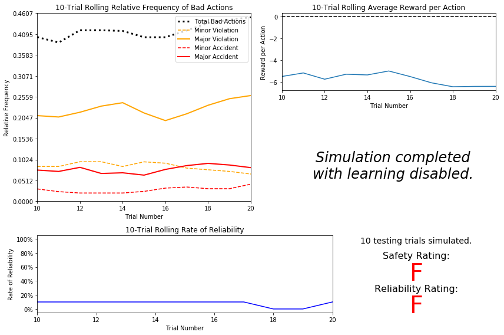
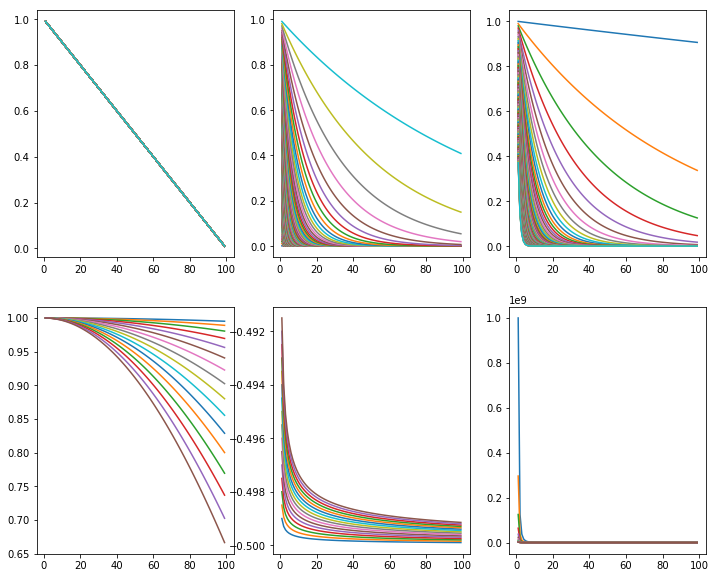
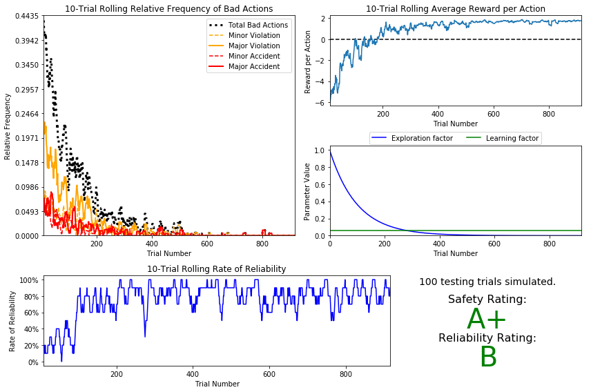
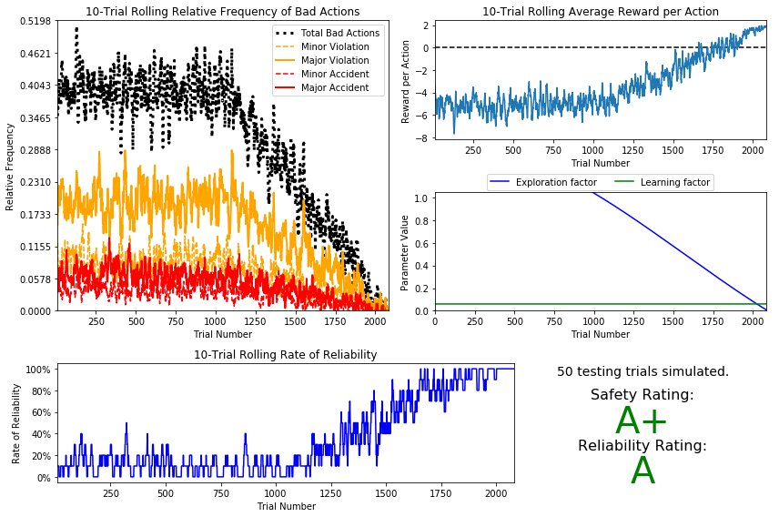

# Machine Learning Engineer Nanodegree
## Reinforcement Learning
## Project: Train a Smartcab to Drive

Welcome to the fourth project of the Machine Learning Engineer Nanodegree! In this notebook, template code has already been provided for you to aid in your analysis of the *Smartcab* and your implemented learning algorithm. You will not need to modify the included code beyond what is requested. There will be questions that you must answer which relate to the project and the visualizations provided in the notebook. Each section where you will answer a question is preceded by a **'Question X'** header. Carefully read each question and provide thorough answers in the following text boxes that begin with **'Answer:'**. Your project submission will be evaluated based on your answers to each of the questions and the implementation you provide in `agent.py`.  

>**Note:** Code and Markdown cells can be executed using the **Shift + Enter** keyboard shortcut. In addition, Markdown cells can be edited by typically double-clicking the cell to enter edit mode.

-----

## Getting Started
In this project, you will work towards constructing an optimized Q-Learning driving agent that will navigate a *Smartcab* through its environment towards a goal. Since the *Smartcab* is expected to drive passengers from one location to another, the driving agent will be evaluated on two very important metrics: **Safety** and **Reliability**. A driving agent that gets the *Smartcab* to its destination while running red lights or narrowly avoiding accidents would be considered **unsafe**. Similarly, a driving agent that frequently fails to reach the destination in time would be considered **unreliable**. Maximizing the driving agent's **safety** and **reliability** would ensure that *Smartcabs* have a permanent place in the transportation industry.

**Safety** and **Reliability** are measured using a letter-grade system as follows:

| Grade 	| Safety 	| Reliability 	|
|:-----:	|:------:	|:-----------:	|
|   A+  	|  Agent commits no traffic violations,<br/>and always chooses the correct action. | Agent reaches the destination in time<br />for 100% of trips. |
|   A   	|  Agent commits few minor traffic violations,<br/>such as failing to move on a green light. | Agent reaches the destination on time<br />for at least 90% of trips. |
|   B   	| Agent commits frequent minor traffic violations,<br/>such as failing to move on a green light. | Agent reaches the destination on time<br />for at least 80% of trips. |
|   C   	|  Agent commits at least one major traffic violation,<br/> such as driving through a red light. | Agent reaches the destination on time<br />for at least 70% of trips. |
|   D   	| Agent causes at least one minor accident,<br/> such as turning left on green with oncoming traffic.       	| Agent reaches the destination on time<br />for at least 60% of trips. |
|   F   	|  Agent causes at least one major accident,<br />such as driving through a red light with cross-traffic.      	| Agent fails to reach the destination on time<br />for at least 60% of trips. |

To assist evaluating these important metrics, you will need to load visualization code that will be used later on in the project. Run the code cell below to import this code which is required for your analysis.


```python
# Import the visualization code
import visuals as vs

# Pretty display for notebooks
%matplotlib inline
```

### Understand the World
Before starting to work on implementing your driving agent, it's necessary to first understand the world (environment) which the *Smartcab* and driving agent work in. One of the major components to building a self-learning agent is understanding the characteristics about the agent, which includes how the agent operates. To begin, simply run the `agent.py` agent code exactly how it is -- no need to make any additions whatsoever. Let the resulting simulation run for some time to see the various working components. Note that in the visual simulation (if enabled), the **white vehicle** is the *Smartcab*.

----------

### Question 1
In a few sentences, describe what you observe during the simulation when running the default `agent.py` agent code. Some things you could consider:
- *Does the Smartcab move at all during the simulation?*
- *What kind of rewards is the driving agent receiving?*
- *How does the light changing color affect the rewards?*  

**Hint:** From the `/smartcab/` top-level directory (where this notebook is located), run the command 
```bash
'python smartcab/agent.py'
```

**Answer:**

The Smartcab doesn't move, while other cars moving according to the traffic light signals. Between trials, smartcab is repositioned to different locations. <br>
The Smartcab gets rewards based on the policy violation. For example, Positive rewards, if there is a green light with other traffic. Negative rewards, if there is a green light without other traffic. Positive rewards, if there is a red light etc. There are several types of violations:

- No violation
- Minor violation
- Major violation
- Minor accident
- Major accident


***The example of a violation rule:***


  ```
      # 1. Agent wants to drive forward: 
        if action == 'forward':
            if light != 'green': # Running red light
                violation = 2 # Major violation
                if inputs['left'] == 'forward' or inputs['right'] == 'forward': # Cross traffic
                    violation = 4 # Accident
    
    
    
        # 2. Agent wants to drive left:
        elif action == 'left':
            if light != 'green': # Running a red light
                violation = 2 # Major violation
                if inputs['left'] == 'forward' or inputs['right'] == 'forward': # Cross traffic
                    violation = 4 # Accident
                elif inputs['oncoming'] == 'right': # Oncoming car turning right
                    violation = 4 # Accident
            else: # Green light
                if inputs['oncoming'] == 'right' or inputs['oncoming'] == 'forward': # Incoming traffic
                    violation = 3 # Accident
                else: # Valid move!
                    heading = (heading[1], -heading[0])


        # 3. Agent wants to drive right:
        elif action == 'right':
            if light != 'green' and inputs['left'] == 'forward': # Cross traffic
                violation = 3 # Accident
            else: # Valid move!
                heading = (-heading[1], heading[0])


        # 4. Agent wants to perform no action: 
        elif action == None:
            if light == 'green' and inputs['oncoming'] != 'left': # No oncoming traffic
                violation = 1 # Minor violation
                ```

*** If there is no policy violation the agent get rewarded based on the rules  ***

```
# Did the agent attempt a valid move?
        if violation == 0:
            if action == agent.get_next_waypoint(): # Was it the correct action?
                reward += 2 - penalty # (2, 1)
            elif action == None and light != 'green': # Was the agent stuck at a red light?
                reward += 2 - penalty # (2, 1)
            else: # Valid but incorrect
                reward += 1 - penalty # (1, 0)


            # Move the agent
            if action is not None:
                location = ((location[0] + heading[0] - self.bounds[0]) % (self.bounds[2] - self.bounds[0] + 1) + self.bounds[0],
                            (location[1] + heading[1] - self.bounds[1]) % (self.bounds[3] - self.bounds[1] + 1) + self.bounds[1])  # wrap-around
                state['location'] = location
                state['heading'] = heading
```

***otherwise these rules will be applied.***

 ```
    # Agent attempted invalid move  
        else:
            if violation == 1: # Minor violation
                reward += -5
            elif violation == 2: # Major violation
                reward += -10
            elif violation == 3: # Minor accident
                reward += -20
            elif violation == 4: # Major accident
                reward += -40```

--------

### Understand the Code
In addition to understanding the world, it is also necessary to understand the code itself that governs how the world, simulation, and so on operate. Attempting to create a driving agent would be difficult without having at least explored the *"hidden"* devices that make everything work. In the `/smartcab/` top-level directory, there are two folders: `/logs/` (which will be used later) and `/smartcab/`. Open the `/smartcab/` folder and explore each Python file included, then answer the following question.

---------------

### Question 2
- *In the *`agent.py`* Python file, choose three flags that can be set and explain how they change the simulation.*
- *In the *`environment.py`* Python file, what Environment class function is called when an agent performs an action?*
- *In the *`simulator.py`* Python file, what is the difference between the *`'render_text()'`* function and the *`'render()'`* function?*
- *In the *`planner.py`* Python file, will the *`'next_waypoint()`* function consider the North-South or East-West direction first?*

**Answer:**

**In the *`agent.py`* Python file, choose three flags that can be set and explain how they change the simulation.** 

- **learning** (True/False): This indicates whether the agent is learning or not. It is to force the driving agent to use Q-learning.

- **epsilon** (float): This is the random exploration factor. It has continuous value, which is default to 1. If it is test set it to 0. While choosing action, if it is learning it has to choose random action with 'epsilon' probability, if it is not learning, choose a random action. Thus it is probability which defines how often the agent acts randomly in order to avoid dead ends.

- **alpha** (float): This is the learning factor. This parameter tunes the rewards recieved from the learning steps. It has continuous value , default is 0.5, if it is test set it to 0.

<br>
**In the *`environment.py`* Python file, what Environment class function is called when an agent performs an action?**

 - **def act(self, agent, action)**: This function considers an action and performs it if it is legal and recieve a reward for the agent based on traffic rules.

<br>
**In the *`simulator.py`* Python file, what is the difference between the *`'render_text()'`* function and the
*`'render()'`* function?**

 - **render_text(self, trial, testing=False)** This is the non-GUI render display of the simulation. This sends trial data to be displayed in the terminal.
 - **render(self, trial, testing=False)**: This is the GUI render display of the simulation. Supplementary trial data can be found from render_text. 
 - First one is used to generate the text (render_text) and the second for displaying it (render)
                 
<br>        
**In the *`planner.py`* Python file, will the *`'next_waypoint()`* function consider the North-South or East-West direction first?**
 - East-West direction is considered first. It checks if destination is cardinally East or West of location first, and then North or South location.

---------

-----
## Implement a Basic Driving Agent

The first step to creating an optimized Q-Learning driving agent is getting the agent to actually take valid actions. In this case, a valid action is one of `None`, (do nothing) `'Left'` (turn left), `'Right'` (turn right), or `'Forward'` (go forward). For your first implementation, navigate to the `'choose_action()'` agent function and make the driving agent randomly choose one of these actions. Note that you have access to several class variables that will help you write this functionality, such as `'self.learning'` and `'self.valid_actions'`. Once implemented, run the agent file and simulation briefly to confirm that your driving agent is taking a random action each time step.

### Basic Agent Simulation Results
To obtain results from the initial simulation, you will need to adjust following flags:
- `'enforce_deadline'` - Set this to `True` to force the driving agent to capture whether it reaches the destination in time.
- `'update_delay'` - Set this to a small value (such as `0.01`) to reduce the time between steps in each trial.
- `'log_metrics'` - Set this to `True` to log the simluation results as a `.csv` file in `/logs/`.
- `'n_test'` - Set this to `'10'` to perform 10 testing trials.

Optionally, you may disable to the visual simulation (which can make the trials go faster) by setting the `'display'` flag to `False`. Flags that have been set here should be returned to their default setting when debugging. It is important that you understand what each flag does and how it affects the simulation!

Once you have successfully completed the initial simulation (there should have been 20 training trials and 10 testing trials), run the code cell below to visualize the results. Note that log files are overwritten when identical simulations are run, so be careful with what log file is being loaded!
Run the agent.py file after setting the flags from projects/smartcab folder instead of projects/smartcab/smartcab.


```python
# Load the 'sim_no-learning' log file from the initial simulation results
vs.plot_trials('sim_no-learning.csv')
```





--------

### Question 3
Using the visualization above that was produced from your initial simulation, provide an analysis and make several observations about the driving agent. Be sure that you are making at least one observation about each panel present in the visualization. Some things you could consider:
- *How frequently is the driving agent making bad decisions? How many of those bad decisions cause accidents?*
- *Given that the agent is driving randomly, does the rate of reliabilty make sense?*
- *What kind of rewards is the agent receiving for its actions? Do the rewards suggest it has been penalized heavily?*
- *As the number of trials increases, does the outcome of results change significantly?*
- *Would this Smartcab be considered safe and/or reliable for its passengers? Why or why not?*

**Answer:**

**How frequently is the driving agent making bad decisions? How many of those bad decisions cause accidents?**

- The driving agent makes bad decisions in 30% to 40% of all cases. Minor accidents take about 1% to 5%, while major accidents are close to 5% to 10% of all cases.<br>

**Given that the agent is driving randomly, does the rate of reliabilty make sense?**

- The reliability means a driving agent that frequently reaches the destination in time. Since the agent is acting randomly, the result is also random and not very much meaningful. <br> 

**What kind of rewards is the agent receiving for its actions? Do the rewards suggest it has been penalized heavily?**

- The agent is getting negative rewards on average. The agents is not making bad decision all the time, but the rolling average is always negative. From above plot, Reward per actioon decreased from -4 to -6, it suggests it has been penalized heavily. <br>

**As the number of trials increases, does the outcome of results change significantly?**
 - No, the result stay relatively the same. The reason is our agent is very random and doen't know the constains and is not able to learn from failures and successes. <br>

**Would this Smartcab be considered safe and/or reliable for its passengers? Why or why not?**

- No, as the both ratings suggest, the Smartcab is neither reliable nor safe, since the cab didn't get to the destination, and make a lot of violations.


-------

-----
## Inform the Driving Agent
The second step to creating an optimized Q-learning driving agent is defining a set of states that the agent can occupy in the environment. Depending on the input, sensory data, and additional variables available to the driving agent, a set of states can be defined for the agent so that it can eventually *learn* what action it should take when occupying a state. The condition of `'if state then action'` for each state is called a **policy**, and is ultimately what the driving agent is expected to learn. Without defining states, the driving agent would never understand which action is most optimal -- or even what environmental variables and conditions it cares about!

### Identify States
Inspecting the `'build_state()'` agent function shows that the driving agent is given the following data from the environment:
- `'waypoint'`, which is the direction the *Smartcab* should drive leading to the destination, relative to the *Smartcab*'s heading.
- `'inputs'`, which is the sensor data from the *Smartcab*. It includes 
  - `'light'`, the color of the light.
  - `'left'`, the intended direction of travel for a vehicle to the *Smartcab*'s left. Returns `None` if no vehicle is present.
  - `'right'`, the intended direction of travel for a vehicle to the *Smartcab*'s right. Returns `None` if no vehicle is present.
  - `'oncoming'`, the intended direction of travel for a vehicle across the intersection from the *Smartcab*. Returns `None` if no vehicle is present.
- `'deadline'`, which is the number of actions remaining for the *Smartcab* to reach the destination before running out of time.

----------

### Question 4
*Which features available to the agent are most relevant for learning both **safety** and **efficiency**? Why are these features appropriate for modeling the *Smartcab* in the environment? If you did not choose some features, why are those features* not *appropriate?*

**Answer:**

all the features are appropriate for learning safety and efficiency (reliability). 

waypoint, light, oncoming, right, left are the most relevant ones. 
- Knowing the waypoint is how the smartcab get to the destination.
- Light can let the smartcab to know whether it should stop or drive at the intersections. 
- Oncoming, left, rigth are relevant because the smartcab should not drive into other cars.
- Deadline seems to be relevant at first glance, since it forces the agent to reach the destination as soon as possible. Unfortunately it could be a source of problems. For instance the agent could break the rules in order to reach the destination faster when it's near the final point. So, we won't use it.Deadline is not appropriate, since knowing deadline won't help smartcab get to destination. 

Too many features will make it hard to learn a good policy.

------

### Define a State Space
When defining a set of states that the agent can occupy, it is necessary to consider the *size* of the state space. That is to say, if you expect the driving agent to learn a **policy** for each state, you would need to have an optimal action for *every* state the agent can occupy. If the number of all possible states is very large, it might be the case that the driving agent never learns what to do in some states, which can lead to uninformed decisions. For example, consider a case where the following features are used to define the state of the *Smartcab*:

`('is_raining', 'is_foggy', 'is_red_light', 'turn_left', 'no_traffic', 'previous_turn_left', 'time_of_day')`.

How frequently would the agent occupy a state like `(False, True, True, True, False, False, '3AM')`? Without a near-infinite amount of time for training, it's doubtful the agent would ever learn the proper action!

--------

### Question 5
*If a state is defined using the features you've selected from **Question 4**, what would be the size of the state space? Given what you know about the evironment and how it is simulated, do you think the driving agent could learn a policy for each possible state within a reasonable number of training trials?*  
**Hint:** Consider the *combinations* of features to calculate the total number of states!

**Answer:**

The total number of states is defined by the product of the number of possible states for each feature. We estimate the total number of states as: 
> WAYPOINT x LIGHTS_STATES x INPUT[LEFT] x INPUT[ONCOMING]

- WAIPOINT: 3 (left, right, forward)
- LIGHTS_STATES:   2 (green, red)
- INPUT[LEFT]:     4 (None, left, right, forwards)
- INPUT[ONCOMING]: 4 (None, left, right, forwards)

<br>
Therefore, the total number of states is 96. Figuring out the policy for each possible state will take some time, because the Smartcab should visit each state  and try different actions to learn the reward policy. The agent won't learn a policy for each possible state. That will take too much time to train. However, the agent doesn't need to do that to get a reasonable good performance.

--------

### Update the Driving Agent State
For your second implementation, navigate to the `'build_state()'` agent function. With the justification you've provided in **Question 4**, you will now set the `'state'` variable to a tuple of all the features necessary for Q-Learning. Confirm your driving agent is updating its state by running the agent file and simulation briefly and note whether the state is displaying. If the visual simulation is used, confirm that the updated state corresponds with what is seen in the simulation.

**Note:** Remember to reset simulation flags to their default setting when making this observation!

-----
## Implement a Q-Learning Driving Agent
The third step to creating an optimized Q-Learning agent is to begin implementing the functionality of Q-Learning itself. The concept of Q-Learning is fairly straightforward: For every state the agent visits, create an entry in the Q-table for all state-action pairs available. Then, when the agent encounters a state and performs an action, update the Q-value associated with that state-action pair based on the reward received and the interative update rule implemented. Of course, additional benefits come from Q-Learning, such that we can have the agent choose the *best* action for each state based on the Q-values of each state-action pair possible. For this project, you will be implementing a *decaying,* $\epsilon$*-greedy* Q-learning algorithm with *no* discount factor. Follow the implementation instructions under each **TODO** in the agent functions.

Note that the agent attribute `self.Q` is a dictionary: This is how the Q-table will be formed. Each state will be a key of the `self.Q` dictionary, and each value will then be another dictionary that holds the *action* and *Q-value*. Here is an example:

```
{ 'state-1': { 
    'action-1' : Qvalue-1,
    'action-2' : Qvalue-2,
     ...
   },
  'state-2': {
    'action-1' : Qvalue-1,
     ...
   },
   ...
}
```

Furthermore, note that you are expected to use a *decaying* $\epsilon$ *(exploration) factor*. Hence, as the number of trials increases, $\epsilon$ should decrease towards 0. This is because the agent is expected to learn from its behavior and begin acting on its learned behavior. Additionally, The agent will be tested on what it has learned after $\epsilon$ has passed a certain threshold (the default threshold is 0.01). For the initial Q-Learning implementation, you will be implementing a linear decaying function for $\epsilon$.

### Q-Learning Simulation Results
To obtain results from the initial Q-Learning implementation, you will need to adjust the following flags and setup:
- `'enforce_deadline'` - Set this to `True` to force the driving agent to capture whether it reaches the destination in time.
- `'update_delay'` - Set this to a small value (such as `0.01`) to reduce the time between steps in each trial.
- `'log_metrics'` - Set this to `True` to log the simluation results as a `.csv` file and the Q-table as a `.txt` file in `/logs/`.
- `'n_test'` - Set this to `'10'` to perform 10 testing trials.
- `'learning'` - Set this to `'True'` to tell the driving agent to use your Q-Learning implementation.

In addition, use the following decay function for $\epsilon$:

$$ \epsilon_{t+1} = \epsilon_{t} - 0.05, \hspace{10px}\textrm{for trial number } t$$

If you have difficulty getting your implementation to work, try setting the `'verbose'` flag to `True` to help debug. Flags that have been set here should be returned to their default setting when debugging. It is important that you understand what each flag does and how it affects the simulation! 

Once you have successfully completed the initial Q-Learning simulation, run the code cell below to visualize the results. Note that log files are overwritten when identical simulations are run, so be careful with what log file is being loaded!


```python
# Load the 'sim_default-learning' file from the default Q-Learning simulation
vs.plot_trials('sim_default-learning.csv')
```


-------

### Question 6
Using the visualization above that was produced from your default Q-Learning simulation, provide an analysis and make observations about the driving agent like in **Question 3**. Note that the simulation should have also produced the Q-table in a text file which can help you make observations about the agent's learning. Some additional things you could consider:  
- *Are there any observations that are similar between the basic driving agent and the default Q-Learning agent?*
- *Approximately how many training trials did the driving agent require before testing? Does that number make sense given the epsilon-tolerance?*
- *Is the decaying function you implemented for $\epsilon$ (the exploration factor) accurately represented in the parameters panel?*
- *As the number of training trials increased, did the number of bad actions decrease? Did the average reward increase?*
- *How does the safety and reliability rating compare to the initial driving agent?*

**Answer:**

**Are there any observations that are similar between the basic driving agent and the default Q-Learning agent?**

Even though we see some improvements, the ratings haven't changed. In both scenarios, the agent fail both test. It's still dangerous to use the Smartcab in the environment. 
<br><br>

**Approximately how many training trials did the driving agent require before testing? Does that number make sense given the epsilon-tolerance?**

The Smartcab needs 20 trials for training before testing. This makes sense since we use decay function ```self.epsilon = self.epsilon - 0.05```, which reach the tolerence value after 20 trials. The test runs after the epsilon value becomes less than 0.001 (tolerance). Taking into account the default value ($\epsilon$ =1) we can easily check that 20 trials is our threshold indeed (1-20x0.05 < 0.001)
<br><br>

**Is the decaying function you implemented for $\epsilon$ (the exploration factor) accurately represented in the parameters panel?**

Yes, we can see a linear function with a negative slope. It starts with $\epsilon$ =1 and ends up with $\epsilon$ =0 after 20 trials.
<br><br>

**As the number of training trials increased, did the number of bad actions decrease? Did the average reward increase?**

Fortunatelly, the total number of bad actions has decreased therefore the total amount of good actions has increased. At the end of the training the average reward value has gone up to -4 from -2. The number of bad actions decreased from ~33% to ~18%.  
<br><br>

**How does the safety and reliability rating compare to the initial driving agent?**

The agent still gets Fs. Unfortunately the rolling rate of reliability is fluctuating around 35% with no evidences of any improvement. Compare to basic driving agent, default Q-Learning agent has improved success rate, though it's still failed, we can understand that from logs, to reflect this rating as well we need more no.of trianing trials before testing, and reliability improved and showed here as Rating B.

-------

-----
## Improve the Q-Learning Driving Agent
The third step to creating an optimized Q-Learning agent is to perform the optimization! Now that the Q-Learning algorithm is implemented and the driving agent is successfully learning, it's necessary to tune settings and adjust learning paramaters so the driving agent learns both **safety** and **efficiency**. Typically this step will require a lot of trial and error, as some settings will invariably make the learning worse. One thing to keep in mind is the act of learning itself and the time that this takes: In theory, we could allow the agent to learn for an incredibly long amount of time; however, another goal of Q-Learning is to *transition from experimenting with unlearned behavior to acting on learned behavior*. For example, always allowing the agent to perform a random action during training (if $\epsilon = 1$ and never decays) will certainly make it *learn*, but never let it *act*. When improving on your Q-Learning implementation, consider the impliciations it creates and whether it is logistically sensible to make a particular adjustment.

### Improved Q-Learning Simulation Results
To obtain results from the initial Q-Learning implementation, you will need to adjust the following flags and setup:
- `'enforce_deadline'` - Set this to `True` to force the driving agent to capture whether it reaches the destination in time.
- `'update_delay'` - Set this to a small value (such as `0.01`) to reduce the time between steps in each trial.
- `'log_metrics'` - Set this to `True` to log the simluation results as a `.csv` file and the Q-table as a `.txt` file in `/logs/`.
- `'learning'` - Set this to `'True'` to tell the driving agent to use your Q-Learning implementation.
- `'optimized'` - Set this to `'True'` to tell the driving agent you are performing an optimized version of the Q-Learning implementation.

Additional flags that can be adjusted as part of optimizing the Q-Learning agent:
- `'n_test'` - Set this to some positive number (previously 10) to perform that many testing trials.
- `'alpha'` - Set this to a real number between 0 - 1 to adjust the learning rate of the Q-Learning algorithm.
- `'epsilon'` - Set this to a real number between 0 - 1 to adjust the starting exploration factor of the Q-Learning algorithm.
- `'tolerance'` - set this to some small value larger than 0 (default was 0.05) to set the epsilon threshold for testing.

Furthermore, use a decaying function of your choice for $\epsilon$ (the exploration factor). Note that whichever function you use, it **must decay to **`'tolerance'`** at a reasonable rate**. The Q-Learning agent will not begin testing until this occurs. Some example decaying functions (for $t$, the number of trials):

$$ \epsilon = a^t, \textrm{for } 0 < a < 1 \hspace{50px}\epsilon = \frac{1}{t^2}\hspace{50px}\epsilon = e^{-at}, \textrm{for } 0 < a < 1 \hspace{50px} \epsilon = \cos(at), \textrm{for } 0 < a < 1$$
You may also use a decaying function for $\alpha$ (the learning rate) if you so choose, however this is typically less common. If you do so, be sure that it adheres to the inequality $0 \leq \alpha \leq 1$.

If you have difficulty getting your implementation to work, try setting the `'verbose'` flag to `True` to help debug. Flags that have been set here should be returned to their default setting when debugging. It is important that you understand what each flag does and how it affects the simulation! 

Once you have successfully completed the improved Q-Learning simulation, run the code cell below to visualize the results. Note that log files are overwritten when identical simulations are run, so be careful with what log file is being loaded!

----------

### Visualizing some decay functions

-------


```python
import numpy as np
import math as math
import pandas as pd
import matplotlib.pyplot as plt
from matplotlib import cm
```


```python
class decay(object):
    def __init__(self,t,a):
        self.t = t
        self.a = a
    def fun1(self):
        return 1.0-(self.t*0.01)
    def fun2(self):
        return self.a**(self.t)  
    def fun3(self):
        return np.exp(-self.a*self.t)
    def fun4(self):
        return np.cos(self.a*self.t)
    def fun5(self):
        return self.a/np.sqrt(self.t) -0.5
    def fun6(self):
        return 1.0/((self.a*self.t)**3)
```


```python
a1 = np.arange(0.001,1.0,0.01) 
x = np.arange(1,100.0,1.0)
plt.figure(figsize = (12,10))
for ia in a1:
    plt.subplot(2,3,1)
    plt.plot(x,decay(x,ia).fun1())
    plt.subplot(2,3,2)
    plt.plot(x,decay(x,ia).fun2())
    plt.subplot(2,3,3)
    plt.plot(x,decay(x,ia).fun3())
    
a2 = np.arange(0.001,0.009,0.0005) 
for ia in a2: 
    plt.subplot(2,3,4)
    plt.plot(x,decay(x,ia).fun4())
    plt.subplot(2,3,5)
    plt.plot(x,decay(x,ia).fun5())
    plt.subplot(2,3,6)
    plt.plot(x,decay(x,ia).fun6())
```





--------

#### Choice of different decay functions

#### Case-I:

-------

| model  |epsilon   |tolerance   |alpha   | a   | safety  |reliability   |trainings   |
|---|---|---|---|---|---|---|---|
| linear  |$$\epsilon = \epsilon -0.005\hspace{25px}$$   | 0.0001  | 0.06  | -  | A+  |  A+ | 200  |   

---------


```python
# Load the 'sim_improved-learning' file from the improved Q-Learning simulation
vs.plot_trials('sim_improved-learning1.csv')
```


--------

#### Case-II:

--------

| model  |epsilon   |tolerance   |alpha   | a   | safety  |reliability   |trainings   |
|---|---|---|---|---|---|---|---|
| exponential  |$$\epsilon = e^{-at}\hspace{50px}$$ | 0.0001  | 0.06  | 0.01  | A+  |  B | ~700  |  

-----------


```python
# Load the 'sim_improved-learning' file from the improved Q-Learning simulation
# Linear function self.epsilon = math.exp(1)**(-a*self.trials) a =0.01
vs.plot_trials('sim_improved-learning2.csv')
```


------

#### Case:III: 

---------

| model  |epsilon   |tolerance   |alpha   | a   | safety  |reliability   |trainings   |
|---|---|---|---|---|---|---|---|
| exponential  |$$\epsilon = a^t\hspace{25px}$$ | 0.0001  | 0.06  | 0.99  | A+  |  B | ~700  |  

-------


```python
# Load the 'sim_improved-learning' file from the improved Q-Learning simulation
# Linear function  self.epsilon = a**self.trials a =0.99

vs.plot_trials('sim_improved-learning3.csv')
```





---------

#### Case-IV:

-----

| model  |epsilon   |tolerance   |alpha   | a   | safety  |reliability   |trainings   |
|---|---|---|---|---|---|---|---| |  
| trigonometric  | $$ \epsilon = \cos(at) +0.5\hspace{50px}$$| 0.01  | 0.06  | 0.001  | A+  |  A | ~2000  |

--------


```python
# Load the 'sim_improved-learning' file from the improved Q-Learning simulation
# Linear function  self.epsilon = math.cos(a*self.trials)+0.5 a=0.001 tolerance=0.01

vs.plot_trials('sim_improved-learning5.csv')
```





------

### Question 7
Using the visualization above that was produced from your improved Q-Learning simulation, provide a final analysis and make observations about the improved driving agent like in **Question 6**. Questions you should answer:  
- *What decaying function was used for epsilon (the exploration factor)?*
- *Approximately how many training trials were needed for your agent before begining testing?*
- *What epsilon-tolerance and alpha (learning rate) did you use? Why did you use them?*
- *How much improvement was made with this Q-Learner when compared to the default Q-Learner from the previous section?*
- *Would you say that the Q-Learner results show that your driving agent successfully learned an appropriate policy?*
- *Are you satisfied with the safety and reliability ratings of the *Smartcab*?*

**Answer:**

Following is the summary table for all models used:

| model  |epsilon   |tolerance   |alpha   | a   | safety  |reliability   |trainings   |
|---|---|---|---|---|---|---|---|
| linear  |$$\epsilon = \epsilon -0.005\hspace{25px}$$   | 0.0001  | 0.06  | -  | A+  |  A+ | 200  |  
| exponential  |$$\epsilon = e^{-at}\hspace{50px}$$ | 0.0001  | 0.06  | 0.01  | A+  |  B | ~700  |  
| exponential  |$$\epsilon = a^t\hspace{25px}$$ | 0.0001  | 0.06  | 0.99  | A+  |  B | ~700  |   |  
| trigonometric|$$ \epsilon = \cos(at) +0.5\hspace{50px}$$| 0.01  | 0.06  | 0.001  | A+  |  A | ~2000  |  
<br>

**What decaying function was used for epsilon (the exploration factor)?**

 Different decay function used asr listed in the chart above.
 <br><br>
 
**Approximately how many training trials were needed for your agent before begining testing?**

 From above chart it ranges from 200 to 2000.

**How much improvement was made with this Q-Learner when compared to the default Q-Learner from the previous section?**

There is a tremendous increase in terms safety and reliability. The Smartcab managed to achieve A/A+, A+/B, A+/B A+/A grades respectively, comparing to F in  case of the default Q-Learner. 

**Would you say that the Q-Learner results show that your driving agent successfully learned an appropriate policy?**

Taking into account the rewards, the linear and exponential decay functions got into a positive reward sector after some training examples. Other functions slowly achive that success. In each of the case driving agent is learning successfully.

**Are you satisfied with the safety and reliability ratings of the Smartcab?**

Yes, I am satisfied with the learning rate and only partially with the safety and reliability ratings, there is a room for improvement here because I have got B+ some where. Obviously the Smartcab is not ready for usage in real world, it still causes road accidents.

-------

### Define an Optimal Policy

Sometimes, the answer to the important question *"what am I trying to get my agent to learn?"* only has a theoretical answer and cannot be concretely described. Here, however, you can concretely define what it is the agent is trying to learn, and that is the U.S. right-of-way traffic laws. Since these laws are known information, you can further define, for each state the *Smartcab* is occupying, the optimal action for the driving agent based on these laws. In that case, we call the set of optimal state-action pairs an **optimal policy**. Hence, unlike some theoretical answers, it is clear whether the agent is acting "incorrectly" not only by the reward (penalty) it receives, but also by pure observation. If the agent drives through a red light, we both see it receive a negative reward but also know that it is not the correct behavior. This can be used to your advantage for verifying whether the **policy** your driving agent has learned is the correct one, or if it is a **suboptimal policy**.

-------

### Question 8
Provide a few examples (using the states you've defined) of what an optimal policy for this problem would look like. Afterwards, investigate the `'sim_improved-learning.txt'` text file to see the results of your improved Q-Learning algorithm. 

 **For each state that has been recorded from the simulation, is the **policy** (the action with the highest value) correct for the given state? Are there any states where the policy is different than what would be expected from an optimal policy?**

 **Provide an example of a state and all state-action rewards recorded, and explain why it is the correct policy.**

**Answer:** 

In most cases the policy does make sense.

The state dictionary is defined like this:

```
state = (inputs['light'],\
         inputs['oncoming'],\
         inputs['right'],\
         inputs['left'],\
         waypoint)
       
```

--------------

***Example-1***: Consider following state-action-reward

```
('green', None, 'forward', 'right', 'left')---> left
 -- forward : 0.13
 -- None : -0.78
 -- right : 0.17
 -- left : 0.67

```
Here traffic light is ```green```, there is ```no``` upcomimg traffic and the waypoint is ```left```. So , moving to ```left``` has highest reward and going ```left``` is optimal policy.

--------------

***Example-2***: Consider following state-action-reward
```
('green', 'right', None, None, 'right')---> right
 -- forward : 0.41
 -- None : -3.46
 -- right : 1.62
 -- left : -12.22
```
Here traffic light is ```green```,  the waypoint is ```right```. Moving to ```right``` has highest reward and going ```right``` is optimal policy.

--------------

***Example-3***: Consider following state-action-reward

```
('green', 'right', 'left', None, 'right')--> forward
 -- forward : 0.68
 -- None : -1.34
 -- right : 0.42
 -- left : -2.34
 ```
 Here traffic light is ```green```, the waypoint is ```right```. But policy shows going ```forward``` has maximum reward. While the correct action would be going to ```right```. So , this is a sub-optimal policy. This will be corected while agent gets more steps to learn.
 


-------

-----
### Optional: Future Rewards - Discount Factor, `'gamma'`
Curiously, as part of the Q-Learning algorithm, you were asked to **not** use the discount factor, `'gamma'` in the implementation. Including future rewards in the algorithm is used to aid in propogating positive rewards backwards from a future state to the current state. Essentially, if the driving agent is given the option to make several actions to arrive at different states, including future rewards will bias the agent towards states that could provide even more rewards. An example of this would be the driving agent moving towards a goal: With all actions and rewards equal, moving towards the goal would theoretically yield better rewards if there is an additional reward for reaching the goal. However, even though in this project, the driving agent is trying to reach a destination in the allotted time, including future rewards will not benefit the agent. In fact, if the agent were given many trials to learn, it could negatively affect Q-values!

-------

### Optional Question 9
*There are two characteristics about the project that invalidate the use of future rewards in the Q-Learning algorithm. One characteristic has to do with the *Smartcab* itself, and the other has to do with the environment. Can you figure out what they are and why future rewards won't work for this project?*

**Answer:**

-----

> **Note**: Once you have completed all of the code implementations and successfully answered each question above, you may finalize your work by exporting the iPython Notebook as an HTML document. You can do this by using the menu above and navigating to  
**File -> Download as -> HTML (.html)**. Include the finished document along with this notebook as your submission.
